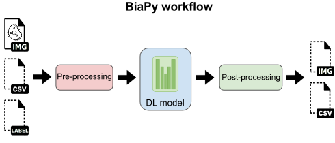

.. _how_works_biapy:

How it works
------------

All BiaPy pipelines are composed of three main steps: data pre-processing, deep learning (DL) model training or inference, and data post-processing. 

  
  General scheme of a BiaPy pipeline/workflow. Dash-lined elements are optional.

Pre-processing
~~~~~~~~~~~~~~

In order to effectively train or perform inference with deep learning (DL) models, it is crucial to properly prepare the input data. BiaPy addresses this need by implementing various pre-processing steps.

An important aspect of pre-processing in BiaPy is the adaptation of input data into a representation that can be fed to a DL model. This is particularly relevant in the case of instance segmentation pipelines, where label images are transformed into binary masks, contours, and distance maps. Similarly, in object detection pipelines, point detection lists are transformed into point mask images. These transformations allow for a more effective training and inference process, as the DL model is presented with data in a format that it can more easily understand and process.

The normalization of the pixel/voxel intensities is performed to ensure that the data falls within a specific range, allowing the model to more effectively learn from the data. This process is currently done inside the generators. 

Training
~~~~~~~~

The training stage of deep learning (DL) models is a crucial step in achieving accurate and reliable results. During this stage, the DL model is presented with examples of input data and corresponding target outputs, also known as ground truth. The goal of the model is to generate outputs as close as possible to the provided target data.

One way to increase the amount of training data available is through the use of data augmentation (DA). This technique involves applying various transformations to the input image, such as random rotations or flips, to create different versions of the original image. By feeding the model with a diverse set of data, DA can help prevent overfitting, which occurs when a model becomes too specialized to the training data and performs poorly on new data.

Another technique to prevent overfitting is to use a validation set in the training process. A validation set is a separate set of data that is not used in the training of the model, but is used to monitor the model's performance during training. By comparing the model's performance on the validation set to its performance on the training set, it is possible to detect when the model is no longer improving and to stop the training process before overfitting occurs. 

Inference
~~~~~~~~~

Once the training process has been completed, the next step is the inference or prediction phase. During this phase, the trained model is presented with images of the same type as those used during training, and the model generates its corresponding target output. If ground truth data is available, the model's output can be compared to this data to measure its performance.

Different metrics are used to evaluate the performance of the model, depending on the specific workflow. For example, in the case of image classification, metrics such as accuracy, precision, and recall may be used to evaluate the model's performance. In object detection workflows, metrics such as average precision (AP) or mean average precision (MAP) are commonly used. In the case of instance segmentation, metrics such as intersection over union (IoU) is used to evaluate the model's performance.

It is important to note that the selection of appropriate metrics is essential for the accurate evaluation of the model's performance and the identification of areas where improvement is needed.

Post-processing
~~~~~~~~~~~~~~~

Once a deep learning (DL) model has been trained and the inference phase has been completed, it is often necessary to perform post-processing on the model's output to achieve the desired results. BiaPy, a Python library for bioimage analysis, provides a variety of post-processing methods to aid in this process.

For semantic segmentation tasks, simple binarization is often used to convert the model's output into a binary image, where each pixel is classified as belonging to a specific class or not. For 3D data, z-filtering is often used to remove noise and improve the overall quality of the output.

In instance segmentation tasks, marker-controlled watershed and Voronoi tessellation are commonly used post-processing methods. These methods help to separate individual objects within the image and create precise boundaries between them. For object detection tasks, close point suppression is often used to eliminate multiple detections of the same object.

It is worth noting that the selection of post-processing methods is dependent on the specific task and the desired output, as well as the characteristics of the data.