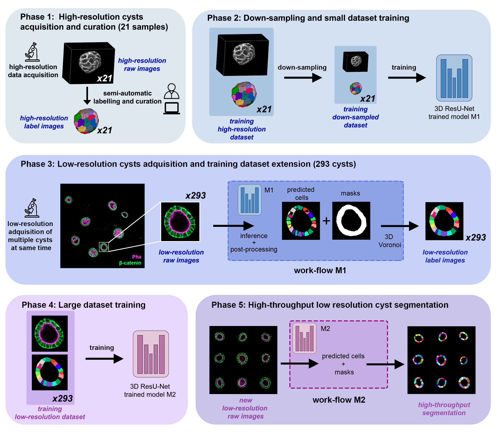

.. _cartocell:

CartoCell, a high-throughput pipeline for accurate 3D image analysis
--------------------------------------------------------------------

This tutorial describes how to train and infer using our custom ResU-Net 3D DNN in order to reproduce the results obtained in ``(Andrés-San Román, 2022)``. Given an initial training dataset of 21 segmented epithelial 3D cysts acquired after confocal microscopy, we follow the CartoCell pipeline (figure below) to high-throughput segment hundreds of cysts at low resolution automatically.

    CartoCell pipeline for high-throughput epithelial cysts segmentation.  

[Paper under review]

.. list-table:: 

  * - .. figure:: ../video/cyst_sample.gif
        :align: center
        :scale: 120%

        Cyst image sample

    - .. figure:: ../video/cyst_instance_prediction.gif 
        :align: center
        :scale: 120%

        Corresponding instance mask 

Data preparation
~~~~~~~~~~~~~~~~

The data needed is:

* `training_down-sampled_raw_images <https://data.mendeley.com/v1/datasets/7gbkxgngpm/draft#folder-dd7044fc-dda2-43a2-9951-cbe6c1851030>`__, `training_down-sampled_label_images <https://data.mendeley.com/v1/datasets/7gbkxgngpm/draft#folder-3e5dded7-24c6-41e3-ab6d-9ca3587c0fbe>`__, `validation_dataset_raw_images <https://data.mendeley.com/v1/datasets/7gbkxgngpm/draft#folder-83538c77-61d8-4770-85d1-1bac988c5e43>`__ and `validation_dataset_ground_truth <https://data.mendeley.com/v1/datasets/7gbkxgngpm/draft#folder-5195c7ac-eacd-491e-9d69-8115b36b6c43>`__ to feed the initial model (model M1, `Phase 2`). 

* `low-resolution_raw_images <https://data.mendeley.com/v1/datasets/7gbkxgngpm/draft#folder-0506e31c-69f2-445d-80d8-d46b0547d320>`__ to run `Phase 3 – 5` of CartoCell pipeline.

* `test_dataset_raw_images <https://data.mendeley.com/v1/datasets/7gbkxgngpm/draft#folder-ba6774bd-7858-4bfb-aca9-9ac307e72120>`__ or  `low-resolution_raw_images <https://data.mendeley.com/v1/datasets/7gbkxgngpm/draft#folder-0506e31c-69f2-445d-80d8-d46b0547d320>`__  if you just want to run the inference using our pretrained model M2.

We also provide all the properly segmented cysts (ground truth) in `Mendeley <https://data.mendeley.com/v1/datasets/7gbkxgngpm/draft>`__.

How to train your model
~~~~~~~~~~~~~~~~~~~~~~~

To reproduce the exact results of our manuscript you need to use `cartocell.yaml <https://github.com/danifranco/BiaPy/blob/master/templates/instance_segmentation/CartoCell_paper/cartocell.yaml>`__ configuration file that allows to train the model (`command line section <https://biapy.readthedocs.io/en/latest/workflows/instance_segmentation.html#run>`__) or using a Google Colab `notebook <https://colab.research.google.com/github/danifranco/BiaPy/blob/master/templates/instance_segmentation/CartoCell_paper/CartoCell_workflow.ipynb>`__. Noteworthy, google colab standard account do not allow you to run a long number of epochs due to time limitations.  

You will need to modify the ``TEST.PATH`` and ``TEST.MASK_PATH`` with the paths of the previously downloaded images (`training_down-sampled_raw_images <https://data.mendeley.com/v1/datasets/7gbkxgngpm/draft#folder-dd7044fc-dda2-43a2-9951-cbe6c1851030>`__ path and `training_down-sampled_label_images <https://data.mendeley.com/v1/datasets/7gbkxgngpm/draft#folder-3e5dded7-24c6-41e3-ab6d-9ca3587c0fbe>`__ path respectively). You will also need to modify ``PATHS.CHECKPOINT_FILE`` to specify the path in which you want to save your model.

How to run the inference
~~~~~~~~~~~~~~~~~~~~~~~~

To perform an inference using a pretrained model, you can run this `notebook <https://colab.research.google.com/github/danifranco/BiaPy/blob/master/templates/instance_segmentation/CartoCell_paper/CartoCell_workflow.ipynb>`__ specifying path of the raw images that you want to segment (e.g. `test_dataset_raw_images <https://data.mendeley.com/v1/datasets/7gbkxgngpm/draft#folder-ba6774bd-7858-4bfb-aca9-9ac307e72120>`__ or `low-resolution_raw_images <https://data.mendeley.com/v1/datasets/7gbkxgngpm/draft#folder-0506e31c-69f2-445d-80d8-d46b0547d320>`__). To this aim, you can use our pretrained model M2, `model_weights_cartocell.h5 <https://github.com/danifranco/BiaPy/blob/master/templates/instance_segmentation/CartoCell_paper/model_weights_cartocell.h5>`__.

To run it via **Docker** you can follow the same steps as decribed in :ref:`instance_segmentation_run`. 

**Colab**: |colablink|

.. |colablink| image:: https://colab.research.google.com/assets/colab-badge.svg
    :target: https://colab.research.google.com/github/danifranco/BiaPy/blob/master/templates/instance_segmentation/CartoCell_paper/CartoCell_workflow.ipynb

Results
~~~~~~~

The results follow same structure as explained in :ref:`instance_segmentation_results`.

                