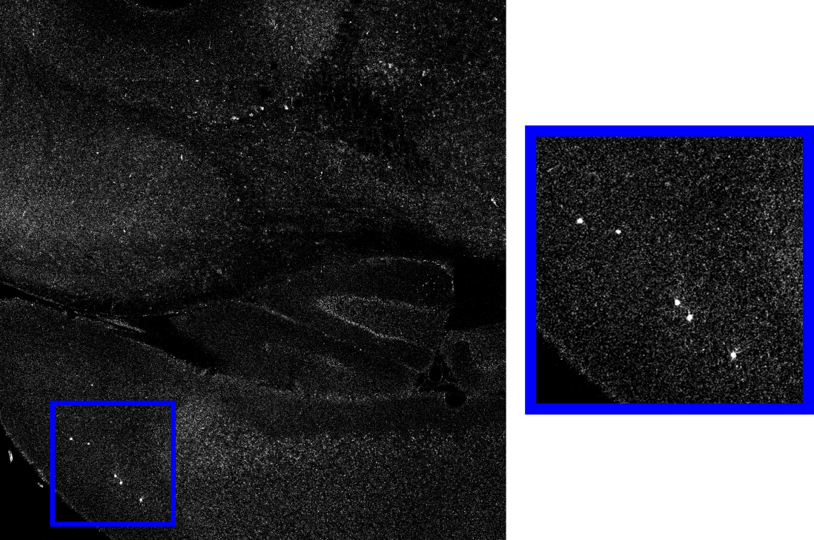
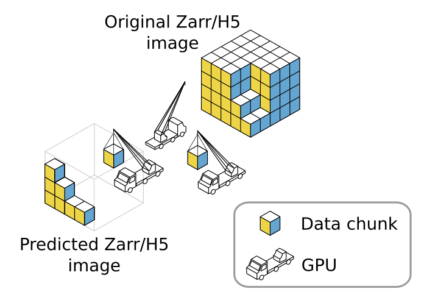
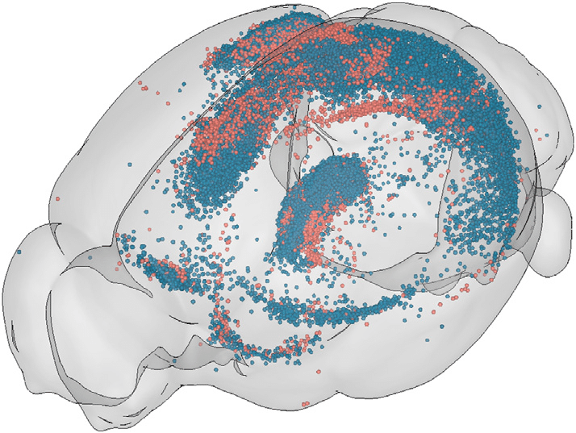

.. _cell_det_brainglobe:

3D Cell Detection in Whole-Brain Microscopy Images
--------------------------------------------------

Task overview
~~~~~~~~~~~~~

In this tutorial, you'll learn how to detect cells in large 3D brain images using the Zarr format (this method also works with H5 format). We'll use **BiaPy** for cell extraction and **BrainGlobe** for visualization, brain region assignment, and statistical analysis. This tutorial bridges **BrainGlobe** and **BiaPy** while showing how to work with large Zarr images without running into memory limitations.

.. figure:: ../../img/detection/3d_cell_detection_biapy_brainglobe.png
   :align: center                  
   :width: 450px

   **Tutorial overview**. In this tutorial you will (1) download a public large dataset of two full brains in **Zarr format**, (2) use **BiaPy** to annotate all single cells in the brains, and (3) visualize and analyze the results in **BrainGlobe**.

\

Due to the large image size, we'll run **BiaPy** on multiple GPUs to maximize performance. This guide will show you how to set up **PyTorch’s distributed data-parallel (DDP)** for multi-GPU execution. BiaPy includes a special implementation for processing large Zarr volumes across multiple GPUs.

The tutorial uses data from *Tyson, Rousseau & Niedworok et al. (2021)* (:cite:p:`tyson2021deep`).

   Example of cells to identify in a large brain image. 

Dataset preparation 
~~~~~~~~~~~~~~~~~~~

#. Download and decompress the dataset from `this link <https://gin.g-node.org/danifranco/tutorial-data/src/master/Zarr_dataset>`__. This Zarr dataset is a converted version of `the original dataset <https://gin.g-node.org/cellfinder/manuscript_data/src/master/raw_data>`__.

   * **zarr_brain_train.tar.gz**: Training data consisting of one brain sample in the **x** folder, with dimensions ``(z, y, x, channels)`` - 2550 x 4949 x 3873 x 2. Channels correspond to `ch2 <https://gin.g-node.org/cellfinder/manuscript_data/src/master/raw_data/brain1/ch2.tar.gz>`__ and `ch4 <https://gin.g-node.org/cellfinder/manuscript_data/src/master/raw_data/brain1/ch4.tar.gz>`__ of the original data. The **y** folder contains the ground truth (CSV file) with cell coordinates.

   * **zarr_brain_test.tar.gz**: Test data with the same structure and dimensions.

#. Download the configuration **template** for this task from `this link <https://github.com/BiaPyX/BiaPy/blob/master/templates/detection/3D_cell_detection_zarr_tutorial.yaml>`__ and update the following paths:

   * ``DATA.TRAIN.PATH`` and ``DATA.TRAIN.GT_PATH``: Set these to the **x** and **y** folders inside `zarr_brain_train`.
   
   * ``DATA.TEST.PATH`` and ``DATA.TEST.GT_PATH``: Set these to the corresponding folders in `zarr_brain_test`.

.. note::

  This tutorial uses one Zarr file for training and one for testing. However, you can use multiple Zarr files if needed.

Pre-processing
~~~~~~~~~~~~~~

In the **pre-processing** step, cell coordinates in the CSV file are transformed into point masks. To avoid duplicate entries, **BiaPy** checks for repeated points by default (``PROBLEM.DETECTION.CHECK_POINTS_CREATED`` is set to ``True``). If duplicates are found, the point mask won't be created until they're resolved.

Training Phase
~~~~~~~~~~~~~~

During **training**, BiaPy loads random patches from the training Zarr file, so only the needed patches are stored in memory, not the whole image. Zarr and H5 formats allow data chunking to minimize memory usage. Key configuration variables include:

* ``DATA.TRAIN.INPUT_IMG_AXES_ORDER`` (and corresponding mask variable): Ensure this matches the axis order in your Zarr/H5 file.
* ``DATA.TRAIN.FILTER_SAMPLES``: Set a minimum foreground percentage to filter out empty patches, helping the model focus on cell-rich areas.

Testing Phase
~~~~~~~~~~~~~

For **testing**, BiaPy uses a unique approach to multi-GPU inference, designed to handle very large images. Instead of distributing each image across all GPUs, BiaPy splits the image into patches with overlap, allowing each GPU to process a section of the image without loading it all into memory. This setup avoids memory bottlenecks and speeds up large-image processing. To enable this feature, set ``TEST.BY_CHUNKS.ENABLE`` to ``True`` and configure ``DATA.TEST.INPUT_IMG_AXES_ORDER`` for proper image handling.

  Each GPU processes a patch (like the trucks in this diagram) to prevent memory bottlenecks.

Detection-specific parameters
*****************************
Everything mentioned up to this point is common to all workflows offered by BiaPy, so these steps can be applied to any of them. 
After inference, the full image is assembled for further processing based on the selected workflow. Next, you need to set the variable ``TEST.BY_CHUNKS.WORKFLOW_PROCESS.ENABLE`` to ``True``, and the variable ``TEST.BY_CHUNKS.WORKFLOW_PROCESS.TYPE`` to one of these options: 

* ``chunk_by_chunk``: Processes each chunk as an individual file, recommended for limited memory systems.
* ``entire_pred``: Loads the entire predicted image into memory (useful if memory allows).

For this tutorial, out **object detection workflow** uses **chunk_by_chunk** to convert probability images into final cell points. You can choose the point detection function (``TEST.DET_POINT_CREATION_FUNCTION``) between these two options:

* **peak_local_max** (`function link <https://scikit-image.org/docs/stable/api/skimage.feature.html#skimage.feature.peak_local_max>`__)
* **blob_log** (`function link <https://scikit-image.org/docs/stable/api/skimage.feature.html#skimage.feature.blob_log>`__)

Set the threshold for point detection with ``TEST.DET_MIN_TH_TO_BE_PEAK``.

.. list-table::
  
  * - .. figure:: ../../img/detection_probs.png
         :align: center
         :width: 300px

         Deep learning model output (probability maps).   

    - .. figure:: ../../img/detected_points.png
         :align: center
         :width: 300px

         Final points detected. 
.. _cell_det_brainglobe_run:

How to Run
~~~~~~~~~~

Once your YAML configuration file is set up, you can start the multi-GPU training and testing process from the command line with the following steps:

.. code-block:: bash

    # Find the path to the BiaPy command (you'll need this for the command below)
    # $ which biapy
    # > /home/user/anaconda3/envs/BiaPy_env/bin/biapy

    # Set the path to your YAML configuration file
    job_cfg_file=/home/user/3d_brain_cell_detection.yaml
    # Set the folder path where results will be saved
    result_dir=/home/user/exp_results
    # Assign a job name to identify this experiment
    job_name=3d_brain_cell_detection
    # Set an execution count for tracking repetitions (start with 1)
    job_counter=1

    # Activate the BiaPy environment
    conda activate BiaPy_env

    # Specify GPU IDs (as listed by nvidia-smi) for multi-GPU usage
    gpu_number="0,1,2,3,4,5,6,7"

    # Run the workflow with multiple GPUs
    python -u -m torch.distributed.run \
        --nproc_per_node=8 \
        /home/user/anaconda3/envs/BiaPy_env/bin/biapy \
        --config $job_cfg_file \
        --result_dir $result_dir \
        --name $job_name \
        --run_id $job_counter \
        --gpu "$gpu_number"  

Before running the command, make sure to update the following parameters:

* ``job_cfg_file``: Full path to your YAML configuration file.
* ``result_dir``: Full path to the folder where results will be stored. **Note**: A new subfolder will be created within this folder for each run.
* ``job_name``: A name for your experiment. This helps distinguish it from other experiments. **Tip**: Avoid using hyphens ("-") or spaces in the name.
* ``job_counter``: A number to identify each execution of your experiment. Start with 1, and increase it if you run the experiment multiple times.

Additionally, replace ``/home/user/anaconda3/envs/BiaPy_env/bin/biapy`` with the correct path to your `biapy` binary, which you can find using the `which biapy` command.

.. note:: Make sure to set **`nproc_per_node`** to match the number of GPUs you are using.

Results                                                                                                                 
~~~~~~~  

The results are saved in the ``results`` folder within the specified ``--result_dir`` directory, organized under the ``--name`` you provided. For example, with the settings above, you should see the directory ``/home/user/exp_results/3d_brain_cell_detection`` created.

.. collapse:: Expand to see an example of the results directory structure

    .. code-block:: bash

      3d_brain_cell_detection/
      ├── config_files
      │   └── 3d_brain_cell_detection.yaml                                                                                                           
      ├── checkpoints
      │   └── 3d_brain_cell_detection_1-checkpoint-best.pth
      └── results
          └── 3d_brain_cell_detection_1
              ├── aug
              │   └── .tif files
              ├── charts
              │   ├── 3d_brain_cell_detection_1_jaccard_index.png
              │   └── 3d_brain_cell_detection_1_loss.png
              ├── per_image
              │   └── .zarr files (or.h5)
              ├── per_image_local_max_check
              │   ├── *_points.csv files  
              │   └── *_all_points.csv files
              ├── point_associations
              │   ├── .tif files
              │   └── .csv files  
              ├── train_logs
              └── tensorboard

\

Here’s a breakdown of the contents:

* ``config_files``: Folder that contains the YAML configuration file used for the experiment.

  * ``3d_brain_cell_detection.yaml``: The specific configuration file for this example.

* ``checkpoints``: Folder that stores the model's weights.

  * ``3d_brain_cell_detection_1-checkpoint-best.pth``: File that contains the best model weights (based on validation).
  
* ``results``: Folder that stores all generated outputs and logs. A separate subfolder is created for each run.

  * ``3d_brain_cell_detection_1``: Folder for the first run of the experiment. 

    * ``aug``: Folder that contains samples of augmented images used during training.

    * ``charts``: Folder that stores performance plots.

      * ``3d_brain_cell_detection_1_jaccard_index.png``: Plot of the IoU (Jaccard index) metric during training

      * ``3d_brain_cell_detection_1_loss.png``: Loss plot over epochs (displayed after training). 

    * ``per_image``:

      * ``.zarr files (or.h5)``: Reconstructed images from patches.  

    * ``per_image_local_max_check_post_proc``: 

     * ``*_points.csv files``: Contains point locations for each test chunk after applying post-processing. 

     * ``*_all_points.csv files``: Aggregates points from all chunks for each test Zarr/H5 sample after applying post-processing.

    * ``point_associations``:

      * ``.csv files``: Files with false positive (``_fp``) and ground truth associations (``_gt_assoc``) for each test chunk.

    * ``train_logs``: Logs with summary statistics for each epoch. Only available if training was performed.
        
    * ``tensorboard``: Logs for visualization in TensorBoard.

Visualization in BrainGlobe                                                                                                                 
~~~~~~~~~~~~~~~~~~~~~~~~~~~

After detecting cell points, you can analyze their spatial distribution within the brain using BrainGlobe's `brainmapper napari widget <https://brainglobe.info/documentation/brainglobe-utils/transform-widget.html>`__. In the example above, the following file would be used:

``3d_brain_cell_detection/results/3d_brain_cell_detection_1/per_image_local_max_check/*_all_points.csv``

A comprehensive `brainmapper tutorial is available <https://brainglobe.info/documentation/brainglobe-utils/transform-widget.html>`__, but briefly, the process involves:

#. `Installing BrainGlobe <https://brainglobe.info/documentation/index.html>`__.
#. Registering your data to an atlas of your choice with `brainreg <https://brainglobe.info/documentation/brainreg/index.html>`__.
#. Transforming the detected cell points to the atlas space and analyzing their distribution using the `brainmapper napari widget <https://brainglobe.info/documentation/brainglobe-utils/transform-widget.html>`__.

The `brainmapper` widget will assign cells to specific brain regions, for example:

.. list-table:: 
   :widths: 25 25 50
   :header-rows: 1

   * - Primary visual area, layer 2/3 
     - 983.0 
     - 1.0
   * - Primary visual area, layer 5
     - 668.0  
     - 4.0
   * - Dorsal part of the lateral geniculate complex, core
     - 286.0  
     - 0.0
   * - Lateral posterior nucleus of the thalamus
     - 245.0  
     - 3.0
   * - Primary visual area, layer 4
     - 242.0  
     - 0.0
   * - Retrosplenial area, ventral part, layer 5
     - 159.0  
     - 0.0
   * - Lateral dorsal nucleus of thalamus
     - 121.0  
     - 1.0
   * - Retrosplenial area, dorsal part, layer 5 
     - 118.0  
     - 0.0

The widget also allows transforming cells into atlas space, enabling visualizations like the following using BrainGlobe's `brainrender` tool (`Claudi et al., 2021 <https://doi.org/10.7554/eLife.65751>`_).

   Credits to Adam L. Tyson (`original image <https://www.researchgate.net/publication/352929222_Mesoscale_microscopy_and_image_analysis_tools_for_understanding_the_brain>`__).

Contact details                                                                                                                
~~~~~~~~~~~~~~~

If you encounter any issues with BiaPy, feel free to reach out via email at (biapy.team@gmail.com), or post in the `Image.sc Forum (biapy tag) <https://forum.image.sc/tag/biapy>`__ or on our `GitHub page <https://github.com/BiaPyX/BiaPy>`__. For BrainGlobe-related questions, you can create a post in the `Image.sc Forum (brainglobe tag) <https://forum.image.sc/tag/brainglobe>`__.
