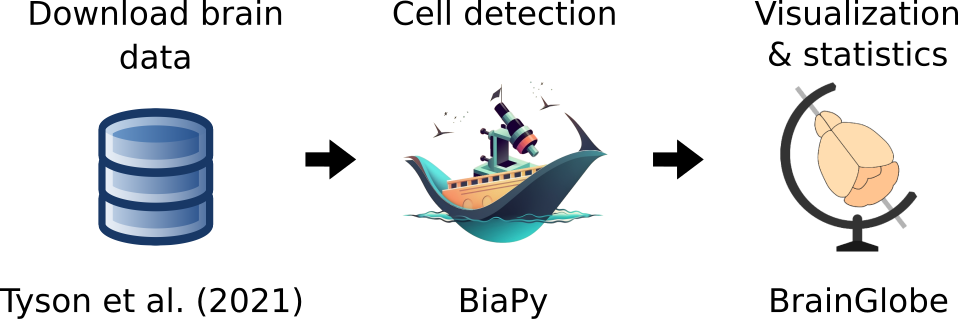

.. _cell_det_brainglobe:

3D cell detection in whole-brain microscopy images
--------------------------------

This tutorial offers a step-by-step guide on detecting cells in large 3D brain images using Zarr. The same method can be used for H5 format images. You will use BiaPy for cell extraction, and `BrainGlobe <https://brainglobe.info/index.html>`__ for visualization, assigning cells to brain regions, and performing statistical analysis. This tutorial not only links **BrainGlobe** and **BiaPy** but also demonstrates how to use large Zarr images without the memory bottleneck that loading all the data into memory might cause.

\

To complete this tutorial, given the large size of the images, it will outline the steps to run BiaPy in a multi-GPU setting via the command line to maximize performance (using `PyTorch’s distributed data-parallel, called *DDP* <https://pytorch.org/tutorials/beginner/ddp_series_theory.html>`__). Additionally, BiaPy includes a special implementation to accelerate the inference process on large Zarr data volumes by using multiple GPUs simultaneously on the same large image. 

This tutorial will be using the data released in *Tyson, Rousseau & Niedworok et al. (2021)* (:cite:p:`tyson2021deep`). First, download the `data <https://gin.g-node.org/cellfinder/manuscript_data/src/master/Zarr_dataset>`__ and unzip it. This dataset is a Zarr version of `the original manuscript dataset <https://gin.g-node.org/cellfinder/manuscript_data/src/master/raw_data>`__. The dataset contains the following:

* ``zarr_brain_train.tar.gz``: training data consisting of one brain sample, in the ``x`` folder, with dimensions ``2550 x 4949 x 3873 x 2`` following ``(z, y, x, channels)`` order (the first and second channels correspond to `ch2 <https://gin.g-node.org/cellfinder/manuscript_data/src/master/raw_data/brain1/ch2.tar.gz>`__ and `ch4 <https://gin.g-node.org/cellfinder/manuscript_data/src/master/raw_data/brain1/ch4.tar.gz>`__ of the original data respectively). In the ``y`` folder, you will find the corresponding ground truth in comma-separated values (CSV) format. The ground truth is a list of central coordinates of the cells to be identified.

* ``zarr_brain_test.tar.gz``: test data consisting of one brain sample with same dimensions and structure as the training data.

.. figure:: ../../img/detection/cell_detection_brainglobe.png
   :align: center                  
   :width: 680px

   Example of the cells to find in the large brain image. 

.. note::

  Here, only one Zarr file is used for both training and testing for simplicity, but multiple Zarr files can be used.

You can find the specific **template** created for this problem `here <https://github.com/BiaPyX/BiaPy/blob/master/templates/detection/3D_cell_detection_zarr_tutorial.yaml>`__. There, you need to update ``DATA.TRAIN.PATH`` and ``DATA.TRAIN.GT_PATH`` with your training data path for EM images and labels, respectively. Similarly, update the paths for the validation data with ``DATA.VAL.PATH`` and ``DATA.VAL.GT_PATH``, and for the test data with ``DATA.TEST.PATH``.

Problem resolution
~~~~~~~~~~~~~~~~~~

Firstly, a **pre-processing** step is done where the list of points of the CSV file is transformed into point mask images. During this process some checks are made to ensure there is not repeated point there. This option is ``True`` by default with ``PROBLEM.DETECTION.CHECK_POINTS_CREATED`` so if any problem is found the point mask of that CSV will not be created until the problem is solved. 

During **training**, the batch will consist of random patches from the training Zarr file. This method ensures that only the patches being processed are loaded into memory, regardless of the image's size. Zarr and H5 file formats help in reading and storing data chunks without needing to load the entire file into memory. During this process, there are some necessary and useful variables worth mentioning:

* ``DATA.TRAIN.INPUT_IMG_AXES_ORDER`` (same applies for its corresponding mask variable, e.g. ``DATA.TRAIN.INPUT_MASK_AXES_ORDER``): necessary to match exactly the order of the axes as they are stored within the Zarr/H5 file(s). 

* ``DATA.TRAIN.MINIMUM_FOREGROUND_PER``: minimum foreground percentage that each image needs to have to avoid being discarded. In these large images, there is a lot of background, so you can use this variable to ensure the model trains only on patches containing cells.

During the **test** phase, BiaPy introduces a novel strategy for multi-GPU inference. Unlike the conventional method of distributing all test images across available GPUs for accelerated processing, BiaPy’s approach is tailored for biological microscopy image data, addressing challenges posed by very large images. More specifically, our method addresses the constraints related to memory and disk space. BiaPy enables multi-GPU processing per image by chunking large images into patches with overlap and padding to mitigate artifacts at the edges. Each GPU processes a chunk of the large image, storing the patch in its designated location within an output file. Consequently, our approach allows the generation of predictions for large images, overcoming potential memory bottlenecks. 

This inference process is enabled with ``TEST.BY_CHUNKS.ENABLE`` . As with training data it is important to set ``TEST.BY_CHUNKS.INPUT_IMG_AXES_ORDER`` correctly so the image can be handled correctly. 

.. figure:: ../../img/detection/zarr_multigpu_trucks.png
  :align: center                  
  :width: 400px

  Funny diagram of how the prediction is made chunk by chunk avoiding the memory bottleneck. Each GPU (truck on the image) processes a batch (blue/yellow cube in the image) at each time. 

Everything mentioned up to this point is common to all workflows offered by BiaPy, so these steps can be applied to any of them. From here, you will have the complete image prediction, and the next steps depend on each workflow. To activate these next steps, you need to enable ``TEST.BY_CHUNKS.WORKFLOW_PROCESS.ENABLE`` and set the variable ``TEST.BY_CHUNKS.WORKFLOW_PROCESS.TYPE`` to one of these options:

* ``'chunk_by_chunk'``: Each chunk will be considered as an individual file. Choose this option if you don't have enough memory to process the entire predicted image with ``'entire_pred'``. This option is only available in the Detection workflow.

* ``'entire_pred'``: The predicted image will be loaded into memory and processed entirely (be mindful of your memory limits).
      
For the Detection workflow, described in this tutorial, the prediction will be analyzed to extract the endpoints using ``'chunk_by_chunk'``. The model output will be an image where each pixel of each channel will have a probability (ranging from ``0-1``) of representing the class for that channel. The image will look something like the picture on the left below:

.. list-table::
  

  * - .. figure:: ../../img/detection_probs.png
         :align: center
         :width: 300px

         Model output.   

    - .. figure:: ../../img/detected_points.png
         :align: center
         :width: 300px

         Final points considered. 

So those probability images, as the left picture above, can be converted into the final points, as the rigth picture above. To do so you can use two possible functions (defined by ``TEST.DET_POINT_CREATION_FUNCTION``):

* ``'peak_local_max'`` (`function <https://scikit-image.org/docs/stable/api/skimage.feature.html#skimage.feature.peak_local_max>`__). 
* ``'blob_log'`` (`function <https://scikit-image.org/docs/stable/api/skimage.feature.html#skimage.feature.blob_log>`__).  

The most important aspect of these options is using the threshold defined by the ``TEST.DET_MIN_TH_TO_BE_PEAK`` variable, which sets the minimum probability for a point to be considered.

Run
~~~

Once you have the YAML configuration file prepared the multi-GPU training of BiaPy can be called as follows:

.. code-block:: bash
    
    # First check where is your biapy command (you need it in the below command)
    # $ which biapy
    # > /home/user/anaconda3/envs/BiaPy_env/bin/biapy

    # Configuration file
    job_cfg_file=/home/user/3d_brain_cell_detection.yaml       
    # Where the experiment output directory should be created
    result_dir=/home/user/exp_results  
    # Just a name for the job
    job_name=3d_brain_cell_detection      
    # Number that should be increased when one need to run the same job multiple times (reproducibility)
    job_counter=1           

    # Load the environment
    conda activate BiaPy_env
    
    gpu_number="0,1,2,3,4,5,6,7"
    python -u -m torch.distributed.run \
        --nproc_per_node=8 \
        /home/user/anaconda3/envs/BiaPy_env/bin/biapy \
        --config $job_cfg_file \
        --result_dir $result_dir  \ 
        --name $job_name    \
        --run_id $job_counter  \
        --gpu "$gpu_number"  

``nproc_per_node`` needs to be equal to the number of GPUs you are using (e.g. ``gpu_number`` length).

Results                                                                                                                 
~~~~~~~  

The results are placed in ``results`` folder under ``--result_dir`` directory with the ``--name`` given. Following the example, you should see that the directory ``/home/user/exp_results/3d_brain_cell_detection`` has been created. 

.. collapse:: Expand directory tree 

    .. code-block:: bash

      3d_brain_cell_detection/
      ├── config_files
      │   └── 3d_brain_cell_detection.yaml                                                                                                           
      ├── checkpoints
      │   └── 3d_brain_cell_detection_1-checkpoint-best.pth
      └── results
          └── 3d_brain_cell_detection_1
              ├── aug
              │   └── .tif files
              ├── charts
              │   ├── 3d_brain_cell_detection_1_jaccard_index.png
              │   └── 3d_brain_cell_detection_1_loss.png
              ├── per_image
              │   └── .zarr files (or.h5)
              ├── per_image_local_max_check
              │   ├── *_points.csv files  
              │   └── *_all_points.csv files
              ├── point_associations
              │   ├── .tif files
              │   └── .csv files  
              ├── train_logs
              └── tensorboard

\

* ``config_files``: directory where the .yaml filed used in the experiment is stored. 

  * ``3d_brain_cell_detection.yaml``: YAML configuration file used.

* ``checkpoints``: directory where model's weights are stored.

  * ``3d_brain_cell_detection_1-checkpoint-best.pth``: checkpoint file (best in validation) where the model's weights are stored among other information.
  
* ``results``: directory where all the generated checks and results will be stored. There, one folder per each run are going to be placed.

  * ``3d_brain_cell_detection_1``: run 1 experiment folder. 

    * ``aug``: image augmentation samples.

    * ``charts``:  

      * ``3d_brain_cell_detection_1_jaccard_index.png``: plot of IoU (jaccard_index) metric used during training.

      * ``3d_brain_cell_detection_1_loss.png``: loss over epochs plot (when training is done). 

    * ``per_image``:

      * ``.zarr files (or.h5)``: reconstructed images from patches.  
      
    * ``per_image_local_max_check``: 

      * ``*_points.csv files``: final point list on each test chunk. 

     * ``*_all_points.csv files``: all points of all chunks together for each test Zarr/H5 sample.

    * ``point_associations``:

      * ``.csv files``: false positives (``_fp``) and ground truth associations (``_gt_assoc``) for each test chunk. 

    * ``train_logs``: each row represents a summary of each epoch stats. Only avaialable if training was done.
        
    * ``tensorboard``: tensorboard logs.

Visualizing the results with Brainglobe                                                                                                                 
~~~~~~~~~~~~~~~~~~~~~~~~~~~~~~~~~~~~~~~

Once the points are detected, you can load the created CSV files into **Brainglobe**. For example, in this tutorial, if you use the sample file ``brain2_ch2ch4.zarr``, the final CSV with all detected cells will be located at ``results/per_image_local_max_check/brain2_ch2ch4_all_points.csv``. Follow the steps in `Brainglobe's tutorial <https://brainglobe.info/tutorials/brainmapper/index.html>`__ to load this file with brainmapper for easy visualization of the results.

   Detected cells can be visualized using Brainglobe's ``brainrender`` tool (Caudi et al., 2021). Credits to Adam L. Tyson (`original image <https://www.researchgate.net/publication/352929222_Mesoscale_microscopy_and_image_analysis_tools_for_understanding_the_brain>`__).

