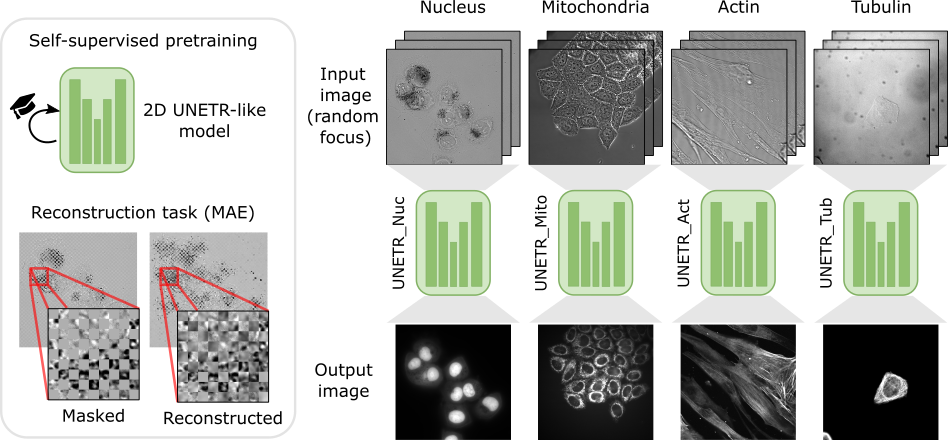
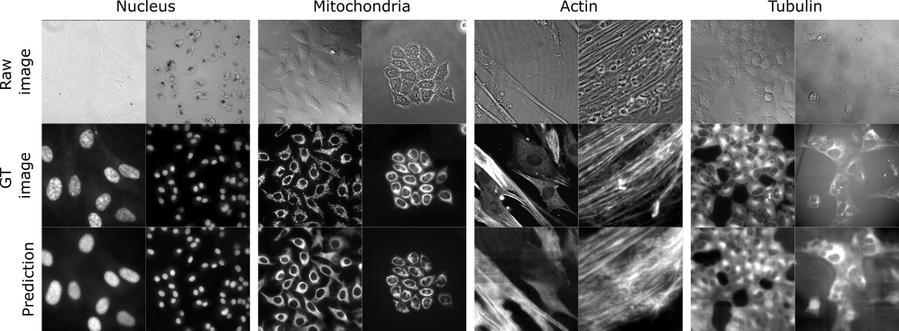

.. _i2i_lightmycell:

(Paper) LightMyCells challenge: self-supervised Vision Transformers for image-to-image labeling
-----------------------------------------------------------------------------------------------

This tutorial aims to reproduce the results reported in the following paper:

.. code-block:: text

  Franco-Barranco, Daniel, et al. "Self-supervised Vision Transformers for image-to-image 
  labeling: a BiaPy solution to the LightMyCells Challenge." 2024 IEEE 21th International 
  Symposium on Biomedical Imaging (ISBI). IEEE, 2024.

In this work, we address the Cell Painting problem within the `LightMyCells challenge at the International Symposium on Biomedical Imaging (ISBI) 2024 <https://lightmycells.grand-challenge.org/>`__, aiming to predict optimally focused fluorescence images from label-free transmitted light inputs. We used the image to image workflow to solve this problem, where the goal is to learn a mapping between an input image and an output image. We leverage four specialized four `UNETR-like <https://arxiv.org/abs/2103.10504>`__ models, each dedicated to predicting a specific organelle, and pretrained in a self-supervised manner using `MAE <https://arxiv.org/abs/2111.06377>`__. 

    Schematic representation of our organelle-specialized 2D UNETR approach. The base model is a modified `UNETR architecture <https://arxiv.org/abs/2103.10504>`__ pretrained using `MAE <https://arxiv.org/abs/2111.06377>`__. Then, four specialized models are fine-tuned independently for identifying specific organelles using an image-to-image workflow with heavy data augmentation.

We refer the reader to our paper (released soon) to check all details of our approach. 

.. _lightmycells_data_prep:

Data preparation
~~~~~~~~~~~~~~~~

LightMyCells challenge data can be downloaded in the `challenge's page <https://lightmycells.grand-challenge.org/>`__ (registration is needed). In our proposed approach we implemented a custom data loader to handle more than one out-of-focus image. To ensure the proper operation of the library the data directory tree should be something like this (here actin training data as example): 

.. collapse:: Expand directory tree 

    .. code-block:: bash
  
      lightmycells_dataset/
      ├── train
      │   ├── x
      │   │   ├── Study_3_BF_image_53_Actin.ome.tiff/
      |   │   |   ├── Study_3_BF_image_53_BF_z0.ome.tiff   
      |   │   |   ├── Study_3_BF_image_53_BF_z1.ome.tiff
      |   │   |   ├── . . .  
      |   │   |   ├── Study_3_BF_image_53_BF_z19.ome.tiff       
      │   │   ├── Study_3_BF_image_54_Actin.ome.tiff/
      |   │   |   ├── Study_3_BF_image_54_BF_z0.ome.tiff    
      │   │   ├── . . .
      │   │   ├── Study_6_PC_image_111_Actin.ome.tiff/
      |   │   |   ├── Study_6_PC_image_111_PC_z0.ome.tiff   
      |   │   |   ├── Study_6_PC_image_111_PC_z1.ome.tiff
      |   │   |   ├── . . .  
      |   │   |   ├── Study_6_PC_image_111_PC_z10.ome.tiff 
      │   └── y
      │       ├── Study_3_BF_image_53_Actin.ome.tiff/
      |       |   └── Study_3_BF_image_53_Actin.ome.tiff          
      │       ├── Study_3_BF_image_54_Actin.ome.tiff/
      |       |   └── Study_3_BF_image_54_Actin.ome.tiff   
      │       ├── . . .
      │       ├── Study_6_PC_image_111_Actin.ome.tiff/
      |       |   └── Study_6_PC_image_111_Actin.ome.tiff  
      └── val
          ├── . . .

\

For the new images you want to predict (test data), you can follow the same directory structure or just put all the images in a directory. You can use the validation folder. 

.. _lightmycells_run:

Run
~~~

For that you need to download the templates of our four specialized models:

- Nucleus `lightmycells_nucleus.yaml <https://github.com/BiaPyX/BiaPy/blob/master/templates/image-to-image/lightmycells_nucleus.yaml>`__  
- Mitochondria `lightmycells_mito.yaml <https://github.com/BiaPyX/BiaPy/blob/master/templates/image-to-image/lightmycells_mito.yaml>`__
- Actin `lightmycells_actin.yaml <https://github.com/BiaPyX/BiaPy/blob/master/templates/image-to-image/lightmycells_actin.yaml>`__
- Tubulin `lightmycells_tubulin.yaml <https://github.com/BiaPyX/BiaPy/blob/master/templates/image-to-image/lightmycells_tubulin.yaml>`__

Then you need to modify ``TRAIN.PATH`` and ``TRAIN.GT_PATH`` with your training data path of EM images and labels respectively. In the same way, do it for the validation data with ``VAL.PATH`` and ``VAL.GT_PATH`` (we use 10% of the training samples as validation). Regarding the test, by setting ``TEST.PATH``, you can use the same validation path. 

Then, you can train by you own those models or you can use directly our checkpoints:

.. tabs::

   .. tab:: Reuse our model

        To use our checkpoints you need to first download them (soon avaialable under `Bioimage Model Zoo <https://bioimage.io/#/>`__):

        - Nucleus `lightmycells_nucleus.pth <https://drive.google.com/file/d/1zcOtPhjpyFd1qU1rYBOwyCuQnoPsx1cJ/view?usp=sharing>`__  
        - Mitochondria `lightmycells_mito.pth <https://drive.google.com/file/d/1WaeUyqIcsNoFE-i_RD9fbfasgFwIwcJI/view?usp=sharing>`__
        - Actin `lightmycells_actin.pth <https://drive.google.com/file/d/1H2bn8xRaimETO90JJ1JYdiv_PrYDlyx4/view?usp=drive_link>`__
        - Tubulin `lightmycells_tubulin.pth <https://drive.google.com/file/d/1WgjMJnxCINPRxaIaYRKewRshKsR50Vwq/view?usp=sharing>`__

        You need to update each setting with the location of each checkpoint so BiaPy can find it (use the ``PATHS.CHECKPOINT_FILE`` variable). For example, for the nucleus, you need to change ``PATHS.CHECKPOINT_FILE`` to the location of your nucleus checkpoint, like this: ``/home/user/Downloads/lightmycells_nucleus.pth``.

        .. tabs::

            .. tab:: Google Colab 

                You can use our notebook prepared for just doing inference: 

                .. |lightmycell_colablink| image:: https://colab.research.google.com/assets/colab-badge.svg
                    :target: https://colab.research.google.com/github/BiaPyX/BiaPy/blob/master/notebooks/BiaPy_Inference.ipynb

                * Inference notebook: |lightmycell_colablink|

            .. tab:: Command line

                These steps assume that you have already installed BiaPy (`instructions here <../../get_started/installation.html>`__). Then, `open a terminal <../../get_started/installation.html>`__ and run the following (here nucleus model is used as example):

                .. code-block:: bash

                    # Clone BiaPy if you don't have it yet 
                    git clone git@github.com:BiaPyX/BiaPy.git 
                    # Move where BiaPy installation resides
                    cd BiaPy
                    # Use an specific commmit until a release with the changes is created 
                    git checkout 60e06ccc27099375c6a6692a6ffbce9308b2aea8

                    # Configuration file
                    job_cfg_file=/home/user/lightmycells_nucleus.yaml       
                    # Where the experiment output directory should be created
                    result_dir=/home/user/exp_results  
                    # Just a name for the job
                    job_name=my_lightmycells_nucleus      
                    # Number that should be increased when one need to run the same job multiple times (reproducibility)
                    job_counter=1
                    # Number of the GPU to run the job in (according to 'nvidia-smi' command)
                    gpu_number=0                   
                    
                    # Load the environment
                    conda activate BiaPy_env

                    python -u main.py \
                        --config $job_cfg_file \
                        --result_dir $result_dir  \ 
                        --name $job_name    \
                        --run_id $job_counter  \
                        --gpu $gpu_number  

            .. tab:: Docker 

                `Open a terminal <../../get_started/faq.html#opening-a-terminal>`__ as described in :ref:`installation` and run the following (here nucleus model is used as example):

                .. code-block:: bash                                                                                                    

                    # Configuration file
                    job_cfg_file=/home/user/lightmycells_nucleus.yaml
                    # Path to the data directory
                    data_dir=/home/user/data
                    # Where the experiment output directory should be created
                    result_dir=/home/user/exp_results
                    # Just a name for the job
                    job_name=my_lightmycells_nucleus
                    # Number that should be increased when one need to run the same job multiple times (reproducibility)
                    job_counter=1
                    # Number of the GPU to run the job in (according to 'nvidia-smi' command)
                    gpu_number=0

                    docker run --rm \
                        --gpus "device=$gpu_number" \
                        --mount type=bind,source=$job_cfg_file,target=$job_cfg_file \
                        --mount type=bind,source=$result_dir,target=$result_dir \
                        --mount type=bind,source=$data_dir,target=$data_dir \
                        BiaPyX/biapy \
                            -cfg $job_cfg_file \
                            -rdir $result_dir \
                            -name $job_name \
                            -rid $job_counter \
                            -gpu $gpu_number

                .. note:: 
                    Note that ``data_dir`` must contain all the paths ``DATA.*.PATH`` and ``DATA.*.GT_PATH`` so the container can find them. For instance, if you want to only train in this example ``DATA.TRAIN.PATH`` and ``DATA.TRAIN.GT_PATH`` could be ``/home/user/data/train/x`` and ``/home/user/data/train/y`` respectively. 

   .. tab:: Train by your own

        The YAML configuration files are prepared for doing test/inferece. For that reason, before using them for training you need to enable it (``TRAIN.ENABLE`` to ``True``) and disable checkpoint loading (``MODEL.LOAD_CHECKPOINT`` to ``True``). After that, you need to `open a terminal <../../get_started/installation.html>`__ as described in :ref:`installation` and run the following (here nucleus model is used as example): 

        .. code-block:: bash

            # Clone BiaPy if you don't have it yet 
            git clone git@github.com:BiaPyX/BiaPy.git 
            # Move where BiaPy installation resides
            cd BiaPy
            # Use an specific commmit until a release with the changes is created 
            git checkout 60e06ccc27099375c6a6692a6ffbce9308b2aea8 

            # Configuration file
            job_cfg_file=/home/user/lightmycells_nucleus.yaml       
            # Where the experiment output directory should be created
            result_dir=/home/user/exp_results  
            # Just a name for the job
            job_name=my_lightmycells_nucleus      
            # Number that should be increased when one need to run the same job multiple times (reproducibility)
            job_counter=1
            # Number of the GPU to run the job in (according to 'nvidia-smi' command)
            gpu_number=0                   

            # Load the environment
            conda activate BiaPy_env
            
            python -u main.py \
                --config $job_cfg_file \
                --result_dir $result_dir  \ 
                --name $job_name    \
                --run_id $job_counter  \
                --gpu $gpu_number  

        In our approach 8 GPUs where used to train nucleus and mitochondria models, while in tubulin and actin we used 4 and 3 GPUs respectively due the amount of data available. For multi-GPU training you can call BiaPy as follows:

        .. code-block:: bash

            gpu_number="0, 1, 2"
            python -u -m torch.distributed.run \
                --nproc_per_node=3 \
                main.py \
                --config $job_cfg_file \
                --result_dir $result_dir  \ 
                --name $job_name    \
                --run_id $job_counter  \
                --gpu $gpu_number  

        ``nproc_per_node`` need to be equal to the number of GPUs you are using (e.g. ``gpu_number`` length).

.. _lightmycells_results:

Results                                                                                                                 
~~~~~~~  

The results are placed in ``results`` folder under ``--result_dir`` directory with the ``--name`` given. All the images are stored in a folder called ``per_image``. You should see there images like the ones depicted below:

   Results on the LightMyCells challenge of our approach. 

