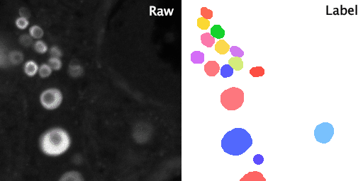

.. _ovarian_reserve_tutorial:

Ovarian Reserve: 3D Instance Segmentation of Oocytes
-----------------------------------------------------

About this tutorial
~~~~~~~~~~~~~~~~~~~

This tutorial explains how to use **BiaPy** for **3D instance segmentation of oocytes** in whole-mount mouse ovaries, based on :cite:`ovarianreserve2025`.

The goal is to make this workflow accessible to all BiaPy users (GUI, notebook, Galaxy, Docker, CLI, or API), even if this is your first time working with 3D instance segmentation.

.. note::

   The pretrained model checkpoint will be published as soon as possible (BioImage Model Zoo and direct PyTorch file).

.. list-table::
  :align: center
  :widths: 50 50

  * - .. figure:: ../../img/tutorials/instance-segmentation/ovarian-reserve/F1.large.jpg
         :align: center
         :figwidth: 300px

         Paper Figure 1 from :cite:`ovarianreserve2025`: SPIM whole-ovary imaging and model-based oocyte segmentation workflow.

    - .. figure:: ../../img/tutorials/instance-segmentation/ovarian-reserve/F2.large.jpg
         :align: center
         :figwidth: 300px

         Paper Figure 2 from :cite:`ovarianreserve2025`: age-resolved ovarian reserve quantification enabled by 3D oocyte segmentation.

Data preparation
~~~~~~~~~~~~~~~~

This tutorial uses two datasets:

* **Inference dataset (Zenodo)**: seven full 3D ovaries (5, 10, 22, 31, 40, 50, and 60 weeks) in TIFF format: `Zenodo link <https://zenodo.org/records/19085211>`__.

  .. collapse:: Expand to see the Zenodo directory structure

     .. code-block::

        raw_ovary/
        ├── w5_134934.tif
        ├── w10_112648.tif
        ├── w22_090202.tif
        ├── w31_084030.tif
        ├── w40_094116.tif
        ├── w50_142422.tif
        └── w60_155112.tif

* **Training dataset (sample)**: ``oocyte_training.zip`` with paired raw/label slices for training or fine-tuning: `Google Drive link <https://drive.google.com/file/d/1xA2b9nY1KuIGC-ZjYg--MXQ8r8GSyOwP/view?usp=sharing>`__.

  .. collapse:: Expand to see the training sample directory structure

     .. code-block::

        oocyte_training/
        ├── raw/
        │   ├── 10W_100330_frame70.tif
        │   ├── 10W_105114_1.tif
        │   ├── ...
        │   └── 5W_150806_frame54.tif
        └── label/
            ├── 10W_100330_frame70.tif
            ├── 10W_105114_1.tif
            ├── ...
            └── 5W_150806_frame54.tif

Training sample preview
************************

The GIF below shows one **raw training sample** and its **matching label** side by side (animation across Z):

   Left: raw DDX4 image stack. Right: corresponding instance-label stack.

Quick start for non-expert users
~~~~~~~~~~~~~~~~~~~~~~~~~~~~~~~~

If you only want to run inference with minimal setup:

#. Download the Zenodo dataset and unzip it.
#. Download the inference YAML file from this tutorial (link below).
#. Edit only two fields in the YAML: ``DATA.TEST.PATH`` and ``PATHS.CHECKPOINT_FILE``.
#. Run BiaPy using your preferred interface (GUI is usually the easiest first option).

Image and data requirements
***************************

* Input images must be **3D TIFF** volumes.
* Typical axis order is ``ZYX`` (single channel).
* Expected physical resolution is approximately ``(5.0, 0.867, 0.867)`` µm in ``(Z, Y, X)``.
* If your data use a different resolution, resampling to this scale is recommended for best results.

Inference configuration
~~~~~~~~~~~~~~~~~~~~~~~

You can download the ready-to-edit YAML file here:

* :download:`ovarian-reserve-inference.yaml <ovarian-reserve-inference.yaml>`

.. collapse:: Expand to preview ovarian-reserve-inference.yaml

   .. literalinclude:: ovarian-reserve-inference.yaml
      :language: yaml

The two mandatory edits are:

* ``DATA.TEST.PATH`` → folder containing your TIFF test volumes.
* ``PATHS.CHECKPOINT_FILE`` → path to the pretrained model checkpoint.

Run inference
~~~~~~~~~~~~~

.. tabs::

   .. tab:: GUI

      #. Open BiaPy GUI (v1.2.2 or newer).
      #. Click ``"Load and modify workflow"`` and select ``ovarian-reserve-inference.yaml``.
      #. Fix invalid paths if prompted (especially ``DATA.TEST.PATH`` and ``PATHS.CHECKPOINT_FILE``).
      #. Choose an output folder and click ``"Run"``.

      .. figure:: ../../img/gui/GUI_load_yaml_generic.png
         :align: center
         :figwidth: 500px

         Load the YAML, verify paths, and run.

   .. tab:: Jupyter/Colab

      #. Open the BiaPy inference notebook `here <https://colab.research.google.com/github/BiaPyX/BiaPy/blob/master/notebooks/BiaPy_Inference.ipynb>`__.
      #. Upload the inference YAML file.
      #. Upload the model checkpoint.
      #. Run the notebook cells.

   .. tab:: Galaxy

      #. Open BiaPy in Galaxy: `launch link <https://imaging.usegalaxy.eu/?tool_id=toolshed.g2.bx.psu.edu%2Frepos%2Fiuc%2Fbiapy%2Fbiapy%2F3.6.5%2Bgalaxy0&version=latest>`__.
      #. Upload your TIFF images, the YAML file, and the model checkpoint.
      #. Select: ``Yes, I already have one and I want to run BiaPy directly``.
      #. Select your config and checkpoint files.
      #. Run the job and download test predictions.

   .. tab:: Docker

      .. code-block:: bash

         job_cfg_file=/home/user/ovarian-reserve-inference.yaml
         data_dir=/home/user/raw_ovary
         result_dir=/home/user/exp_results
         job_name=my_ovarian_reserve_test
         job_counter=1
         gpu_number=0

         docker run --rm \
            --gpus "device=$gpu_number" \
            --mount type=bind,source=$job_cfg_file,target=$job_cfg_file \
            --mount type=bind,source=$result_dir,target=$result_dir \
            --mount type=bind,source=$data_dir,target=$data_dir \
            biapyx/biapy:latest-11.8 \
               biapy \
               --config $job_cfg_file \
               --result_dir $result_dir \
               --name $job_name \
               --run_id $job_counter \
               --gpu "$gpu_number"

   .. tab:: CLI

      .. code-block:: bash

         job_cfg_file=/home/user/ovarian-reserve-inference.yaml
         result_dir=/home/user/exp_results
         job_name=my_ovarian_reserve_test
         job_counter=1
         gpu_number=0

         conda activate BiaPy_env

         biapy \
            --config $job_cfg_file \
            --result_dir $result_dir \
            --name $job_name \
            --run_id $job_counter \
            --gpu "$gpu_number"

   .. tab:: API

      .. code-block:: python

         from biapy import BiaPy

         config_path = "/home/user/ovarian-reserve-inference.yaml"
         result_dir = "/home/user/exp_results"
         job_name = "my_ovarian_reserve_test"

         biapy = BiaPy(config_path, result_dir=result_dir, name=job_name, run_id=1, gpu="0")
         biapy.run_job()

Training or fine-tuning from scratch
~~~~~~~~~~~~~~~~~~~~~~~~~~~~~~~~~~~~

You can train a model using ``oocyte_training.zip`` and test it on the Zenodo 3D volumes.

Download the training YAML file here:

* :download:`ovarian-reserve-training.yaml <ovarian-reserve-training.yaml>`

.. collapse:: Expand to preview ovarian-reserve-training.yaml

   .. literalinclude:: ovarian-reserve-training.yaml
      :language: yaml

Before running training, update at least these paths:

* ``DATA.TRAIN.PATH`` → ``.../oocyte_training/raw/``
* ``DATA.TRAIN.GT_PATH`` → ``.../oocyte_training/label/``
* ``DATA.TEST.PATH`` → ``.../raw_ovary/`` (Zenodo test set)

.. note::

   The test data are TIFF volumes (not Zarr input files). The provided YAML is already configured for TIFF input axis order.

Run training (CLI):

.. code-block:: bash

   job_cfg_file=/home/user/ovarian-reserve-training.yaml
   result_dir=/home/user/exp_results
   job_name=my_ovarian_reserve_training
   job_counter=1
   gpu_number=0

   conda activate BiaPy_env

   biapy \
      --config $job_cfg_file \
      --result_dir $result_dir \
      --name $job_name \
      --run_id $job_counter \
      --gpu "$gpu_number"

Post-analysis scripts
~~~~~~~~~~~~~~~~~~~~~

After segmentation, you can run the analysis scripts from the `Boke-Lab ovarian_reserve repository <https://github.com/Boke-Lab/ovarian_reserve>`__:

* **oocyte density**: quantifies oocytes per volume.
* **radial quantification**: measures the radial spatial distribution of oocytes.

These scripts reproduce the quantitative analyses described in :cite:`ovarianreserve2025`.
