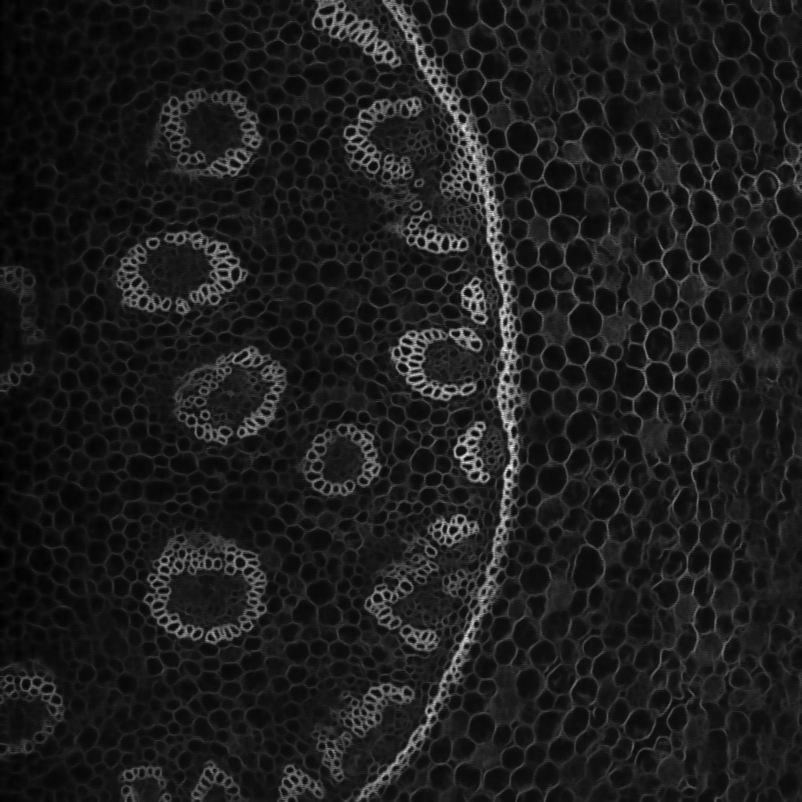

.. _denoising:

Denoising
---------

The goal is to remove noise from an image. Our library includes Noise2Void :cite:p:`krull2019noise2void` using any of the U-Net versions provided. The main advantage of Noise2Void is neither relying on noise image pairs nor clean target images since frequently clean images are simply unavailable.

* **Input:** 
    * Noisy image. 
* **Output:**
    * Image without noise. 

In the figure below an example of this workflow's **input** is depicted:

.. figure:: ../img/denoising_input.png
    :align: center

    Input image. Obtained from Noise2Void project.   

.. _denoising_data_prep:

Data preparation
~~~~~~~~~~~~~~~~

To ensure the proper operation of the library the data directory tree should be something like this: ::

    dataset/
    ├── train
    │   └── x
    │       ├── training-0001.tif
    │       ├── training-0002.tif
    │       ├── . . .
    │       ├── training-9999.tif   
    └── test
        └── x
            ├── testing-0001.tif
            ├── testing-0002.tif
            ├── . . .
            ├── testing-9999.tif

.. _denoising_problem_resolution:

Configuration file
~~~~~~~~~~~~~~~~~~

Find in `templates/denoising <https://github.com/danifranco/BiaPy/tree/master/templates/denoising>`__ folder of BiaPy a few YAML configuration templates for this workflow. 

Special workflow configuration
~~~~~~~~~~~~~~~~~~~~~~~~~~~~~~

Please refer to `Noise2Void <https://arxiv.org/abs/1811.10980>`__  to understand the method functionality. These variables can be set:

    * ``PROBLEM.DENOISING.N2V_PERC_PIX`` controls the percentage of pixels per input patch to be manipulated. This is the ``n2v_perc_pix`` in their code. 

    * ``PROBLEM.DENOISING.N2V_MANIPULATOR`` controls how the pixels will be replaced. This is the ``n2v_manipulator`` in their code. 

    * ``PROBLEM.DENOISING.N2V_NEIGHBORHOOD_RADIUS`` controls the radius of the neighborhood. This is the ``n2v_neighborhood_radius`` in their code. 

    * ``PROBLEM.DENOISING.N2V_STRUCTMASK`` wheter to use `Struct Noise2Void <https://github.com/juglab/n2v/blob/main/examples/2D/structN2V_2D_convallaria/>`__. 

Run
~~~

**Command line**: Open a terminal as described in :ref:`installation`. For instance, using `n2v_2d_denoising.yaml <https://github.com/danifranco/BiaPy/blob/master/templates/denoising/n2v_2d_denoising.yaml>`__ template file, the code can be run as follows:

.. code-block:: bash
    
    # Configuration file
    job_cfg_file=/home/user/n2v_2d_denoising.yaml       
    # Where the experiment output directory should be created
    result_dir=/home/user/exp_results  
    # Just a name for the job
    job_name=n2v_2d_denoising      
    # Number that should be increased when one need to run the same job multiple times (reproducibility)
    job_counter=1
    # Number of the GPU to run the job in (according to 'nvidia-smi' command)
    gpu_number=0                   

    # Move where BiaPy installation resides
    cd BiaPy

    # Load the environment
    conda activate BiaPy_env
    
    python -u main.py \
           --config $job_cfg_file \
           --result_dir $result_dir  \ 
           --name $job_name    \
           --run_id $job_counter  \
           --gpu $gpu_number  

**Docker**: Open a terminal as described in :ref:`installation`. For instance, using `n2v_2d_denoising.yaml <https://github.com/danifranco/BiaPy/blob/master/templates/denoising/n2v_2d_denoising.yaml>`__ template file, the code can be run as follows:

.. code-block:: bash                                                                                                    

    # Configuration file
    job_cfg_file=/home/user/n2v_2d_denoising.yaml
    # Path to the data directory
    data_dir=/home/user/data
    # Where the experiment output directory should be created
    result_dir=/home/user/exp_results
    # Just a name for the job
    job_name=n2v_2d_denoising
    # Number that should be increased when one need to run the same job multiple times (reproducibility)
    job_counter=1
    # Number of the GPU to run the job in (according to 'nvidia-smi' command)
    gpu_number=0

    docker run --rm \
        --gpus "device=$gpu_number" \
        --mount type=bind,source=$job_cfg_file,target=$job_cfg_file \
        --mount type=bind,source=$result_dir,target=$result_dir \
        --mount type=bind,source=$data_dir,target=$data_dir \
        danifranco/biapy \
            -cfg $job_cfg_file \
            -rdir $result_dir \
            -name $job_name \
            -rid $job_counter \
            -gpu $gpu_number

.. note:: 
    Note that ``data_dir`` must contain all the paths ``DATA.*.PATH`` and ``DATA.*.MASK_PATH`` so the container can find them. For instance, if you want to only train in this example ``DATA.TRAIN.PATH`` and ``DATA.TRAIN.MASK_PATH`` could be ``/home/user/data/train/x`` and ``/home/user/data/train/y`` respectively. 

.. _denoising_results:

Results                                                                                                                 
~~~~~~~  

The results are placed in ``results`` folder under ``--result_dir`` directory with the ``--name`` given. An example of this workflow is depicted below:

   Example of denoising model prediction. 

Following the example, you should see that the directory ``/home/user/exp_results/n2v_2d_denoising`` has been created. If the same experiment is run 5 times, varying ``--run_id`` argument only, you should find the following directory tree: ::

    n2v_2d_denoising/
    ├── config_files/
    │   └── n2v_2d_denoising.yaml                                                                                                           
    ├── checkpoints
    |   ├── model_weights_n2v_2d_denoising_1.h5
    |   ├── normalization_mean_value.npy
    │   └── normalization_std_value.npy
    └── results
        ├── n2v_2d_denoising_1
        ├── . . .
        └── n2v_2d_denoising_5
            ├── cell_counter.csv
            ├── aug
            │   └── .tif files
            ├── charts
            │   ├── n2v_2d_denoising_1_n2v_mse.png
            │   ├── n2v_2d_denoising_1_loss.png
            │   └── model_plot_n2v_2d_denoising_1.png
            └── per_image
                └── .tif files

* ``config_files``: directory where the .yaml filed used in the experiment is stored. 

    * ``n2v_2d_denoising.yaml``: YAML configuration file used (it will be overwrited every time the code is run).

* ``checkpoints``: directory where model's weights are stored.

    * ``model_weights_n2v_2d_denoising_1.h5``: model's weights file.

    * ``normalization_mean_value.npy``: normalization mean value. Is saved to not calculate it everytime and to use it in inference.  
    
    * ``normalization_std_value.npy``: normalization std value. Is saved to not calculate it everytime and to use it in inference. 

* ``results``: directory where all the generated checks and results will be stored. There, one folder per each run are going to be placed.

    * ``n2v_2d_denoising_1``: run 1 experiment folder. 

        * ``cell_counter.csv``: file with a counter of detected objects for each test sample.

        * ``aug``: image augmentation samples.

        * ``charts``:  

             * ``n2v_2d_denoising_1_n2v_mse.png``: Noise2Void MSE over epochs plot (when training is done).

             * ``n2v_2d_denoising_1_loss.png``: Loss over epochs plot (when training is done). 

             * ``model_plot_n2v_2d_denoising_1.png``: plot of the model.

        * ``per_image``:

            * ``.tif files``: reconstructed images from patches.  

.. note:: 

  Here, for visualization purposes, only ``n2v_2d_denoising_1`` has been described but ``n2v_2d_denoising_2``, ``n2v_2d_denoising_3``, ``n2v_2d_denoising_4`` and ``n2v_2d_denoising_5`` will follow the same structure.

