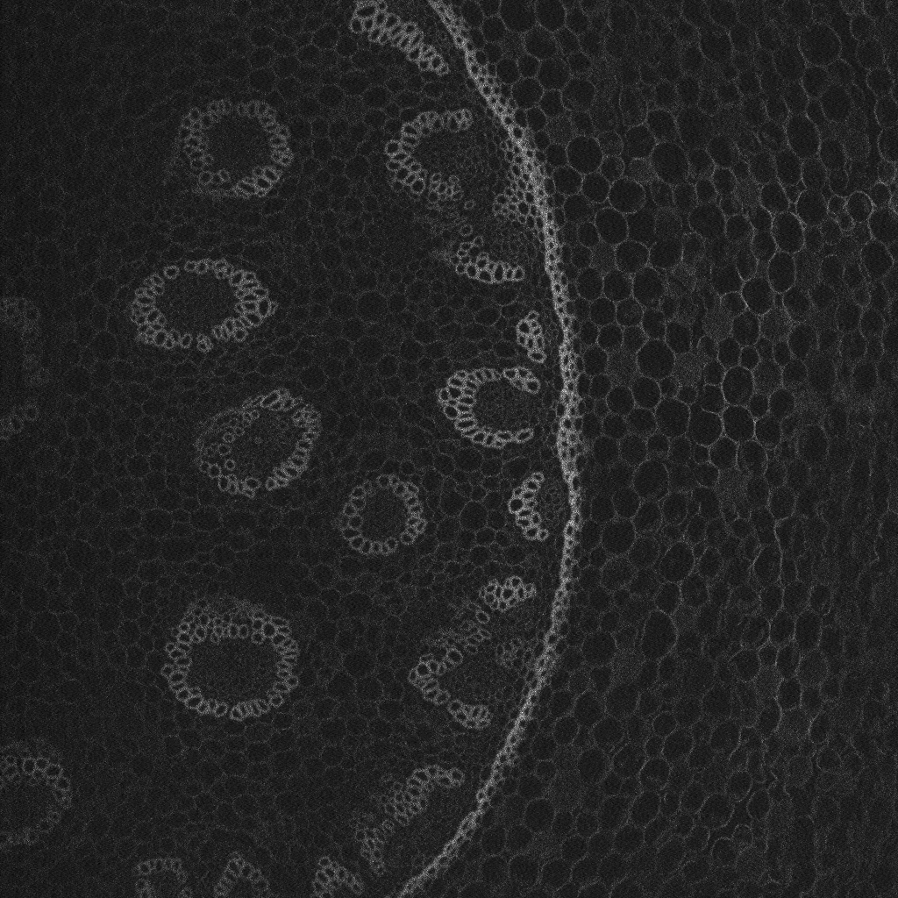

.. _denoising:

Denoising
---------

The goal is to remove noise from an image. Our library includes Noise2Void :cite:p:`krull2019noise2void` using any of the U-Net versions provided. The main advantage of Noise2Void is neither relying on noise image pairs nor clean target images since frequently clean images are simply unavailable.

* **Input:** 
    * Noisy image. 
* **Output:**
    * Image without noise. 

In the figure below an example of this workflow's **input** is depicted:

    Input image. Obtained from Noise2Void project.   

.. _denoising_data_prep:

Data preparation
~~~~~~~~~~~~~~~~

To ensure the proper operation of the library the data directory tree should be something like this: ::

    dataset/
    ├── train
    │   └── x
    │       ├── training-0001.tif
    │       ├── training-0002.tif
    │       ├── . . .
    │       ├── training-9999.tif   
    └── test
        └── x
            ├── testing-0001.tif
            ├── testing-0002.tif
            ├── . . .
            ├── testing-9999.tif

.. _denoising_problem_resolution:

Configuration file
~~~~~~~~~~~~~~~~~~

Find in `templates/denoising <https://github.com/BiaPyX/BiaPy/tree/master/templates/denoising>`__ folder of BiaPy a few YAML configuration templates for this workflow. 

Special workflow configuration
~~~~~~~~~~~~~~~~~~~~~~~~~~~~~~

Please refer to `Noise2Void <https://arxiv.org/abs/1811.10980>`__  to understand the method functionality. These variables can be set:

    * ``PROBLEM.DENOISING.N2V_PERC_PIX`` controls the percentage of pixels per input patch to be manipulated. This is the ``n2v_perc_pix`` in their code. 

    * ``PROBLEM.DENOISING.N2V_MANIPULATOR`` controls how the pixels will be replaced. This is the ``n2v_manipulator`` in their code. 

    * ``PROBLEM.DENOISING.N2V_NEIGHBORHOOD_RADIUS`` controls the radius of the neighborhood. This is the ``n2v_neighborhood_radius`` in their code. 

    * ``PROBLEM.DENOISING.N2V_STRUCTMASK`` whether to use `Struct Noise2Void <https://github.com/juglab/n2v/blob/main/examples/2D/structN2V_2D_convallaria/>`__. 

Run
~~~

.. tabs::

   .. tab:: Command line

        Open a terminal as described in :ref:`installation`. For instance, using `2d_denoising.yaml <https://github.com/BiaPyX/BiaPy/blob/master/templates/denoising/2d_denoising.yaml>`__ template file, the code can be run as follows:

        .. code-block:: bash
            
            # Configuration file
            job_cfg_file=/home/user/2d_denoising.yaml       
            # Where the experiment output directory should be created
            result_dir=/home/user/exp_results  
            # Just a name for the job
            job_name=2d_denoising      
            # Number that should be increased when one need to run the same job multiple times (reproducibility)
            job_counter=1
            # Number of the GPU to run the job in (according to 'nvidia-smi' command)
            gpu_number=0                   

            # Move where BiaPy installation resides
            cd BiaPy

            # Load the environment
            conda activate BiaPy_env
            source $CONDA_PREFIX/etc/conda/activate.d/env_vars.sh
            
            python -u main.py \
                --config $job_cfg_file \
                --result_dir $result_dir  \ 
                --name $job_name    \
                --run_id $job_counter  \
                --gpu $gpu_number  

        For multi-GPU training you can call BiaPy as follows:

        .. code-block:: bash
            
            gpu_number="0, 1, 2"
            python -u -m torch.distributed.run \
                --nproc_per_node=3 \
                main.py \
                --config $job_cfg_file \
                --result_dir $result_dir  \ 
                --name $job_name    \
                --run_id $job_counter  \
                --gpu $gpu_number  

        ``nproc_per_node`` need to be equal to the number of GPUs you are using (e.g. ``gpu_number`` length).

   .. tab:: Docker

        Open a terminal as described in :ref:`installation`. For instance, using `2d_denoising.yaml <https://github.com/BiaPyX/BiaPy/blob/master/templates/denoising/2d_denoising.yaml>`__ template file, the code can be run as follows:

        .. code-block:: bash                                                                                                    

            # Configuration file
            job_cfg_file=/home/user/2d_denoising.yaml
            # Path to the data directory
            data_dir=/home/user/data
            # Where the experiment output directory should be created
            result_dir=/home/user/exp_results
            # Just a name for the job
            job_name=my_2d_denoising
            # Number that should be increased when one need to run the same job multiple times (reproducibility)
            job_counter=1
            # Number of the GPU to run the job in (according to 'nvidia-smi' command)
            gpu_number=0

            docker run --rm \
                --gpus "device=$gpu_number" \
                --mount type=bind,source=$job_cfg_file,target=$job_cfg_file \
                --mount type=bind,source=$result_dir,target=$result_dir \
                --mount type=bind,source=$data_dir,target=$data_dir \
                BiaPyX/biapy \
                    -cfg $job_cfg_file \
                    -rdir $result_dir \
                    -name $job_name \
                    -rid $job_counter \
                    -gpu $gpu_number

        .. note:: 
            Note that ``data_dir`` must contain all the paths ``DATA.*.PATH`` and ``DATA.*.GT_PATH`` so the container can find them. For instance, if you want to only train in this example ``DATA.TRAIN.PATH`` and ``DATA.TRAIN.GT_PATH`` could be ``/home/user/data/train/x`` and ``/home/user/data/train/y`` respectively. 

   .. tab:: Google Colab

        Two different options depending on the image dimension: 

        .. |denoising_2D_colablink| image:: https://colab.research.google.com/assets/colab-badge.svg
            :target: https://colab.research.google.com/github/BiaPyX/BiaPy/blob/master/notebooks/denoising/BiaPy_2D_Denoising.ipynb

        .. |denoising_3D_colablink| image:: https://colab.research.google.com/assets/colab-badge.svg
            :target: https://colab.research.google.com/github/BiaPyX/BiaPy/blob/master/notebooks/denoising/BiaPy_3D_Denoising.ipynb

        * 2D: |denoising_2D_colablink|

        * 3D: |denoising_3D_colablink|

.. _denoising_results:

Results                                                                                                                 
~~~~~~~  

The results are placed in ``results`` folder under ``--result_dir`` directory with the ``--name`` given. An example of this workflow is depicted below:

.. figure:: ../img/denosing_overview.svg
   :align: center                  

   Example of denoising model prediction. 

Following the example, you should see that the directory ``/home/user/exp_results/my_2d_denoising`` has been created. If the same experiment is run 5 times, varying ``--run_id`` argument only, you should find the following directory tree: ::

    my_2d_denoising/
    ├── config_files/
    │   └── my_2d_denoising.yaml                                                                                                           
    ├── checkpoints
    |   ├── my_2d_denoising_1-checkpoint-best.pth
    |   ├── normalization_mean_value.npy
    │   └── normalization_std_value.npy
    └── results
        ├── my_2d_denoising
        ├── . . .
        └── my_2d_denoising
            ├── cell_counter.csv
            ├── aug
            │   └── .tif files
            ├── charts
            │   ├── my_2d_denoising_1_n2v_mse.png
            │   ├── my_2d_denoising_1_loss.png
            │   └── model_plot_my_2d_denoising_1.png
            ├── per_image
            │   └── .tif files
            ├── train_logs
            └── tensorboard

* ``config_files``: directory where the .yaml filed used in the experiment is stored. 

    * ``my_2d_denoising.yaml``: YAML configuration file used (it will be overwrited every time the code is run).

* ``checkpoints``: directory where model's weights are stored.

    * ``my_2d_denoising_1-checkpoint-best.pth``: checkpoint file (best in validation) where the model's weights are stored among other information.

    * ``normalization_mean_value.npy``: normalization mean value (only created if ``DATA.NORMALIZATION.TYPE`` is ``custom``). Is saved to not calculate it everytime and to use it in inference.  
    
    * ``normalization_std_value.npy``: normalization std value (only created if ``DATA.NORMALIZATION.TYPE`` is ``custom``). Is saved to not calculate it everytime and to use it in inference. 

* ``results``: directory where all the generated checks and results will be stored. There, one folder per each run are going to be placed.

    * ``my_2d_denoising_1``: run 1 experiment folder. 

        * ``cell_counter.csv``: file with a counter of detected objects for each test sample.

        * ``aug``: image augmentation samples.

        * ``charts``:  

             * ``my_2d_denoising_1_*.png``: Plot of each metric used during training.

             * ``my_2d_denoising_1_loss.png``: Loss over epochs plot (when training is done). 

             * ``model_plot_my_2d_denoising_1.png``: plot of the model.

        * ``per_image``:

            * ``.tif files``: reconstructed images from patches.  

* ``train_logs``: each row represents a summary of each epoch stats. Only avaialable if training was done.

* ``tensorboard``: Tensorboard logs.

.. note:: 

  Here, for visualization purposes, only ``my_2d_denoising_1`` has been described but ``my_2d_denoising_2``, ``my_2d_denoising_3``, ``my_2d_denoising_4`` and ``my_2d_denoising_5`` will follow the same structure.

