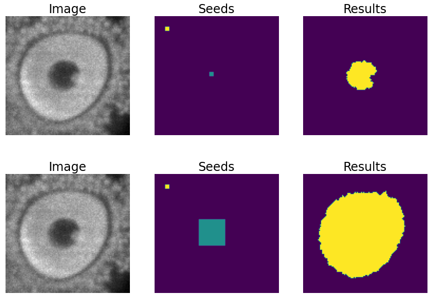

.. _detection:

Object Detection
----------------

Description of the task
~~~~~~~~~~~~~~~~~~~~~~~

The goal of this workflow is to **localize objects** in the input image, not requiring a pixel-level class. Common strategies produce either bounding boxes containing the objects or **individual points** at their center of mass :cite:p:`zhou2019objects`, which is the one adopted by BiaPy.

An example of this task is displayed in the figure below, with a fluorescence microscopy image used as input (left) and its corresponding nuclei detection results (rigth). Each red dot in the right image corresponds to a unique predicted object.

.. role:: raw-html(raw)
    :format: html

.. list-table::
  :align: center
  :widths: 50 50
  
  * - .. figure:: ../img/detection/nuclei.png
         :align: center
         :figwidth: 300px

         Input image (fluorescence microscopy, :raw-html:` ` by `Jukkala & Jacquemet <https://zenodo.org/records/3715492#.Y4m7FjPMJH6>`_).

    - .. figure:: ../img/detection/detected-nuclei.png
         :align: center
         :figwidth: 300px

         Detected nuclei represented with red dots :raw-html:` ` overlaying the original input image.

Inputs and outputs
~~~~~~~~~~~~~~~~~~
The detection workflows in BiaPy expect a series of **folders** as input:

* **Training Raw Images**: A folder that contains the unprocessed (single-channel or multi-channel) images that will be used to train the model.
  
  .. collapse:: Expand to see how to configure

    .. tabs::
      .. tab:: GUI

        Under *Workflow*, select *Object detection*, twice *Continue*, under *General options* > *Train data*, click on the *Browse* button of **Input raw image folder**:

        .. image:: ../img/detection/GUI-train-data.png
          :align: center

      .. tab:: Google Colab / Notebooks
        
        In either the 2D or the 3D detection notebook, go to *Paths for Input Images and Output Files*, edit the field **train_data_path**:
        
        .. image:: ../img/detection/Notebooks-Inputs-Outputs.png
          :align: center
          :width: 85%

      .. tab:: YAML configuration file
        
        Edit the variable ``DATA.TRAIN.PATH`` with the absolute path to the folder with your training raw images.

* **Training CSV files**: A folder that contains the CSV files for training, providing the coordinates of the center of each object of interest. The number of these files should align with the number of training raw images.
  
  .. collapse:: Expand to see how to configure

    .. tabs::
      .. tab:: GUI

        Under *Workflow*, select *Object detection*, twice *Continue*, under *General options* > *Train data*, click on the *Browse* button of **Input CSV folder**:

        .. image:: ../img/detection/GUI-train-data.png
          :align: center

      .. tab:: Google Colab / Notebooks
        
        In either the 2D or the 3D detection notebook, go to *Paths for Input Images and Output Files*, edit the field **train_csv_path**:
        
        .. image:: ../img/detection/Notebooks-Inputs-Outputs.png
          :align: center
          :width: 85%

      .. tab:: YAML configuration file
        
        Edit the variable ``DATA.TRAIN.GT_PATH`` with the absolute path to the folder with your training CSV files.

* .. raw:: html

      <b>[Optional] Test Raw Images</b>: A folder that contains the images to evaluate the model's performance.
 
  .. collapse:: Expand to see how to configure

    .. tabs::
      .. tab:: GUI

        Under *Workflow*, select *Object detection*, three times *Continue*, under *General options* > *Test data*, click on the *Browse* button of **Input raw image folder**:

        .. image:: ../img/detection/GUI-test-data.png
          :align: center

      .. tab:: Google Colab / Notebooks
        
        In either the 2D or the 3D detection notebook, go to *Paths for Input Images and Output Files*, edit the field **test_data_path**:
        
        .. image:: ../img/detection/Notebooks-Inputs-Outputs.png
          :align: center
          :width: 85%

      .. tab:: YAML configuration file
        
        Edit the variable ``DATA.TEST.PATH`` with the absolute path to the folder with your test raw images.

* .. raw:: html

      <b>[Optional] Test CSV files</b>: A folder that contains the CSV files with the center of the objects for testing. Again, ensure their count aligns with that of the test raw images.

  .. collapse:: Expand to see how to configure

    .. tabs::
      .. tab:: GUI

        Under *Workflow*, select *Object detection*, three times *Continue*, under *General options* > *Test data*, select "Yes" in the *Do you have CSV files for test data?* field, and then click on the *Browse* button of **Input CSV folder**:

        .. image:: ../img/detection/GUI-test-data-gt.png
          :align: center

      .. tab:: Google Colab / Notebooks
        
        In either the 2D or the 3D detection notebook, go to *Paths for Input Images and Output Files*, edit the field **test_csv_path**:
        
        .. image:: ../img/detection/Notebooks-Inputs-Outputs.png
          :align: center
          :width: 85%

      .. tab:: YAML configuration file
        
        Edit the variable ``DATA.TEST.GT_PATH`` with the absolute path to the folder with your test CSV files.

Upon successful execution, a directory will be generated with the detection results. Therefore, you will need to define:

* **Output Folder**: A designated path to save the detection outcomes.

  .. collapse:: Expand to see how to configure

    .. tabs::
      .. tab:: GUI

        Under *Run Workflow*, click on the *Browse* button of **Output folder to save the results**:

        .. image:: ../img/detection/GUI-run-workflow.png
          :align: center

      .. tab:: Google Colab / Notebooks
        
        In either the 2D or the 3D detection notebook, go to *Paths for Input Images and Output Files*, edit the field **output_path**:
        
        .. image:: ../img/detection/Notebooks-Inputs-Outputs.png
          :align: center
          :width: 75%

      .. tab:: Command line
        
        When calling BiaPy from command line, you can specify the output folder with the ``--result_dir`` flag. See the *Command line* configuration of :ref:`detection_data_run` for a full example.

.. list-table::
  :align: center

  * - .. figure:: ../img/Inputs-outputs.svg
         :align: center
         :width: 500
         :alt: Graphical description of minimal inputs and outputs in BiaPy for detection.
        
         **BiaPy input and output folders for detection.** The label folders in this case :raw-html:` ` contain the CSV files with the center coordinates of each object of interest.
  

.. note:: All comma-separated values (CSV) files used in the detection workflow follow the `napari point format <https://napari.org/stable/howtos/layers/points.html>`_, so those annotations files can be easily exported from and imported to napari. Here you have an example of the beginning of such file with the 2D coordinates of the objects of interest of its corresponding input image:

  .. collapse:: Expand to visualize file

    .. code-block:: text

      index,axis-0,axis-1
      0,5,149
      1,6,491
      2,8,655
      3,4,890
      4,3,957
      5,16,791
      6,33,993
      7,43,894
      8,50,564
      9,53,538
      10,64,151
      11,64,318
      12,68,937
      13,74,466
      14,84,789
      15,88,408
      

.. _detection_data_prep:

Data structure
~~~~~~~~~~~~~~

To ensure the proper operation of the library, the data directory tree should be something like this: 

.. code-block:: 
    
  dataset/
  ├── train
  │   ├── x
  │   │   ├── training-0001.tif
  │   │   ├── training-0002.tif
  │   │   ├── . . .
  │   │   ├── training-9999.tif
  │   └── y
  │       ├── training-0001.csv
  │       ├── training-0002.csv
  │       ├── . . .
  │       ├── training-9999.csv
  └── test
      ├── x
      │   ├── testing-0001.tif
      │   ├── testing-0002.tif
      │   ├── . . .
      │   ├── testing-9999.tif
      └── y
          ├── testing-0001.csv
          ├── testing-0002.csv
          ├── . . .
          ├── testing-9999.csv

In this example, the raw training images are under ``dataset/train/x/`` and their corresponding CSV files are under ``dataset/train/y/``, while the raw test images are under ``dataset/test/x/`` and their corresponding CSV files are under ``dataset/test/y/``. **This is just an example**, you can name your folders as you wish as long as you set the paths correctly later.

.. note:: In this workflow the name of each input file (with extension **.tif** in the example above) and its corresponding CSV file must be the same. 

Minimal configuration
~~~~~~~~~~~~~~~~~~~~~
Apart from the input and output folders, there are a few basic parameters that always need to be specified in order to run an detection workflow in BiaPy. **These parameters can be introduced either directly in the GUI, the code-free notebooks or by editing the YAML configuration file**.

Experiment name
***************
Also known as "model name" or "job name", this will be the name of the current experiment you want to run, so it can be differenciated from other past and future experiments.

.. collapse:: Expand to see how to configure

    .. tabs::
      .. tab:: GUI

        Under *Run Workflow*, type the name you want for the job in the **Job name** field:

        .. image:: ../img/detection/GUI-run-workflow.png
          :align: center

      .. tab:: Google Colab / Notebooks
        
        In either the 2D or the 3D detection notebook, go to *Configure and train the DNN model* > *Select your parameters*, and edit the field **model_name**:
        
        .. image:: ../img/detection/Notebooks-model-name-data-conf.png
          :align: center
          :width: 65%

      .. tab:: Command line
        
        When calling BiaPy from command line, you can specify the output folder with the ``--name`` flag. See the *Command line* configuration of :ref:`detection_data_run` for a full example.

\

.. note:: Use only *my_model* -style, not *my-model* (Use "_" not "-"). Do not use spaces in the name. Avoid using the name of an existing experiment/model/job (saved in the same result folder) as it will be overwritten.

Data management
***************
Validation Set
""""""""""""""
With the goal to monitor the training process, it is common to use a third dataset called the "Validation Set". This is a subset of the whole dataset that is used to evaluate the model's performance and optimize training parameters. This subset will not be directly used for training the model, and thus, when applying the model to these images, we can see if the model is learning the training set's patterns too specifically or if it is generalizing properly.

.. list-table::
  :align: center

  * - .. figure:: ../img/data-partitions.png
         :align: center
         :width: 400
         :alt: Graphical description of data partitions in BiaPy
        
         **Graphical description of data partitions in BiaPy.**

To define such set, there are two options:
  
* **Validation percentage**: Select a percentage of your training dataset to be used to validate the network during the training. Usual values are 10% or 20%, and the samples of that set will be selected at random.
  
  .. collapse:: Expand to see how to configure

      .. tabs::
        .. tab:: GUI

          Under *Workflow*, select *Object detection*, click twice on *Continue*, and under *General options* > *Validation data*, select "Extract from train (split training)" in **Validation type**, and introduce your value in the **Train percentage for validation**:

          .. image:: ../img/GUI-validation-percentage.png
            :align: center

        .. tab:: Google Colab / Notebooks
          
          In either the 2D or the 3D detection notebook, go to *Configure and train the DNN model* > *Select your parameters*, and edit the field **percentage_validation**:
          
          .. image:: ../img/detection/Notebooks-model-name-data-conf.png
            :align: center
            :width: 65%

        .. tab:: YAML configuration file
        
          Edit the variable ``DATA.VAL.SPLIT_TRAIN`` with a value between 0 and 1, representing the proportion of the training set that will be set apart for validation.

* **Validation paths**: Similar to the training and test sets, you can select two folders with the validation raw and label images:

  * **Validation Raw Images**: A folder that contains the unprocessed (single-channel or multi-channel) images that will be used to select the best model during training.
  
    .. collapse:: Expand to see how to configure

      .. tabs::
        .. tab:: GUI

          Under *Workflow*, select *Object detection*, click twice on *Continue*, and under *General options* > *Validation data*, select "Not extracted from train (path needed)" in **Validation type**, click on the *Browse* button of **Input raw image folder** and select the folder containing your validation raw images:

          .. image:: ../img/detection/GUI-validation-paths.png
            :align: center

        .. tab:: Google Colab / Notebooks
          
          This option is currently not available in the notebooks.

        .. tab:: YAML configuration file
        
          Edit the variable ``DATA.VAL.PATH`` with the absolute path to your validation raw images.

  * **Validation CSV files**: A folder that contains the CSV files for validation.
  
    .. collapse:: Expand to see how to configure

      .. tabs::
        .. tab:: GUI

          Under *Workflow*, select *Object detection*, click twice on *Continue*, and under *General options* > *Validation data*, select "Not extracted from train (path needed)" in **Validation type**, click on the *Browse* button of **Input CSV folder** and select the folder containing your validation label images:

          .. image:: ../img/detection/GUI-validation-paths.png
            :align: center

        .. tab:: Google Colab / Notebooks
          
          This option is currently not available in the notebooks.

        .. tab:: YAML configuration file
        
          Edit the variable ``DATA.VAL.GT_PATH`` with the absolute path to your validation CSV files.

      .. note:: Remember the number and names of the validation raw images must much those of the validation CSV files.

Test ground-truth
"""""""""""""""""
Do you have annotations (CSV files with the object coordinates) for the test set? This is a key question so BiaPy knows if your test set will be used for evaluation in new data (unseen during training) or simply produce predictions on that new data. All workflows contain a parameter to specify this aspect.

.. collapse:: Expand to see how to configure

  .. tabs::
    .. tab:: GUI

      Under *Workflow*, select *Object detection*, three times *Continue*, under *General options* > *Test data*, select "Yes" in the **Do you have CSV files for test data?** field:

      .. image:: ../img/detection/GUI-test-data.png
        :align: center

    .. tab:: Google Colab / Notebooks
      
      In either the 2D or the 3D detection notebook, go to *Configure and train the DNN model* > *Select your parameters*, and select the **test_ground_truth** option:
      
      .. image:: ../img/detection/Notebooks-model-name-data-conf.png
        :align: center
        :width: 50%

    .. tab:: YAML configuration file
      
      Set the variable ``DATA.TEST.LOAD_GT`` to ``True``.

\

Basic training parameters
*************************
At the core of each BiaPy workflow there is a deep learning model. Although we try to simplify the number of parameters to tune, these are the basic parameters that need to be defined for training an object detection workflow:

* **Number of input channels**: The number of channels of your raw images (grayscale = 1, RGB = 3). Notice the dimensionality of your images (2D/3D) is set by default depending on the workflow template you select.
  
  .. collapse:: Expand to see how to configure

        .. tabs::
          .. tab:: GUI

            Under *Workflow*, select *Object detection*, click twice on *Continue*, and under *General options*, scroll down to *Advanced options*, and edit the last value of the field **Patch size** with the number of channels. This variable follows a ``(y, x, channels)`` notation in 2D and a ``(z, y, x, channels)`` notation in 3D:

            .. image:: ../img/GUI-advanced-options.png
              :align: center
              :width: 75%

          .. tab:: Google Colab / Notebooks
            
            In either the 2D or the 3D detection notebook, go to *Configure and train the DNN model* > *Select your parameters*, and edit the field **input_channels**:
            
            .. image:: ../img/detection/Notebooks-basic-training-params.png
              :align: center
              :width: 50%

          .. tab:: YAML configuration file
          
            Edit the last value of the variable ``DATA.PATCH_SIZE`` with the number of channels. This variable follows a ``(y, x, channels)`` notation in 2D and a ``(z, y, x, channels)`` notation in 3D.

* **Number of epochs**: This number indicates how many `rounds <https://machine-learning.paperspace.com/wiki/epoch>`_ the network will be trained. On each round, the network usually sees the full training set. The value of this parameter depends on the size and complexity of each dataset. You can start with something like 100 epochs and tune it depending on how fast the loss (error) is reduced.
  
  .. collapse:: Expand to see how to configure

        .. tabs::
          .. tab:: GUI

            Under *Workflow*, select *Object detection*, click twice on *Continue*, and under *General options*, scroll down to *Basic training parameters*, and edit the field **Number of epochs**:

            .. image:: ../img/GUI-basic-training-params.png
              :align: center
              :width: 75%

          .. tab:: Google Colab / Notebooks
            
            In either the 2D or the 3D detection notebook, go to *Configure and train the DNN model* > *Select your parameters*, and edit the field **number_of_epochs**:
            
            .. image:: ../img/detection/Notebooks-basic-training-params.png
              :align: center
              :width: 50%

          .. tab:: YAML configuration file
          
            Edit the last value of the variable ``TRAIN.EPOCHS`` with the number of epochs. For this to have effect, the variable ``TRAIN.ENABLE`` should also be set to ``True``.

* **Patience**: This is a number that indicates how many epochs you want to wait without the model improving its results in the validation set to stop training. Again, this value depends on the data you're working on, but you can start with something like 20.
   
  .. collapse:: Expand to see how to configure

        .. tabs::
          .. tab:: GUI

            Under *Workflow*, select *Object detection*, click twice on *Continue*, and under *General options*, scroll down to *Basic training parameters*, and edit the field **Patience**:

            .. image:: ../img/GUI-basic-training-params.png
              :align: center
              :width: 75%

          .. tab:: Google Colab / Notebooks
            
            In either the 2D or the 3D detection notebook, go to *Configure and train the DNN model* > *Select your parameters*, and edit the field **patience**:
            
            .. image:: ../img/detection/Notebooks-basic-training-params.png
              :align: center
              :width: 50%

          .. tab:: YAML configuration file
          
            Edit the last value of the variable ``TRAIN.PATIENCE`` with the number of epochs. For this to have effect, the variable ``TRAIN.ENABLE`` should also be set to ``True``.

For improving performance, other advanced parameters can be optimized, for example, the model's architecture. The architecture assigned as default is the Residual U-Net, as it is effective in object detection tasks. This architecture allows a strong baseline, but further exploration could potentially lead to better results.

.. note:: Once the parameters are correctly assigned, the training phase can be executed. Note that to train large models effectively the use of a GPU (Graphics Processing Unit) is essential. This hardware accelerator performs parallel computations and has larger RAM memory compared to the CPUs, which enables faster training times.

.. _detection_data_run:

How to run
~~~~~~~~~~
BiaPy offers different options to run workflows depending on your degree of computer expertise. Select whichever is more approppriate for you:

.. tabs::
   .. tab:: GUI

        In the GUI of BiaPy, under *Workflow*, select *Object Detection* and follow the instructions displayed there:

        .. image:: ../img/gui/biapy_gui_detection.png
            :align: center 

   .. tab:: Google Colab
        
        BiaPy offers two code-free notebooks in Google Colab to perform object detection:

        .. |detection_2D_colablink| image:: https://colab.research.google.com/assets/colab-badge.svg
            :target: https://colab.research.google.com/github/BiaPyX/BiaPy/blob/master/notebooks/detection/BiaPy_2D_Detection.ipynb

        * For 2D images: |detection_2D_colablink|

        .. |detection_3D_colablink| image:: https://colab.research.google.com/assets/colab-badge.svg
            :target: https://colab.research.google.com/github/BiaPyX/BiaPy/blob/master/notebooks/detection/BiaPy_3D_Detection.ipynb

        * For 3D images: |detection_3D_colablink|

   .. tab:: Docker 

        If you installed BiaPy via Docker, `open a terminal <../get_started/faq.html#opening-a-terminal>`__ as described in :ref:`installation`. . Then, you can use for instance the `2d_detection.yaml <https://github.com/BiaPyX/BiaPy/blob/master/templates/detection/2d_detection.yaml>`__ template file (or your own YAML configuration file), and run the workflow as follows:

        .. code-block:: bash                                                                                                    

            # Configuration file
            job_cfg_file=/home/user/2d_detection.yaml
            # Path to the data directory
            data_dir=/home/user/data
            # Where the experiment output directory should be created
            result_dir=/home/user/exp_results
            # Just a name for the job
            job_name=my_2d_detection
            # Number that should be increased when one need to run the same job multiple times (reproducibility)
            job_counter=1
            # Number of the GPU to run the job in (according to 'nvidia-smi' command)
            gpu_number=0

            docker run --rm \
                --gpus "device=$gpu_number" \
                --mount type=bind,source=$job_cfg_file,target=$job_cfg_file \
                --mount type=bind,source=$result_dir,target=$result_dir \
                --mount type=bind,source=$data_dir,target=$data_dir \
                BiaPyX/biapy \
                    -cfg $job_cfg_file \
                    -rdir $result_dir \
                    -name $job_name \
                    -rid $job_counter \
                    -gpu "$gpu_number"

        .. note:: 
            Note that ``data_dir`` must contain all the paths ``DATA.*.PATH`` and ``DATA.*.GT_PATH`` so the container can find them. For instance, if you want to only train in this example ``DATA.TRAIN.PATH`` and ``DATA.TRAIN.GT_PATH`` could be ``/home/user/data/train/x`` and ``/home/user/data/train/y`` respectively. 

   .. tab:: Command line

        `From a terminal <../get_started/faq.html#opening-a-terminal>`__, you can use for instance the `2d_detection.yaml <https://github.com/BiaPyX/BiaPy/blob/master/templates/detection/2d_detection.yaml>`__ template file (or your own YAML configuration file), and run the workflow as follows:

        .. code-block:: bash
            
            # Configuration file
            job_cfg_file=/home/user/2d_detection.yaml       
            # Where the experiment output directory should be created
            result_dir=/home/user/exp_results  
            # Just a name for the job
            job_name=my_2d_detection      
            # Number that should be increased when one need to run the same job multiple times (reproducibility)
            job_counter=1
            # Number of the GPU to run the job in (according to 'nvidia-smi' command)
            gpu_number=0                   

            # Load the environment
            conda activate BiaPy_env
            
            biapy \
                --config $job_cfg_file \
                --result_dir $result_dir  \ 
                --name $job_name    \
                --run_id $job_counter  \
                --gpu "$gpu_number"  

        For multi-GPU training you can call BiaPy as follows:

        .. code-block:: bash
            
            # First check where is your biapy command (you need it in the below command)
            # $ which biapy
            # > /home/user/anaconda3/envs/BiaPy_env/bin/biapy

            gpu_number="0, 1, 2"
            python -u -m torch.distributed.run \
                --nproc_per_node=3 \
                /home/user/anaconda3/envs/BiaPy_env/bin/biapy \
                --config $job_cfg_file \
                --result_dir $result_dir  \ 
                --name $job_name    \
                --run_id $job_counter  \
                --gpu "$gpu_number"  

        ``nproc_per_node`` needs to be equal to the number of GPUs you are using (e.g. ``gpu_number`` length).

Templates                                                                                                                 
~~~~~~~~~~

In the `templates/detection <https://github.com/BiaPyX/BiaPy/tree/master/templates/detection>`__ folder of BiaPy, you will find a few YAML configuration templates for this workflow. 

[Advanced] Special workflow configuration
~~~~~~~~~~~~~~~~~~~~~~~~~~~~~~~~~~~~~~~~~

.. note:: This section is recommended for experienced users only to improve the performance of their workflows. When in doubt, do not hesitate to check our `FAQ & Troubleshooting <../get_started/faq.html>`__ or open a question in the `image.sc discussion forum <our FAQ & Troubleshooting section>`_.

Advanced Parameters 
*******************
Many of the parameters of our workflows are set by default to values that work commonly well. However, it may be needed to tune them to improve the results of the workflow. For instance, you may modify the following parameters

* **Model architecture**: Select the architecture of the deep neural network used as backbone of the pipeline. Options: U-Net, Residual U-Net, Attention U-Net, SEUNet, MultiResUNet, ResUNet++, UNETR-Mini, UNETR-Small and UNETR-Base. Default value: Residual U-Net.
* **Batch size**: This parameter defines the number of patches seen in each training step. Reducing or increasing the batch size may slow or speed up your training, respectively, and can influence network performance. Common values are 4, 8, 16, etc.
* **Patch size**: Input the size of the patches use to train your model (length in pixels in X and Y). The value should be smaller or equal to the dimensions of the image. The default value is 256 in 2D, i.e. 256x256 pixels.
* **Optimizer**: Select the optimizer used to train your model. Options: ADAM, ADAMW, Stochastic Gradient Descent (SGD). ADAM usually converges faster, while ADAMW provides a balance between fast convergence and better handling of weight decay regularization. SGD is known for better generalization. Default value: ADAMW.
* **Initial learning rate**: Input the initial value to be used as learning rate. If you select ADAM as optimizer, this value should be around 10e-4. 
* **Learning rate scheduler**: Select to adjust the learning rate between epochs. The current options are "Reduce on plateau", "One cycle", "Warm-up cosine decay" or no scheduler.
* **Test time augmentation (TTA)**: Select to apply augmentation (flips and rotations) at test time. It usually provides more robust results but uses more time to produce each result. By default, no TTA is peformed.

Problem resolution
******************

In the detection workflows, a **pre-processing** step is performed where the list of points of the ``.csv`` file is transformed into point mask images. During this process some checks are made to ensure there is not repeated point in the ``.csv``. This option is ``True`` by default with ``PROBLEM.DETECTION.CHECK_POINTS_CREATED`` so if any problem is found the point mask of that ``.csv`` will not be created until the problem is solve. 

After the train phase, the model output will be an image where each pixel of each channel will have the probability (in ``[0-1]`` range) of being of the class that represents that channel. The image would be something similar to the left picture below:

.. list-table::
  :align: center
  :width: 680px

  * - .. figure:: ../img/detection_probs.png
         :align: center
         :width: 300px

         Model output.   

    - .. figure:: ../img/detected_points.png
         :align: center
         :width: 300px

         Final points considered. 

So those probability images, as the left picture above, can be converted into the final points, as the rigth picture above. To do so you can use two possible functions (defined by ``TEST.DET_POINT_CREATION_FUNCTION``):

* ``'peak_local_max'`` (`function <https://scikit-image.org/docs/stable/api/skimage.feature.html#skimage.feature.peak_local_max>`__). 
* ``'blob_log'`` (`function <https://scikit-image.org/docs/stable/api/skimage.feature.html#skimage.feature.blob_log>`__).  

The most important aspect of these options is using the threshold defined by the ``TEST.DET_MIN_TH_TO_BE_PEAK`` variable, which sets the minimum probability for a point to be considered.

CSV specifications
******************
The CSV files used in the detection workflows are as follows:
  
* Each row represents the middle point of the object to be detected. Each column is a coordinate in the image dimension space. 

* The first column name does not matter but it needs to be there. No matter also the enumeration and order for that column.

* If the images are ``3D``, three columns need to be present and their names must be ``[axis-0, axis-1, axis-2]``, which represent ``(z,y,x)`` axes. If the images are ``2D``, only two columns are required ``[axis-0, axis-1]``, which represent ``(y,x)`` axes. 

* For multi-class detection problem, i.e. ``MODEL.N_CLASSES > 1``, add an additional ``class`` column to the file. The classes need to start from ``1`` and consecutive, i.e. ``1,2,3,4...`` and not like ``1,4,8,6...``. 

* Coordinates can be float or int but they will be converted into ints so they can be translated to pixels. 

Metrics
*******

During the inference phase, the performance of the test data is measured using different metrics if test annotations were provided (i.e. ground truth) and, consequently, ``DATA.TEST.LOAD_GT`` is ``True``. In the case of detection, the **Intersection over Union** (IoU) is measured after network prediction:

* **IoU** metric, also referred as the Jaccard index, is essentially a method to quantify the percent of overlap between the target masks (small point masks in the detection workflows) and the prediction output. Depending on the configuration, different values are calculated (as explained in :ref:`config_test` and :ref:`config_metric`). This values can vary a lot as stated in :cite:p:`Franco-Barranco2021`.

    * **Per patch**: IoU is calculated for each patch separately and then averaged. 
    * **Reconstructed image**: IoU is calculated for each reconstructed image separately and then averaged. Notice that depending on the amount of overlap/padding selected the merged image can be different than just concatenating each patch. 
    * **Full image**: IoU is calculated for each image separately and then averaged. The results may be slightly different from the reconstructed image. 

Then, after extracting the final points from the predictions, **precision**, **recall** and **F1** are defined as follows:

* **Precision**, is the fraction of relevant points among the retrieved points. More info `here <https://en.wikipedia.org/wiki/Precision_and_recall>`__.

* **Recall**, is the fraction of relevant points that were retrieved. More info `here <https://en.wikipedia.org/wiki/Precision_and_recall>`__.

* **F1**, is the harmonic mean of the precision and recall. More info `here <https://en.wikipedia.org/wiki/F-score>`__.

The last three metrics, i.e. precision, recall and F1, use ``TEST.DET_TOLERANCE`` to determine when a point is considered as a true positive. In this process the test resolution is also taken into account. You can set different tolerances for each class, e.g. ``[10,15]``.

Post-processing
***************

After network prediction, if your data is ``3D`` (e.g. ``PROBLEM.NDIM`` is ``2D`` or ``TEST.ANALIZE_2D_IMGS_AS_3D_STACK`` is ``True``), there are the following options to improve your object probabilities:

* **Z-filtering**: to apply a median filtering in ``z`` axis. Useful to maintain class coherence across ``3D`` volumes. Enable it with ``TEST.POST_PROCESSING.Z_FILTERING`` and use ``TEST.POST_PROCESSING.Z_FILTERING_SIZE`` for the size of the median filter. 

* **YZ-filtering**: to apply a median filtering in ``y`` and ``z`` axes. Useful to maintain class coherence across ``3D`` volumes that can work slightly better than ``Z-filtering``. Enable it with ``TEST.POST_PROCESSING.YZ_FILTERING`` and use ``TEST.POST_PROCESSING.YZ_FILTERING_SIZE`` for the size of the median filter.  

\

Finally, discrete points are calculated from the predicted probabilities. Some post-processing methods can then be applied as well:
    
* **Remove close points**: to remove redundant close points to each other within a certain radius (controlled by ``TEST.POST_PROCESSING.REMOVE_CLOSE_POINTS``). The radius value can be specified using the variable ``TEST.POST_PROCESSING.REMOVE_CLOSE_POINTS_RADIUS``. You can set different radius for each class, e.g. ``[0.7,0.9]``. In this post-processing is important to set ``DATA.TEST.RESOLUTION``, specially for ``3D`` data where the resolution in ``z`` dimension is usually less than in other axes. That resolution will be taken into account when removing points. 
* **Create instances from points**: Once the points have been detected and any close points have been removed, it is possible to create instances from the remaining points. The variable ``TEST.POST_PROCESSING.DET_WATERSHED`` can be set to perform this step. However, sometimes cells have low contrast in their centers, for example due to the presence of a nucleus. This can result in the seed growing to fill only the nucleus while the cell is much larger. In order to address the issue of limited growth of certain types of seeds, a process has been implemented to expand the seeds beyond the borders of their nuclei. This process allows for improved growth of these seeds. To ensure that this process is applied only to the appropriate cells, variables such as ``TEST.POST_PROCESSING.DET_WATERSHED_DONUTS_CLASSES``, ``TEST.POST_PROCESSING.DET_WATERSHED_DONUTS_PATCH``, and ``TEST.POST_PROCESSING.DET_WATERSHED_DONUTS_NUCLEUS_DIAMETER`` have been created. It is important to note that these variables are necessary to prevent the expansion of the seed beyond the boundaries of the cell, which could lead to expansion into the background.

    
    **Post-processing option in the detection workflows: create instances from point detections**. From left to right: raw image, initial seeds for the watershed and the resulting instances after growing the seeds. In the first row, the problem with nucleus visible type cells is depicted, where the central seed can not be grown more than the nucleus border. In the second row, the solution of dilating the central point is depicted. 

.. _detection_results:

Results                                                                                                                 
~~~~~~~  

The results are placed in ``results`` folder under ``--result_dir`` directory with the ``--name`` given. Following the example, you should see that the directory ``/home/user/exp_results/my_2d_detection`` has been created. If the same experiment is run 5 times, varying ``--run_id`` argument only, you should find the following directory tree: 

.. collapse:: Expand directory tree 

    .. code-block:: bash

      my_2d_detection/
      ├── config_files
      │   └── my_2d_detection.yaml                                                                                                           
      ├── checkpoints
      │   └── my_2d_detection_1-checkpoint-best.pth
      └── results
          ├── my_2d_detection_1
          ├── . . .
          └── my_2d_detection_5
              ├── aug
              │   └── .tif files
              ├── charts
              │   ├── my_2d_detection_1_*.png
              │   └── my_2d_detection_1_loss.png
              ├── per_image
              │   ├── .tif files
              │   └── .zarr files (or.h5)
              ├── full_image
              │   └── .tif files
              ├── per_image_local_max_check
              │   ├── .tif files  
              │   ├── *_points.csv files  
              │   └── *_all_points.csv files
              ├── point_associations
              │   ├── .tif files
              │   └── .csv files  
              ├── watershed
              │   ├── seed_map.tif
              │   ├── foreground.tif                
              │   └── watershed.tif
              ├── train_logs
              └── tensorboard

\

* ``config_files``: directory where the .yaml filed used in the experiment is stored. 

  * ``my_2d_detection.yaml``: YAML configuration file used (it will be overwrited every time the code is run).

* ``checkpoints``, *optional*: directory where model's weights are stored. Only created when ``TRAIN.ENABLE`` is ``True`` and the model is trained for at least one epoch. Can contain:

  * ``my_2d_detection_1-checkpoint-best.pth``, *optional*: checkpoint file (best in validation) where the model's weights are stored among other information. Only created when the model is trained for at least one epoch. 

  * ``normalization_mean_value.npy``, *optional*: normalization mean value. Is saved to not calculate it everytime and to use it in inference. Only created if ``DATA.NORMALIZATION.TYPE`` is ``custom``.
  
  * ``normalization_std_value.npy``, *optional*: normalization std value. Is saved to not calculate it everytime and to use it in inference. Only created if ``DATA.NORMALIZATION.TYPE`` is ``custom``.
  
* ``results``: directory where all the generated checks and results will be stored. There, one folder per each run are going to be placed. Can contain:

  * ``my_2d_detection_1``: run 1 experiment folder. Can contain:

    * ``aug``, *optional*: image augmentation samples. Only created if ``AUGMENTOR.AUG_SAMPLES`` is ``True``.

    * ``charts``, *optional*: only created when ``TRAIN.ENABLE`` is ``True`` and epochs trained are more or equal ``LOG.CHART_CREATION_FREQ``. Can contain:

      * ``my_2d_detection_1_*.png``: plot of each metric used during training.

      * ``my_2d_detection_1_loss.png``: loss over epochs plot. 

    * ``per_image``, *optional*: only created if ``TEST.FULL_IMG`` is ``False``. Can contain:

      * ``.tif files``, *optional*: reconstructed images from patches. Created when ``TEST.BY_CHUNKS.ENABLE`` is ``False`` or when ``TEST.BY_CHUNKS.ENABLE`` is ``True`` but ``TEST.BY_CHUNKS.SAVE_OUT_TIF`` is ``True``. 

      * ``.zarr files (or.h5)``, *optional*: reconstructed images from patches. Created when ``TEST.BY_CHUNKS.ENABLE`` is ``True``.

    * ``full_image``, *optional*: only created if ``TEST.FULL_IMG`` is ``True``. Can contain:

      * ``.tif files``: full image predictions.

    * ``per_image_local_max_check``, can contain:

      * ``.tif files``, *optional*: same as ``per_image`` but with the final detected points in tif format. Created when ``TEST.BY_CHUNKS.ENABLE`` is ``False`` or when ``TEST.BY_CHUNKS.ENABLE`` is ``True`` but ``TEST.BY_CHUNKS.SAVE_OUT_TIF`` is ``True``.  

      * ``*_points.csv files``: final point list for each test sample or test chunk (only created if ``TEST.BY_CHUNKS.ENABLE`` is ``True``). 

      * ``*_all_points.csv files``, *optional*: all points of all chunks together for each test Zarr/H5 sample (only created if ``TEST.BY_CHUNKS.ENABLE``).

    * ``point_associations``, *optional*: only if ground truth was provided by setting ``DATA.TEST.LOAD_GT``. Can contain:

      * ``.tif files``, coloured associations per each matching threshold selected to be analised (controlled by ``TEST.MATCHING_STATS_THS_COLORED_IMG``) for each test sample or test chunk. Green is a true positive, red is a false negative and blue is a false positive.

      * ``.csv files``: false positives (``_fp``) and ground truth associations (``_gt_assoc``) for each test sample or test chunk. There is a file per each matching threshold selected (controlled by ``TEST.MATCHING_STATS_THS``).  

    * ``watershed``, *optional*: only if ``TEST.POST_PROCESSING.DET_WATERSHED`` and ``PROBLEM.DETECTION.DATA_CHECK_MW`` are ``True``. Can contain: 
              
      * ``seed_map.tif``: initial seeds created before growing. 
          
      * ``semantic.tif``: region where the watershed will run.

      * ``foreground.tif``: foreground mask area that delimits the grown of the seeds.

    * ``train_logs``: each row represents a summary of each epoch stats. Only avaialable if training was done.
        
    * ``tensorboard``: tensorboard logs.

.. note:: 

  Here, for visualization purposes, only ``my_2d_detection_1`` has been described but ``my_2d_detection_2``, ``my_2d_detection_3``, ``my_2d_detection_4`` and ``my_2d_detection_5`` will follow the same structure.

