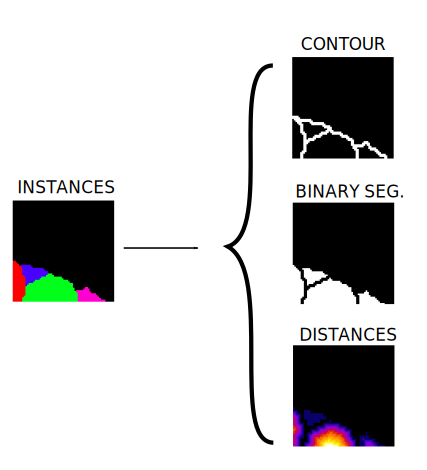

.. _instance_segmentation:

Instance segmentation
---------------------

Description of the task
~~~~~~~~~~~~~~~~~~~~~~~

The goal of this workflow is assign a unique ID, i.e. an integer value, to each object of the **input image**, thus producing a **label image** with **instance** masks. An example of this task is displayed in the figure below, with an electron microscopy image used as input (left) and its corresponding instance label image identifying each invididual mitochondrion (rigth). Each color in the mask image corresponds to a unique object.

.. role:: raw-html(raw)
    :format: html

.. list-table::
  :align: center
  :widths: 50 50
  
  * - .. figure:: ../img/mitoem_crop.png
         :align: center
         :figwidth: 300px

         Input image (electron microscopy, :raw-html:` ` from the `MitoEM dataset <https://mitoem.grand-challenge.org/>`_).

    - .. figure:: ../img/mitoem_crop_mask.png
         :align: center
         :figwidth: 300px

         Label image with mitochondria :raw-html:` ` instance masks.
         

Each instance may also contain information about its **class** (optional). In that case, the label image will contain two channels, one with the instance IDs and one with their corresponding semantic (class) labels. An example of this setting is depicted below:

.. figure:: ../img/instance_seg_multichannel.gif
    :align: center

    **Instance and classification setting example**. From right to left: input raw image (histology image from `CoNIC Challenge <https://conic-challenge.grand-challenge.org/>`__) and its corresponding label image with instance masks (channel 0) and classification/semantic masks (channel 1).

Inputs and outputs
~~~~~~~~~~~~~~~~~~
The instance segmentation workflows in BiaPy expect a series of **folders** as input:

* **Training Raw Images**: A folder that contains the unprocessed (single-channel or multi-channel) images that will be used to train the model.
  
  .. collapse:: Expand to see how to configure

    .. tabs::
      .. tab:: GUI

        Under *Workflow*, select *Instance Segmentation*, twice *Continue*, under *General options* > *Train data*, click on the *Browse* button of **Input raw image folder**:

        .. image:: ../img/GUI-general-options.png
          :align: center

      .. tab:: Google Colab / Notebooks
        
        In either the 2D or the 3D instance segmentation notebook, go to *Paths for Input Images and Output Files*, edit the field **train_data_path**:
        
        .. image:: ../img/Notebooks-Inputs-Outputs.png
          :align: center
          :width: 75%

      .. tab:: YAML configuration file
        
        Edit the variable ``DATA.TRAIN.PATH`` with the absolute path to the folder with your training raw images.

* **Training Label Images**: A folder that contains the instance label (single- or multi-channel) images for training. Ensure the number and dimensions match the training raw images.
  
  .. collapse:: Expand to see how to configure

    .. tabs::
      .. tab:: GUI

        Under *Workflow*, select *Instance Segmentation*, twice *Continue*, under *General options* > *Train data*, click on the *Browse* button of **Input label folder**:

        .. image:: ../img/GUI-general-options.png
          :align: center

      .. tab:: Google Colab / Notebooks
        
        In either the 2D or the 3D instance segmentation notebook, go to *Paths for Input Images and Output Files*, edit the field **train_data_gt_path**:
        
        .. image:: ../img/Notebooks-Inputs-Outputs.png
          :align: center
          :width: 75%

      .. tab:: YAML configuration file
        
        Edit the variable ``DATA.TRAIN.GT_PATH`` with the absolute path to the folder with your training label images.

    .. note:: Remember the label images need to be **single-channel when performing instance segmentation only**, and **multi-channel in the instance and classification setting** (first channel for instance labels and second channel for semantic labels).

* .. raw:: html

      <b>[Optional] Test Raw Images</b>: A folder that contains the images to evaluate the model's performance.
 
  .. collapse:: Expand to see how to configure

    .. tabs::
      .. tab:: GUI

        Under *Workflow*, select *Instance Segmentation*, three times *Continue*, under *General options* > *Test data*, click on the *Browse* button of **Input raw image folder**:

        .. image:: ../img/GUI-test-data.png
          :align: center

      .. tab:: Google Colab / Notebooks
        
        In either the 2D or the 3D instance segmentation notebook, go to *Paths for Input Images and Output Files*, edit the field **test_data_path**:
        
        .. image:: ../img/Notebooks-Inputs-Outputs.png
          :align: center
          :width: 75%

      .. tab:: YAML configuration file
        
        Edit the variable ``DATA.TEST.PATH`` with the absolute path to the folder with your test raw images.

* .. raw:: html

      <b>[Optional] Test Label Images</b>: A folder that contains the instance label images for testing. Again, ensure their count and sizes align with the test raw images.

  .. collapse:: Expand to see how to configure

    .. tabs::
      .. tab:: GUI

        Under *Workflow*, select *Instance Segmentation*, three times *Continue*, under *General options* > *Test data*, select "Yes" in the *Do you have test labels?* field, and then click on the *Browse* button of **Input label folder**:

        .. image:: ../img/GUI-test-data-gt.png
          :align: center

      .. tab:: Google Colab / Notebooks
        
        In either the 2D or the 3D instance segmentation notebook, go to *Paths for Input Images and Output Files*, edit the field **test_data_gt_path**:
        
        .. image:: ../img/Notebooks-Inputs-Outputs.png
          :align: center
          :width: 75%

      .. tab:: YAML configuration file
        
        Edit the variable ``DATA.TEST.GT_PATH`` with the absolute path to the folder with your test label images.

    .. note:: Remember the label images need to be **single-channel when performing instance segmentation only**, and **multi-channel in the instance and classification setting** (first channel for instance labels and second channel for semantic labels).

Upon successful execution, a directory will be generated with the segmentation results. Therefore, you will need to define:

* **Output Folder**: A designated path to save the segmentation outcomes.

  .. collapse:: Expand to see how to configure

    .. tabs::
      .. tab:: GUI

        Under *Run Workflow*, click on the *Browse* button of **Output folder to save the results**:

        .. image:: ../img/instance-seg/GUI-run-workflow.png
          :align: center

      .. tab:: Google Colab / Notebooks
        
        In either the 2D or the 3D instance segmentation notebook, go to *Paths for Input Images and Output Files*, edit the field **output_path**:
        
        .. image:: ../img/Notebooks-Inputs-Outputs.png
          :align: center
          :width: 75%

      .. tab:: Command line
        
        When calling BiaPy from command line, you can specify the output folder with the ``--result_dir`` flag. See the *Command line* configuration of :ref:`instance_segmentation_data_run` for a full example.

.. list-table::
  :align: center

  * - .. figure:: ../img/Inputs-outputs.svg
         :align: center
         :width: 500
         :alt: Graphical description of minimal inputs and outputs in BiaPy for instance segmentation.
        
         **BiaPy input and output folders for instance segmentation.**
  
.. _instance_segmentation_data_prep:

Data structure
**************

To ensure the proper operation of the library, the data directory tree should be something like this: 

.. code-block::

  dataset/
  ├── train
  │   ├── x
  │   │   ├── training-0001.tif
  │   │   ├── training-0002.tif
  │   │   ├── . . .
  │   │   └── training-9999.tif
  │   └── y
  │       ├── training_groundtruth-0001.tif
  │       ├── training_groundtruth-0002.tif
  │       ├── . . .
  │       └── training_groundtruth-9999.tif
  └── test
      ├── x
      │   ├── testing-0001.tif
      │   ├── testing-0002.tif
      │   ├── . . .
      │   └── testing-9999.tif
      └── y
          ├── testing_groundtruth-0001.tif
          ├── testing_groundtruth-0002.tif
          ├── . . .
          └── testing_groundtruth-9999.tif

In this example, the raw training images are under ``dataset/train/x/`` and their corresponding labels are under ``dataset/train/y/``, while the raw test images are under ``dataset/test/x/`` and their corresponding labels are under ``dataset/test/y/``. **This is just an example**, you can name your folders as you wish as long as you set the paths correctly later.

.. note:: Ensure that images and their corresponding masks are sorted in the same way. A common approach is to fill with zeros the image number added to the filenames (as in the example).

Minimal configuration
~~~~~~~~~~~~~~~~~~~~~
Apart from the input and output folders, there are a few basic parameters that always need to be specified in order to run an instance segmentation workflow in BiaPy. **These parameters can be introduced either directly in the GUI, the code-free notebooks or by editing the YAML configuration file**.

Experiment name
***************
Also known as "model name" or "job name", this will be the name of the current experiment you want to run, so it can be differenciated from other past and future experiments.

.. collapse:: Expand to see how to configure

    .. tabs::
      .. tab:: GUI

        Under *Run Workflow*, type the name you want for the job in the **Job name** field:

        .. image:: ../img/instance-seg/GUI-run-workflow.png
          :align: center

      .. tab:: Google Colab / Notebooks
        
        In either the 2D or the 3D instance segmentation notebook, go to *Configure and train the DNN model* > *Select your parameters*, and edit the field **model_name**:
        
        .. image:: ../img/instance-seg/Notebooks-model-name-data-conf.png
          :align: center
          :width: 50%

      .. tab:: Command line
        
        When calling BiaPy from command line, you can specify the output folder with the ``--name`` flag. See the *Command line* configuration of :ref:`instance_segmentation_data_run` for a full example.

\

.. note:: Use only *my_model* -style, not *my-model* (Use "_" not "-"). Do not use spaces in the name. Avoid using the name of an existing experiment/model/job (saved in the same result folder) as it will be overwritten.

Data management
***************
Validation Set
""""""""""""""
With the goal to monitor the training process, it is common to use a third dataset called the "Validation Set". This is a subset of the whole dataset that is used to evaluate the model's performance and optimize training parameters. This subset will not be directly used for training the model, and thus, when applying the model to these images, we can see if the model is learning the training set's patterns too specifically or if it is generalizing properly.

.. list-table::
  :align: center

  * - .. figure:: ../img/data-partitions.png
         :align: center
         :width: 400
         :alt: Graphical description of data partitions in BiaPy
        
         **Graphical description of data partitions in BiaPy.**

To define such set, there are two options:
  
* **Validation proportion/percentage**: Select a proportion (or percentage) of your training dataset to be used to validate the network during the training. Usual values are 0.1 (10%) or 0.2 (20%), and the samples of that set will be selected at random.
  
  .. collapse:: Expand to see how to configure

      .. tabs::
        .. tab:: GUI

          Under *Workflow*, select *Instance Segmentation*, click twice on *Continue*, and under *General options* > *Advanced options* > *Validation data*, select "Extract from train (split training)" in **Validation type**, and introduce your value (between 0 and 1) in the **Train proportion for validation**:

          .. image:: ../img/GUI-validation-percentage.png
            :align: center

        .. tab:: Google Colab / Notebooks
          
          In either the 2D or the 3D instance segmentation notebook, go to *Configure and train the DNN model* > *Select your parameters*, and edit the field **percentage_validation** with a value between 0 and 100:
          
          .. image:: ../img/instance-seg/Notebooks-model-name-data-conf.png
            :align: center
            :width: 50%

        .. tab:: YAML configuration file
        
          Edit the variable ``DATA.VAL.SPLIT_TRAIN`` with a value between 0 and 1, representing the proportion of the training set that will be set apart for validation.

* **Validation paths**: Similar to the training and test sets, you can select two folders with the validation raw and label images:

  * **Validation Raw Images**: A folder that contains the unprocessed (single-channel or multi-channel) images that will be used to select the best model during training.
  
    .. collapse:: Expand to see how to configure

      .. tabs::
        .. tab:: GUI

          Under *Workflow*, select *Instance Segmentation*, click twice on *Continue*, and under *General options* > *Advanced options* > *Validation data*, select "Not extracted from train (path needed)" in **Validation type**, click on the *Browse* button of **Input raw image folder** and select the folder containing your validation raw images:

          .. image:: ../img/GUI-validation-paths.png
            :align: center

        .. tab:: Google Colab / Notebooks
          
          This option is currently not available in the notebooks.

        .. tab:: YAML configuration file
        
          Edit the variable ``DATA.VAL.PATH`` with the absolute path to your validation raw images.

  * **Validation Label Images**: A folder that contains the instance label (single-channel) images for validation. Ensure the number and dimensions match those of the validation raw images.
  
    .. collapse:: Expand to see how to configure

      .. tabs::
        .. tab:: GUI

          Under *Workflow*, select *Instance Segmentation*, click twice on *Continue*, and under *General options* > *Advanced options* > *Validation data*, select "Not extracted from train (path needed)" in **Validation type**, click on the *Browse* button of **Input label folder** and select the folder containing your validation label images:

          .. image:: ../img/GUI-validation-paths.png
            :align: center

        .. tab:: Google Colab / Notebooks
          
          This option is currently not available in the notebooks.

        .. tab:: YAML configuration file
        
          Edit the variable ``DATA.VAL.GT_PATH`` with the absolute path to your validation label images.

      .. note:: Remember the label images need to be **single-channel when performing instance segmentation only**, and **multi-channel in the instance and classification setting** (first channel for instance labels and second channel for semantic labels).

Test ground-truth
"""""""""""""""""
Do you have labels for the test set? This is a key question so BiaPy knows if your test set will be used for evaluation in new data (unseen during training) or simply produce predictions on that new data. All workflows contain a parameter to specify this aspect.

.. collapse:: Expand to see how to configure

  .. tabs::
    .. tab:: GUI

      Under *Workflow*, select *Instance Segmentation*, three times *Continue*, under *General options* > *Test data*, select "No" or "Yes" in the **Do you have test labels?** field:

      .. image:: ../img/GUI-test-data.png
        :align: center

    .. tab:: Google Colab / Notebooks
      
      In either the 2D or the 3D instance segmentation notebook, go to *Configure and train the DNN model* > *Select your parameters*, and check or uncheck the **test_ground_truth** option:
      
      .. image:: ../img/instance-seg/Notebooks-model-name-data-conf.png
        :align: center
        :width: 50%

    .. tab:: YAML configuration file
      
      Set the variable ``DATA.TEST.LOAD_GT`` to ``True`` if you have test labels, or ``False`` if you do not.

\

Basic training parameters
*************************
At the core of each BiaPy workflow there is a deep learning model. Although we try to simplify the number of parameters to tune, these are the basic parameters that need to be defined for training an instance segmentation workflow:

* **Number of input channels**: The number of channels of your raw images (grayscale = 1, RGB = 3). Notice the dimensionality of your images (2D/3D) is set by default depending on the workflow template you select.
  
  .. collapse:: Expand to see how to configure

        .. tabs::
          .. tab:: GUI

            Under *Workflow*, select *Instance Segmentation*, click twice on *Continue*, and under *General options* > *Train data*, edit the last value of the field **Data patch size** with the number of channels. This variable follows a ``(y, x, channels)`` notation in 2D and a ``(z, y, x, channels)`` notation in 3D:

            .. image:: ../img/GUI-general-options.png
              :align: center

          .. tab:: Google Colab / Notebooks
            
            In either the 2D or the 3D instance segmentation notebook, go to *Configure and train the DNN model* > *Select your parameters*, and edit the field **input_channels**:
            
            .. image:: ../img/instance-seg/Notebooks-basic-training-params.png
              :align: center
              :width: 75%

          .. tab:: YAML configuration file
          
            Edit the last value of the variable ``DATA.PATCH_SIZE`` with the number of channels. This variable follows a ``(y, x, channels)`` notation in 2D and a ``(z, y, x, channels)`` notation in 3D.

* **Number of epochs**: This number indicates how many `rounds <https://machine-learning.paperspace.com/wiki/epoch>`_ the network will be trained. On each round, the network usually sees the full training set. The value of this parameter depends on the size and complexity of each dataset. You can start with something like 100 epochs and tune it depending on how fast the loss (error) is reduced.
  
  .. collapse:: Expand to see how to configure

        .. tabs::
          .. tab:: GUI

            Under *Workflow*, select *Instance Segmentation*, click twice on *Continue*, and under *General options*, click on *Advanced options*, scroll down to *General training parameters*, and edit the field **Number of epochs**:

            .. image:: ../img/instance-seg/GUI-basic-training-params.png
              :align: center
              :width: 75%

          .. tab:: Google Colab / Notebooks
            
            In either the 2D or the 3D instance segmentation notebook, go to *Configure and train the DNN model* > *Select your parameters*, and edit the field **number_of_epochs**:
            
            .. image:: ../img/instance-seg/Notebooks-basic-training-params.png
              :align: center
              :width: 75%

          .. tab:: YAML configuration file
          
            Edit the last value of the variable ``TRAIN.EPOCHS`` with the number of epochs. For this to have effect, the variable ``TRAIN.ENABLE`` should also be set to ``True``.

* **Patience**: This is a number that indicates how many epochs you want to wait without the model improving its results in the validation set to stop training. Again, this value depends on the data you're working on, but you can start with something like 20.
   
  .. collapse:: Expand to see how to configure

        .. tabs::
          .. tab:: GUI

            Under *Workflow*, select *Instance Segmentation*, click twice on *Continue*, and under *General options*, click on *Advanced options*, scroll down to *General training parameters*, and edit the field **Patience**:

            .. image:: ../img/instance-seg/GUI-basic-training-params.png
              :align: center
              :width: 75%

          .. tab:: Google Colab / Notebooks
            
            In either the 2D or the 3D instance segmentation notebook, go to *Configure and train the DNN model* > *Select your parameters*, and edit the field **patience**:
            
            .. image:: ../img/instance-seg/Notebooks-basic-training-params.png
              :align: center
              :width: 75%

          .. tab:: YAML configuration file
          
            Edit the last value of the variable ``TRAIN.PATIENCE`` with the number of epochs. For this to have effect, the variable ``TRAIN.ENABLE`` should also be set to ``True``.

For improving performance, other advanced parameters can be optimized, for example, the model's architecture. The architecture assigned as default is the U-Net, as it is effective in instance segmentation tasks. This architecture allows a strong baseline, but further exploration could potentially lead to better results.

.. note:: Once the parameters are correctly assigned, the training phase can be executed. Note that to train large models effectively the use of a GPU (Graphics Processing Unit) is essential. This hardware accelerator performs parallel computations and has larger RAM memory compared to the CPUs, which enables faster training times.

.. _instance_segmentation_data_run:

How to run
~~~~~~~~~~
BiaPy offers different options to run workflows depending on your degree of computer expertise. Select whichever is more approppriate for you:

.. tabs::
   .. tab:: GUI

        In the BiaPy GUI, navigate to *Workflow*, then select *Instance Segmentation* and follow the on-screen instructions:

        .. image:: ../img/gui/biapy_gui_instance_seg.png
            :align: center

        \
        
        **Tip**: If you need additional help, watch BiaPy's `GUI walk-through video <https://www.youtube.com/embed/vY7aBh5FUNk?si=yvVolBnu5APNeHwB>`__.

   .. tab:: Google Colab 
    
      BiaPy offers two code-free notebooks in Google Colab to perform instance segmentation: 

      .. |inst_seg_2D_colablink| image:: https://colab.research.google.com/assets/colab-badge.svg
          :target: https://colab.research.google.com/github/BiaPyX/BiaPy/blob/master/notebooks/instance_segmentation/BiaPy_2D_Instance_Segmentation.ipynb

      * For 2D images: |inst_seg_2D_colablink|

      .. |inst_seg_3D_colablink| image:: https://colab.research.google.com/assets/colab-badge.svg
          :target: https://colab.research.google.com/github/BiaPyX/BiaPy/blob/master/notebooks/instance_segmentation/BiaPy_3D_Instance_Segmentation.ipynb

      * For 3D images: |inst_seg_3D_colablink|

   .. tab:: Docker 

      If you installed BiaPy via Docker, `open a terminal <../get_started/faq.html#opening-a-terminal>`__ as described in :ref:`installation`. Then, you can use the `3d_instance_segmentation.yaml <https://github.com/BiaPyX/BiaPy/blob/master/templates/instance_segmentation/3d_instance_segmentation.yaml>`__ template file (or your own file), and run the workflow as follows:

      .. code-block:: bash                                                                                                    

          # Configuration file
          job_cfg_file=/home/user/3d_instance_segmentation.yaml
          # Path to the data directory
          data_dir=/home/user/data
          # Where the experiment output directory should be created
          result_dir=/home/user/exp_results
          # Just a name for the job
          job_name=my_3d_instance_segmentation
          # Number that should be increased when one need to run the same job multiple times (reproducibility)
          job_counter=1
          # Number of the GPU to run the job in (according to 'nvidia-smi' command)
          gpu_number=0

          docker run --rm \
              --gpus "device=$gpu_number" \
              --mount type=bind,source=$job_cfg_file,target=$job_cfg_file \
              --mount type=bind,source=$result_dir,target=$result_dir \
              --mount type=bind,source=$data_dir,target=$data_dir \
              BiaPyX/biapy \
                  -cfg $job_cfg_file \
                  -rdir $result_dir \
                  -name $job_name \
                  -rid $job_counter \
                  -gpu "$gpu_number"

      .. note:: 
          Note that ``data_dir`` must contain all the paths ``DATA.*.PATH`` and ``DATA.*.GT_PATH`` so the container can find them. For instance, if you want to only train in this example ``DATA.TRAIN.PATH`` and ``DATA.TRAIN.GT_PATH`` could be ``/home/user/data/train/x`` and ``/home/user/data/train/y`` respectively. 

   .. tab:: Command line

      `From a terminal <../get_started/faq.html#opening-a-terminal>`__, you can use the `3d_instance_segmentation.yaml <https://github.com/BiaPyX/BiaPy/blob/master/templates/instance_segmentation/3d_instance_segmentation.yaml>`__ template file (or your own file), and run the workflow as follows:

      .. code-block:: bash
          
          # Configuration file
          job_cfg_file=/home/user/3d_instance_segmentation.yaml       
          # Where the experiment output directory should be created
          result_dir=/home/user/exp_results  
          # Just a name for the job
          job_name=my_3d_instance_segmentation      
          # Number that should be increased when one need to run the same job multiple times (reproducibility)
          job_counter=1
          # Number of the GPU to run the job in (according to 'nvidia-smi' command)
          gpu_number=0                   

          # Load the environment
          conda activate BiaPy_env
          
          biapy \
                --config $job_cfg_file \
                --result_dir $result_dir  \ 
                --name $job_name    \
                --run_id $job_counter  \
                --gpu "$gpu_number"  

      For multi-GPU training you can call BiaPy as follows:

      .. code-block:: bash
          
          # First check where is your biapy command (you need it in the below command)
          # $ which biapy
          # > /home/user/anaconda3/envs/BiaPy_env/bin/biapy

          gpu_number="0, 1, 2"
          python -u -m torch.distributed.run \
              --nproc_per_node=3 \
              /home/user/anaconda3/envs/BiaPy_env/bin/biapy \
              --config $job_cfg_file \
              --result_dir $result_dir  \ 
              --name $job_name    \
              --run_id $job_counter  \
              --gpu "$gpu_number"  

      ``nproc_per_node`` needs to be equal to the number of GPUs you are using (e.g. ``gpu_number`` length).
      

Templates                                                                                                                 
~~~~~~~~~~

In the `templates/instance_segmentation <https://github.com/BiaPyX/BiaPy/tree/master/templates/instance_segmentation>`__ folder of BiaPy, you will find a few YAML configuration templates for this workflow. 

[Advanced] Special workflow configuration 
~~~~~~~~~~~~~~~~~~~~~~~~~~~~~~~~~~~~~~~~~

.. note:: This section is recommended for experienced users only to improve the performance of their workflows. When in doubt, do not hesitate to check our `FAQ & Troubleshooting <../get_started/faq.html>`__ or open a question in the `image.sc discussion forum <our FAQ & Troubleshooting section>`_.

Advanced Parameters 
*******************
Many of the parameters of our workflows are set by default to values that work commonly well. However, it may be needed to tune them to improve the results of the workflow. For instance, you may modify the following parameters

* **Model architecture**: Select the architecture of the deep neural network used as backbone of the pipeline. Options: U-Net, Residual U-Net, Attention U-Net, SEUNet, MultiResUNet, ResUNet++, UNETR-Mini, UNETR-Small, UNETR-Base, ResUNet SE and U-NeXt V1. Default value: U-Net.
* **Batch size**: This parameter defines the number of patches seen in each training step. Reducing or increasing the batch size may slow or speed up your training, respectively, and can influence network performance. Common values are 4, 8, 16, etc.
* **Patch size**: Input the size of the patches use to train your model (length in pixels in X and Y). The value should be smaller or equal to the dimensions of the image. The default value is 256 in 2D, i.e. 256x256 pixels.
* **Optimizer**: Select the optimizer used to train your model. Options: ADAM, ADAMW, Stochastic Gradient Descent (SGD). ADAM usually converges faster, while ADAMW provides a balance between fast convergence and better handling of weight decay regularization. SGD is known for better generalization. Default value: ADAMW.
* **Initial learning rate**: Input the initial value to be used as learning rate. If you select ADAM as optimizer, this value should be around 10e-4. 
* **Learning rate scheduler**: Select to adjust the learning rate between epochs. The current options are "Reduce on plateau", "One cycle", "Warm-up cosine decay" or no scheduler.
* **Test time augmentation (TTA)**: Select to apply augmentation (flips and rotations) at test time. It usually provides more robust results but uses more time to produce each result. By default, no TTA is peformed.

Problem representation
**********************

Firstly, a **pre-processing** step is done where the new data representation is created from the input instance masks. The new data is a multi-channel mask with up to three channels (controlled by ``PROBLEM.INSTANCE_SEG.DATA_CHANNELS``). This way, the model is trained with the input images and these new multi-channel masks. Available channels to choose are the following: 

* Binary mask (referred as ``B`` in the code), contains each instance region without the contour. This mask is binary, i.e. pixels in the instance region are ``1`` and the rest are ``0``.
* Contour (``C``), contains each instance contour. This mask is binary, i.e. pixels in the contour are ``1`` and the rest are ``0``.
* Distances (``D``), each pixel containing the euclidean distance of it to the instance contour. This mask is a float, not binary. 
* Mask (``M``), contains the ``B`` and the ``C`` channels, i.e. the foreground mask. Is simply achieved by binarizing input instance masks. This mask is also binary. 
* Points (``P``), contains the central point of the instances. This mask is binary, i.e. pixels in the contour are ``1`` and the rest are ``0``. 
* [Experimental]: updated version of distances (``Dv2``), that extends ``D`` channel by calculating the background distances as well. This mask is a float, not binary. The piecewise function is as follows:

  where A, B and C denote the binary mask, background and contour, respectively. ``dist`` refers to euclidean distance formula.

``PROBLEM.INSTANCE_SEG.DATA_CHANNELS`` is in charge of selecting the channels to be created. It can be set to one of the following configurations ``BC``, ``BP``, ``BCM``, ``BCD``, ``BCDv2``, ``Dv2`` and ``BDv2``. For instance, ``BC`` will create a 2-channel mask: the first channel will be ``B`` and the second  ``C``. In the image below the creation of 3-channel mask based on ``BCD`` is depicted:

  Process of the new multi-channel mask creation based on ``BCD`` configuration. From instance segmentation labels (left) to contour, binary mask and distances (right). Here a small patch is presented just for the sake of visualization but the process is done for each full resolution image.

This new data representation is stored in ``DATA.TRAIN.INSTANCE_CHANNELS_DIR`` and ``DATA.TRAIN.INSTANCE_CHANNELS_MASK_DIR`` for train data, ``DATA.VAL.INSTANCE_CHANNELS_DIR`` and ``DATA.VAL.INSTANCE_CHANNELS_MASK_DIR`` for validation, and ``DATA.TEST.INSTANCE_CHANNELS_DIR``, ``DATA.TEST.INSTANCE_CHANNELS_MASK_DIR`` for test. 

.. seealso::

  You can modify ``PROBLEM.INSTANCE_SEG.DATA_CHANNEL_WEIGHTS`` to control which channels the model will learn the most. For instance, in ``BCD`` setting you can set it to ``(1,1,0.5)`` for distance channel (``D``) to have half the impact during the learning process.

After the train phase, the model output will have the same channels as the ones used to train. In the case of binary channels, i.e. ``B``, ``C`` and ``M``, each pixel of each channel will have the probability (in ``[0-1]`` range) of being of the class that represents that channel. Whereas for the ``D`` and ``Dv2`` channel each pixel will have a float that represents the distance.

In a further step the multi-channel data information will be used to create the final instance segmentation labels using a marker-controlled watershed. The process vary depending on the configuration:

.. tabs::

   .. tab:: ``BC``, ``BCM`` and ``BCD``
        
      * First, seeds are created based on ``B``, ``C`` and ``D`` (notice that depending on the configuration selected not all of them will be present). For that, each channel is binarized using different thresholds: ``PROBLEM.INSTANCE_SEG.DATA_MW_TH_BINARY_MASK`` for ``B`` channel, ``PROBLEM.INSTANCE_SEG.DATA_MW_TH_CONTOUR`` for ``C`` and ``PROBLEM.INSTANCE_SEG.DATA_MW_TH_DISTANCE`` for ``D``. These thresholds will decide whether a point is labeled as a class or not. This way, the seeds are created following this formula: :: 

          seed_mask = (B > DATA_MW_TH_BINARY_MASK) * (D > DATA_MW_TH_DISTANCE) * (C < DATA_MW_TH_CONTOUR)  

        Translated to words seeds will be: all pixels part of the binary mask (``B`` channel), which will be those higher than ``PROBLEM.INSTANCE_SEG.DATA_MW_TH_BINARY_MASK``; and also in the center of each instances, i.e. higher than ``PROBLEM.INSTANCE_SEG.DATA_MW_TH_DISTANCE`` ; but not labeled as contour, i.e. less than ``PROBLEM.INSTANCE_SEG.DATA_MW_TH_CONTOUR``. 

      * After that, each instance is labeled with a unique integer, e.g. using `connected component <https://en.wikipedia.org/wiki/Connected-component_labeling>`_. Then a foreground mask is created to delimit the area in which the seeds can grow. This foreground mask is defined based on ``B`` channel using ``PROBLEM.INSTANCE_SEG.DATA_MW_TH_FOREGROUND`` and ``D`` using ``PROBLEM.INSTANCE_SEG.DATA_MW_TH_DIST_FOREGROUND``. The formula is as follows: :: 

          foreground_mask = (B > DATA_MW_TH_FOREGROUND) * (D > DATA_MW_TH_DIST_FOREGROUND) 

      * Afterwards, tiny instances are removed using ``PROBLEM.INSTANCE_SEG.DATA_REMOVE_SMALL_OBJ`` value. Finally, the seeds are grown using marker-controlled watershed over the ``B`` channel.

   .. tab:: ``BP``

      * First, seeds are created based on ``P``. For that, each channel is binarized using a threshold: ``PROBLEM.INSTANCE_SEG.TH_POINTS``. This way, the seeds are created following this formula: :: 

          seed_mask = (P > TH_POINTS)  

      * After that, each instance is labeled with a unique integer, e.g. using `connected component <https://en.wikipedia.org/wiki/Connected-component_labeling>`_. Then a foreground mask is created to delimit the area in which the seeds can grow. This foreground mask is defined based on ``B`` channel using ``PROBLEM.INSTANCE_SEG.DATA_MW_TH_FOREGROUND``. The formula is as follows: :: 

          foreground_mask = (B > DATA_MW_TH_FOREGROUND)

      * Afterwards, tiny instances are removed using ``PROBLEM.INSTANCE_SEG.DATA_REMOVE_SMALL_OBJ`` value. Finally, the seeds are grown using marker-controlled watershed over the ``B`` channel.

   .. tab:: ``BDv2``, ``BCDv2`` and ``Dv2``
      * These options are experimental. Configurations are as follows:

        * First, seeds are created based on ``B``, ``C`` and ``Dv2`` (notice that depending on the configuration selected not all of them will be present). For that, each channel is binarized using different thresholds: ``PROBLEM.INSTANCE_SEG.DATA_MW_TH_BINARY_MASK`` for ``B`` channel, ``PROBLEM.INSTANCE_SEG.DATA_MW_TH_CONTOUR`` for ``C`` and ``PROBLEM.INSTANCE_SEG.DATA_MW_TH_DISTANCE`` for ``Dv2``. These thresholds will decide whether a point is labeled as a class or not. This way, the seeds are created following this formula: :: 

            seed_mask = (B > DATA_MW_TH_BINARY_MASK) * (Dv2 < DATA_MW_TH_DISTANCE) * (C < DATA_MW_TH_CONTOUR)

          Translated to words seeds will be: all pixels part of the binary mask (``B`` channel), which will be those higher than ``PROBLEM.INSTANCE_SEG.DATA_MW_TH_BINARY_MASK``; and also in the center of each instances, i.e. less than ``PROBLEM.INSTANCE_SEG.DATA_MW_TH_DISTANCE`` ; but not labeled as contour, i.e. less than ``PROBLEM.INSTANCE_SEG.DATA_MW_TH_CONTOUR``. 

        * After that different steps are applied depending on the configuration but the key thing here is that we are not going to set a foreground mask to delimit the area in which the seeds can grow as is done in ``BC``, ``BCM`` and ``BCD`` configurations. Instead, we are going to define a background seed in ``BDv2`` and ``BCDv2`` configurations so it can grow at the same time as the rest of the seeds.

          * For ``BCDv2`` the background seed will be: ::

              background_seed = invert( dilate( (B > DATA_MW_TH_BINARY_MASK) + (C > DATA_MW_TH_CONTOUR) ) )

            Translated to words seeds will be: all pixels part of the binary mask (``B`` channel), which will be those higher than ``PROBLEM.INSTANCE_SEG.DATA_MW_TH_BINARY_MASK`` and also part of the contours, i.e. greater than ``PROBLEM.INSTANCE_SEG.DATA_MW_TH_DISTANCE`` will constitute the foreground (or all the cell). Then, the rest of the pixels of the image will be considerer as background so we can now 1) dilate that mask so it can go beyond cell region, i.e. background, and afterwards 2) invert it to obtain the background seed. 

          * For ``BDv2`` the background seed will be: ::

              background_seed = (Dv2 < DATA_MW_TH_DISTANCE) * (do not overlap with seed_mask)

            Translated to words seeds will be: all pixels part of the distance mask (``Dv2`` channel) and that dot not overlap with any of the seeds created in ``seed_mask``. 

          * For ``Dv2`` there is no way to know where the background seed is. This configuration will require the user to inspect the result so they can remove the unnecesary background instances. 

        * Afterwards, tiny instances are removed using ``PROBLEM.INSTANCE_SEG.DATA_REMOVE_SMALL_OBJ`` value. Finally, the seeds are grown using marker-controlled watershed over the ``Dv2`` channel.

In general, each configuration has its own advantages and drawbacks. The best thing to do is to inspect the results generated by the model so you can adjust each threshold for your particular case and run again the inference (i.e. not training again the network and loading model's weights). 

Metrics
*******

During the inference phase the performance of the test data is measured using different metrics if test masks were provided (i.e. ground truth) and, consequently, ``DATA.TEST.LOAD_GT`` is ``True``. In the case of detection, the **Intersection over Union** (IoU) is measured after network prediction:

* **IoU**: also referred as the Jaccard index, is essentially a method to quantify the percent of overlap between the target mask and the prediction output. Depending on the configuration different values are calculated (as explained in :ref:`config_test` and :ref:`config_metric`). This values can vary a lot as stated in :cite:p:`Franco-Barranco2021`.

  * **Per patch**: IoU is calculated for each patch separately and then averaged. 
  * **Reconstructed image**: IoU is calculated for each reconstructed image separately and then averaged. Notice that depending on the amount of overlap/padding selected the merged image can be different than just concatenating each patch. 
  * **Full image**: IoU is calculated for each image separately and then averaged. The results may be slightly different from the reconstructed image. 

Then, after creating the final instances from the predictions, **matching metrics** and **morphological measurements** are calculated:

* **Matching metrics** (controlled with ``TEST.MATCHING_STATS``): calculates **precision**, **recall**, **accuracy**, **F1** and **panoptic quality** based on a defined threshold to decide whether an instance is a true positive. That threshold measures the overlap between predicted instance and its ground truth. More than one threshold can be set and it is done with ``TEST.MATCHING_STATS_THS``. For instance, if ``TEST.MATCHING_STATS_THS`` is ``[0.5, 0.75]`` this means that these metrics will be calculated two times, one for ``0.5`` threshold and another for ``0.75``. In the first case, all instances that have more than ``0.5``, i.e. ``50%``, of overlap with their respective ground truth are considered true positives. The **precision**, **recall** and **F1** are defined as follows:

  * **Precision**: fraction of relevant points among the retrieved points. More info `here <https://en.wikipedia.org/wiki/Precision_and_recall>`__.

  * **Recall**: fraction of relevant points that were retrieved. More info `here <https://en.wikipedia.org/wiki/Precision_and_recall>`__.

  * **F1**: the harmonic mean of the precision and recall. More info `here <https://en.wikipedia.org/wiki/F-score>`__.
  
  * **Panoptic quality**: defined as in `Eq. 1 of Kirillov et al. "Panoptic Segmentation", CVPR 2019 <https://openaccess.thecvf.com/content_CVPR_2019/html/Kirillov_Panoptic_Segmentation_CVPR_2019_paper.html>`__.

  The code was adapted from Stardist (:cite:p:`weigert2020star`) evaluation `code <https://github.com/stardist/stardist>`_.  

* **Morphological measurements** (controlled by ``TEST.POST_PROCESSING.MEASURE_PROPERTIES``): measure morphological features on each instances. The following are implemented:

  * ``circularity``: defined as the ratio of area over the square of the perimeter, normalized such that the value for a disk equals one: ``(4 * PI * area) / (perimeter^2)``. Only measurable for ``2D`` images (use sphericity for ``3D`` images). While values of circularity range theoretically within the interval ``[0, 1]``, the measurements errors of the perimeter may produce circularity values above ``1`` (`Lehmann et al., 201211 <https://doi.org/10.1093/bioinformatics/btw413>`__). 
  
  * ``elongation``: the inverse of the circularity. The values of elongation range from 1 for round particles and increase for 
    elongated particles. Calculated as: ``(perimeter^2)/(4 * PI * area)``. Only measurable for ``2D`` images.

  * ``npixels``: corresponds to the sum of pixels that compose an instance. 

  * ``area``: correspond to the number of pixels taking into account the image resolution (we call it ``area`` also even in a ``3D`` 
    image for simplicity, but that will be the volume in that case). In the resulting statistics ``volume`` will appear in that 
    case too.

  * ``diameter``: calculated with the bounding box and by taking the maximum value of the box in x and y axes. In ``3D``, z axis 
    is also taken into account. Does not take into account the image resolution.

  * ``perimeter``: in ``2D``, approximates the contour as a line through the centers of border pixels using a 4-connectivity. In ``3D``, 
    it is the surface area computed using `Lewiner et al. algorithm <https://www.tandfonline.com/doi/abs/10.1080/10867651.2003.10487582>`__ using `marching_cubes <https://scikit-image.org/docs/stable/api/skimage.measure.htmlskimage.measure.marching_cubes>`__ and `mesh_surface_area <https://scikit-image.org/docs/stable/api/skimage.measure.htmlskimage.measure.mesh_surface_area>`__ functions of scikit-image. 

  * ``sphericity``: in ``3D``, it is the ratio of the squared volume over the cube of the surface area, normalized such that the value 
    for a ball equals one: ``(36 * PI)*((volume^2)/(perimeter^3))``. Only measurable for ``3D`` images (use circularity for ``2D`` images).
  
Post-processing
***************

After network prediction and applied to ``3D`` images (e.g. ``PROBLEM.NDIM`` is ``2D`` or ``TEST.ANALIZE_2D_IMGS_AS_3D_STACK`` is ``True``). There are the following options:

* **Z-filtering**: to apply a median filtering in ``z`` axis. Useful to maintain class coherence across ``3D`` volumes. Enable it with ``TEST.POST_PROCESSING.Z_FILTERING`` and use ``TEST.POST_PROCESSING.Z_FILTERING_SIZE`` for the size of the median filter. 

* **YZ-filtering**: to apply a median filtering in ``y`` and ``z`` axes. Useful to maintain class coherence across ``3D`` volumes that can work slightly better than ``Z-filtering``. Enable it with ``TEST.POST_PROCESSING.YZ_FILTERING`` and use ``TEST.POST_PROCESSING.YZ_FILTERING_SIZE`` for the size of the median filter.  

\

Then, after extracting the final instances from the predictions, the following post-processing methods are avaialable:

* **Big instance repair**: In order to repair large instances, the variable ``TEST.POST_PROCESSING.REPARE_LARGE_BLOBS_SIZE`` can be set to a value other than ``-1``. This process attempts to merge the large instances with their neighboring instances and remove any central holes. The value of the variable determines which instances will be repaired based on their size (number of pixels that compose the instance). This option is particularly useful when the ``PROBLEM.INSTANCE_SEG.DATA_CHANNELS`` is set to ``BP``, as multiple central seeds may be created in big instances.
  
  .. figure:: ../img/repair_large_blobs_postproc.png
      :width: 400px
      :align: center
      
      For left to right: raw image, instances created after the watershed and the resulting instance after the post-proccessing. Note how the two instances of the middle image (two colors) have been merged just in one in the last image, as it should be. 
      
* **Filter instances by morphological measurements**: To remove instances by the conditions based in each instance properties. The three variables, ``TEST.POST_PROCESSING.MEASURE_PROPERTIES.REMOVE_BY_PROPERTIES.PROPS``, ``TEST.POST_PROCESSING.MEASURE_PROPERTIES.REMOVE_BY_PROPERTIES.VALUES`` and ``TEST.POST_PROCESSING.MEASURE_PROPERTIES.REMOVE_BY_PROPERTIES.SIGN`` will compose a list of conditions to remove the instances. They are list of list of conditions, for instance, the conditions can be like this: ``[['A'], ['B','C']]``. Then, if the instance satisfies the first list of conditions, only 'A' in this first case (from ['A'] list), or satisfy 'B' and 'C' (from ['B','C'] list) it will be removed from the image. In each sublist all the conditions must be satisfied. Available properties are: [``circularity``', ``elongation``', ``npixels``', ``area``', ``diameter``', ``perimeter``', ``sphericity``']. 
  
  When this post-processing step is selected two .csv files will be created, one with the properties of each instance from the original image (will be placed in ``PATHS.RESULT_DIR.PER_IMAGE_INSTANCES`` path), and another with only instances that remain once this post-processing has been applied (will be placed in ``PATHS.RESULT_DIR.PER_IMAGE_POST_PROCESSING`` path). In those csv files two more information columns will appear: a list of conditions that each instance has satisfy or not ('`Satisfied`', '`No satisfied`' respectively), and a comment with two possible values, '`Removed`' and '`Correct`', telling you if the instance has been removed or not, respectively. Some of the properties follow the formulas used in `MorphoLibJ library for Fiji <https://doi.org/10.1093/bioinformatics/btw413>`__. 

  A full example of this post-processing would be the following: if you want to remove those instances that have less than ``100`` pixels and circularity less equal to ``0.7`` you should declare the above three variables as follows: ::
  
    TEST.POST_PROCESSING.MEASURE_PROPERTIES.REMOVE_BY_PROPERTIES.PROPS = [['npixels', 'circularity']]
    TEST.POST_PROCESSING.MEASURE_PROPERTIES.REMOVE_BY_PROPERTIES.VALUES = [[100, 0.7]]
    TEST.POST_PROCESSING.MEASURE_PROPERTIES.REMOVE_BY_PROPERTIES.SIGN = [['lt', 'le']]

  You can also concatenate more restrictions and they will be applied in order. For instance, if you want to remove those instances that are bigger than an specific area, and do that before the condition described above, you can define the variables this way: ::

    TEST.POST_PROCESSING.MEASURE_PROPERTIES.REMOVE_BY_PROPERTIES.PROPS = [['area'], ['npixels', 'circularity']]
    TEST.POST_PROCESSING.MEASURE_PROPERTIES.REMOVE_BY_PROPERTIES.VALUES = [[500], [100, 0.7]]
    TEST.POST_PROCESSING.MEASURE_PROPERTIES.REMOVE_BY_PROPERTIES.SIGN = [['gt'], ['lt', 'le']]        

  This way, the instances will be removed by ``area`` and then by ``npixels`` and ``circularity``.

* **Voronoi tessellation**: The variable ``TEST.POST_PROCESSING.VORONOI_ON_MASK`` can be used after the instances have been created to ensure that all instances are touching each other (`Voronoi tesellation <https://en.wikipedia.org/wiki/Voronoi_diagram>`__). This grown is restricted by a predefined area from ``PROBLEM.INSTANCE_SEG.DATA_CHANNEL_WEIGHTS``. For that reason, that last variable need to be set as one between ``BC``, ``BCM``, ``BCD`` and ``BCDv2``. This way, the area will be the foreground mask, so ``M`` will be used ``BCM`` and the sum of ``B`` and ``C`` channels in the rest of the options.

.. _instance_segmentation_results:

Results                                                                                                                 
~~~~~~~  

The results are placed in ``results`` folder under ``--result_dir`` directory with the ``--name`` given. Following the example, you should see that the directory ``/home/user/exp_results/my_3d_instance_segmentation`` has been created. If the same experiment is run 5 times, varying ``--run_id`` argument only, you should find the following directory tree: 

.. collapse:: Expand directory tree 

    .. code-block:: bash
        
      my_3d_instance_segmentation/
      ├── config_files
      │   └── 3d_instance_segmentation.yaml                                                                                                           
      ├── checkpoints
      │   └── my_3d_instance_segmentation_1-checkpoint-best.pth
      └── results
          ├── my_3d_instance_segmentation_1
          ├── . . .
          └── my_3d_instance_segmentation_5
              ├── aug
              │   └── .tif files
              ├── charts
              │   ├── my_3d_instance_segmentation_1_*.png
              │   └── my_3d_instance_segmentation_1_loss.png
              ├── per_image
              │   ├── .tif files
              │   └── .zarr files (or.h5)
              ├── full_image
              │   └── .tif files
              ├── per_image_instances
              │   └── .tif files  
              ├── per_image_instances_post_processing
              │   └── .tif files 
              ├── instance_associations
              │   ├── .tif files
              │   └── .csv files                        
              ├── watershed
              │   ├── seed_map.tif
              │   ├── foreground.tif                
              │   └── watershed.tif
              ├── train_logs
              └── tensorboard

\

* ``config_files``: directory where the .yaml filed used in the experiment is stored. 

  * ``3d_instance_segmentation.yaml``: YAML configuration file used (it will be overwrited every time the code is run).

* ``checkpoints``, *optional*: directory where model's weights are stored. Only created when ``TRAIN.ENABLE`` is ``True`` and the model is trained for at least one epoch. 

  * ``model_weights_my_3d_instance_segmentation_1.h5``, *optional*: checkpoint file (best in validation) where the model's weights are stored among other information. Only created when the model is trained for at least one epoch. 

  * ``normalization_mean_value.npy``, *optional*: normalization mean value. Is saved to not calculate it everytime and to use it in inference. Only created if ``DATA.NORMALIZATION.TYPE`` is ``custom``.
  
  * ``normalization_std_value.npy``, *optional*: normalization std value. Is saved to not calculate it everytime and to use it in inference. Only created if ``DATA.NORMALIZATION.TYPE`` is ``custom``. 
  
* ``results``: directory where all the generated checks and results will be stored. There, one folder per each run are going to be placed.

  * ``my_3d_instance_segmentation_1``: run 1 experiment folder. Can contain:

    * ``aug``, *optional*: image augmentation samples. Only created if ``AUGMENTOR.AUG_SAMPLES`` is ``True``.

    * ``charts``, *optional*. Only created when ``TRAIN.ENABLE`` is ``True`` and epochs trained are more or equal ``LOG.CHART_CREATION_FREQ``:  

      * ``my_3d_instance_segmentation_1_*.png``: plot of each metric used during training.

      * ``my_3d_instance_segmentation_1_loss.png``: loss over epochs plot. 

    * ``per_image``, *optional*: only created if ``TEST.FULL_IMG`` is ``False``. Can contain:

      * ``.tif files``, *optional*: reconstructed images from patches. Created when ``TEST.BY_CHUNKS.ENABLE`` is ``False`` or when ``TEST.BY_CHUNKS.ENABLE`` is ``True`` but ``TEST.BY_CHUNKS.SAVE_OUT_TIF`` is ``True``. 

      * ``.zarr files (or.h5)``, *optional*: reconstructed images from patches. Created when ``TEST.BY_CHUNKS.ENABLE`` is ``True``.

    * ``per_image_instances``: 

      * ``.tif files``: instances from reconstructed image prediction.

    * ``per_image_post_processing``, *optional*: only created if a post-proccessing is enabled. Can contain: 

      * ``.tif files``: Same as ``per_image_instances`` but post-processing applied. 

    * ``full_image``, *optional*: only created if ``TEST.FULL_IMG`` is ``True``. Can contain:

      * ``.tif files``: full image predictions.

    * ``full_image_instances``, *optional*: only created if ``TEST.FULL_IMG`` is ``True``. Can contain:

      * ``.tif files``: instances from full image prediction.

    * ``full_image_post_processing``, *optional*: only created if ``TEST.FULL_IMG`` is ``True`` and a post-proccessing is enabled. Can contain:

      * ``.tif files``: same as ``full_image_instances`` but applied post-processing. 
    
    * ``as_3d_stack``, *optional*: only created if ``TEST.ANALIZE_2D_IMGS_AS_3D_STACK`` is ``True``. Can contain:

      * ``.tif files``: same as ``full_image_instances`` but applied post-processing. 

    * ``point_associations``, *optional*: only if ground truth was provided by setting ``DATA.TEST.LOAD_GT``. Can contain:

      * ``.tif files``: coloured associations per each matching threshold selected to be analised (controlled by ``TEST.MATCHING_STATS_THS_COLORED_IMG``). Green is a true positive, red is a false negative and blue is a false positive. 

      * ``.csv files``: false positives (``_fp``) and ground truth associations (``_gt_assoc``). There is a file per each matching threshold selected (controlled by ``TEST.MATCHING_STATS_THS``).  

    * ``watershed``, *optional*: only if ``PROBLEM.INSTANCE_SEG.DATA_CHECK_MW`` is ``True``. Can contain: 
              
      * ``seed_map.tif``: initial seeds created before growing. 
          
      * ``semantic.tif``: region where the watershed will run.

      * ``foreground.tif``: foreground mask area that delimits the grown of the seeds.

    * ``train_logs``: each row represents a summary of each epoch stats. Only avaialable if training was done.

    * ``tensorboard``: tensorboard logs.

.. note:: 

  Here, for visualization purposes, only ``my_3d_instance_segmentation_1`` has been described but ``my_3d_instance_segmentation_2``, ``my_3d_instance_segmentation_3``, ``my_3d_instance_segmentation_4`` and ``my_3d_instance_segmentation_5`` will follow the same structure.

