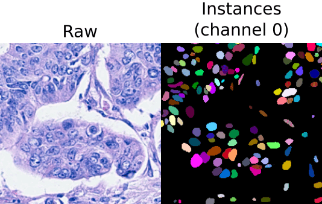

.. _instance_segmentation:

Instance segmentation
---------------------

Description of the task
~~~~~~~~~~~~~~~~~~~~~~~

The goal of this workflow is assign a unique ID, i.e. an integer value, to each object of the **input image**, thus producing a **label image** with **instance** masks. An example of this task is displayed in the figure below, with an electron microscopy image used as input (left) and its corresponding instance label image identifying each invididual mitochondrion (rigth). Each color in the mask image corresponds to a unique object.

.. role:: raw-html(raw)
    :format: html

.. list-table::
  :align: center
  :widths: 50 50
  
  * - .. figure:: ../img/mitoem_crop.png
         :align: center
         :figwidth: 300px

         Input image (electron microscopy, :raw-html:` ` from the `MitoEM dataset <https://mitoem.grand-challenge.org/>`_).

    - .. figure:: ../img/mitoem_crop_mask.png
         :align: center
         :figwidth: 300px

         Label image with mitochondria :raw-html:` ` instance masks.
         

Each instance may also contain information about its **class** (optional). In that case, the label image will contain two channels, one with the instance IDs and one with their corresponding semantic (class) labels. An example of this setting is depicted below:

    **Instance and classification setting example**. From right to left: input raw image (histology image from `CoNIC Challenge <https://conic-challenge.grand-challenge.org/>`__) and its corresponding label image with instance masks (channel 0) and classification/semantic masks (channel 1).

Inputs and outputs
~~~~~~~~~~~~~~~~~~
The instance segmentation workflows in BiaPy expect a series of **folders** as input:

* **Training Raw Images**: A folder that contains the unprocessed (single-channel or multi-channel) images that will be used to train the model.
  
  .. collapse:: Expand to see how to configure

    .. tabs::
      .. tab:: GUI

        Under *Workflow*, select *Instance Segmentation*, twice *Continue*, under *General options* > *Train data*, click on the *Browse* button of **Input raw image folder** and select the folder with your training raw images:

        .. image:: ../img/instance-seg/GUI-train-general-options.png
          :align: center

      .. tab:: Google Colab / Notebooks
        
        In either the 2D or the 3D instance segmentation notebook, go to *Paths for Input Images and Output Files*, edit the field **train_data_path**:
        
        .. image:: ../img/Notebooks-Inputs-Outputs.png
          :align: center
          :width: 75%

      .. tab:: YAML configuration file
        
        Edit the variable ``DATA.TRAIN.PATH`` with the absolute path to the folder with your training raw images.

* **Training Label Images**: A folder that contains the instance label (single- or multi-channel) images for training. Ensure the number and dimensions match the training raw images.
  
  .. collapse:: Expand to see how to configure

    .. tabs::
      .. tab:: GUI

        Under *Workflow*, select *Instance Segmentation*, twice *Continue*, under *General options* > *Train data*, click on the *Browse* button of **Input label folder** and select the folder with your training label images:

        .. image:: ../img/instance-seg/GUI-train-general-options.png
          :align: center

      .. tab:: Google Colab / Notebooks
        
        In either the 2D or the 3D instance segmentation notebook, go to *Paths for Input Images and Output Files*, edit the field **train_data_gt_path**:
        
        .. image:: ../img/Notebooks-Inputs-Outputs.png
          :align: center
          :width: 75%

      .. tab:: YAML configuration file
        
        Edit the variable ``DATA.TRAIN.GT_PATH`` with the absolute path to the folder with your training label images.

    .. note:: Remember the label images need to be **single-channel when performing instance segmentation only**, and **multi-channel in the instance and classification setting** (first channel for instance labels and second channel for semantic labels).

* .. raw:: html

      <b>[Optional] Test Raw Images</b>: A folder that contains the images to evaluate the model's performance.
 
  .. collapse:: Expand to see how to configure

    .. tabs::
      .. tab:: GUI

        Under *Workflow*, select *Instance Segmentation*, three times *Continue*, under *General options* > *Test data*, click on the *Browse* button of **Input raw image folder** and select the folder with your test raw images:

        .. image:: ../img/instance-seg/GUI-test-data.png
          :align: center

      .. tab:: Google Colab / Notebooks
        
        In either the 2D or the 3D instance segmentation notebook, go to *Paths for Input Images and Output Files*, edit the field **test_data_path**:
        
        .. image:: ../img/Notebooks-Inputs-Outputs.png
          :align: center
          :width: 75%

      .. tab:: YAML configuration file
        
        Edit the variable ``DATA.TEST.PATH`` with the absolute path to the folder with your test raw images.

* .. raw:: html

      <b>[Optional] Test Label Images</b>: A folder that contains the instance label images for testing. Again, ensure their count and sizes align with the test raw images.

  .. collapse:: Expand to see how to configure

    .. tabs::
      .. tab:: GUI

        Under *Workflow*, select *Instance Segmentation*, three times *Continue*, under *General options* > *Test data*, select "Yes" in the *Do you have test labels?* field, and then click on the *Browse* button of **Input label folder** and select the folder with your test label images:

        .. image:: ../img/instance-seg/GUI-test-data-gt.png
          :align: center

      .. tab:: Google Colab / Notebooks
        
        In either the 2D or the 3D instance segmentation notebook, go to *Paths for Input Images and Output Files*, edit the field **test_data_gt_path**:
        
        .. image:: ../img/Notebooks-Inputs-Outputs.png
          :align: center
          :width: 75%

      .. tab:: YAML configuration file
        
        Edit the variable ``DATA.TEST.GT_PATH`` with the absolute path to the folder with your test label images.

    .. note:: Remember the label images need to be **single-channel when performing instance segmentation only**, and **multi-channel in the instance and classification setting** (first channel for instance labels and second channel for semantic labels).

Upon successful execution, a directory will be generated with the segmentation results. Therefore, you will need to define:

* **Output Folder**: A designated path to save the segmentation outcomes.

  .. collapse:: Expand to see how to configure

    .. tabs::
      .. tab:: GUI

        Under *Run Workflow*, click on the *Browse* button of **Output folder to save the results**:

        .. image:: ../img/instance-seg/GUI-run-workflow.png
          :align: center

      .. tab:: Google Colab / Notebooks
        
        In either the 2D or the 3D instance segmentation notebook, go to *Paths for Input Images and Output Files*, edit the field **output_path**:
        
        .. image:: ../img/Notebooks-Inputs-Outputs.png
          :align: center
          :width: 75%

      .. tab:: Command line
        
        When calling BiaPy from command line, you can specify the output folder with the ``--result_dir`` flag. See the *Command line* configuration of :ref:`instance_segmentation_data_run` for a full example.

.. list-table::
  :align: center

  * - .. figure:: ../img/Inputs-outputs.svg
         :align: center
         :width: 500
         :alt: Graphical description of minimal inputs and outputs in BiaPy for instance segmentation.
        
         **BiaPy input and output folders for instance segmentation.**
  
.. _instance_segmentation_data_prep:

Data structure
**************

To ensure the proper operation of the library, the data directory tree should be something like this: 

.. code-block::

  dataset/
  ├── train
  │   ├── raw
  │   │   ├── training-0001.tif
  │   │   ├── training-0002.tif
  │   │   ├── . . .
  │   │   └── training-9999.tif
  │   └── label
  │       ├── training_groundtruth-0001.tif
  │       ├── training_groundtruth-0002.tif
  │       ├── . . .
  │       └── training_groundtruth-9999.tif
  └── test
      ├── raw
      │   ├── testing-0001.tif
      │   ├── testing-0002.tif
      │   ├── . . .
      │   └── testing-9999.tif
      └── label
          ├── testing_groundtruth-0001.tif
          ├── testing_groundtruth-0002.tif
          ├── . . .
          └── testing_groundtruth-9999.tif

In this example, the raw training images are under ``dataset/train/raw/`` and their corresponding labels are under ``dataset/train/label/``, while the raw test images are under ``dataset/test/raw/`` and their corresponding labels are under ``dataset/test/label/``. **This is just an example**, you can name your folders as you wish as long as you set the paths correctly later.

.. note:: Ensure that images and their corresponding masks are sorted in the same way. A common approach is to fill with zeros the image number added to the filenames (as in the example).

Example datasets
****************
Below is a list of publicly available datasets that are ready to be used in BiaPy for instance segmentation:

.. list-table::
  :widths: auto
  :header-rows: 1
  :align: center

  * - Example dataset
    - Image dimensions
    - Link to data
  * - `StarDist V2 <https://www.nature.com/articles/s41597-022-01721-8>`__
    - 2D
    - `Stardist_v2.zip <https://drive.google.com/file/d/1b7_WDDGEEaEoIpO_1EefVr0w0VQaetmg/view?usp=drive_link>`__
  * - `3D demo (from StarDist 0.3.0 release) <https://github.com/mpicbg-csbd/stardist/releases/download/0.3.0/demo3D.zip>`__
    - 3D
    - `demo3D.zip <https://drive.google.com/file/d/1pypWJ4Z9sRLPlVHbG6zpwmS6COkm3wUg/view?usp=drive_link>`__
  * - `CartoCell dataset <https://zenodo.org/records/10973241>`__
    - 3D
    - `CartoCell.zip <https://drive.google.com/file/d/1eScAB6mpmPeQcirR5xK6Rkz4AAobsG_X/view?usp=share_link>`__

Minimal configuration
~~~~~~~~~~~~~~~~~~~~~
Apart from the input and output folders, there are a few basic parameters that always need to be specified in order to run an instance segmentation workflow in BiaPy. **These parameters can be introduced either directly in the GUI, the code-free notebooks or by editing the YAML configuration file**.

Experiment name
***************
Also known as "model name" or "job name", this will be the name of the current experiment you want to run, so it can be differenciated from other past and future experiments.

.. collapse:: Expand to see how to configure

    .. tabs::
      .. tab:: GUI

        Under *Run Workflow*, type the name you want for the job in the **Job name** field:

        .. image:: ../img/instance-seg/GUI-run-workflow.png
          :align: center

      .. tab:: Google Colab / Notebooks
        
        In either the 2D or the 3D instance segmentation notebook, go to *Configure and train the DNN model* > *Select your parameters*, and edit the field **model_name**:
        
        .. image:: ../img/instance-seg/Notebooks-model-name-data-conf.png
          :align: center
          :width: 50%

      .. tab:: Command line
        
        When calling BiaPy from command line, you can specify the output folder with the ``--name`` flag. See the *Command line* configuration of :ref:`instance_segmentation_data_run` for a full example.

\

.. note:: Use only *my_model* -style, not *my-model* (Use "_" not "-"). Do not use spaces in the name. Avoid using the name of an existing experiment/model/job (saved in the same result folder) as it will be overwritten.

Data management
***************
Validation Set
""""""""""""""
With the goal to monitor the training process, it is common to use a third dataset called the "Validation Set". This is a subset of the whole dataset that is used to evaluate the model's performance and optimize training parameters. This subset will not be directly used for training the model, and thus, when applying the model to these images, we can see if the model is learning the training set's patterns too specifically or if it is generalizing properly.

.. list-table::
  :align: center

  * - .. figure:: ../img/data-partitions.png
         :align: center
         :width: 400
         :alt: Graphical description of data partitions in BiaPy
        
         **Graphical description of data partitions in BiaPy.**

To define such set, there are two options:
  
* **Validation proportion/percentage**: Select a proportion (or percentage) of your training dataset to be used to validate the network during the training. Usual values are 0.1 (10%) or 0.2 (20%), and the samples of that set will be selected at random.
  
  .. collapse:: Expand to see how to configure

      .. tabs::
        .. tab:: GUI

          Under *Workflow*, select *Instance Segmentation*, click twice on *Continue*, and under *Advanced options* > *Validation data*, select "Extract from train (split training)" in **Validation type**, and introduce your value (between 0 and 1) in the **Train proportion for validation**:

          .. image:: ../img/GUI-validation-percentage.png
            :align: center

        .. tab:: Google Colab / Notebooks
          
          In either the 2D or the 3D instance segmentation notebook, go to *Configure and train the DNN model* > *Select your parameters*, and edit the field **percentage_validation** with a value between 0 and 100:
          
          .. image:: ../img/instance-seg/Notebooks-model-name-data-conf.png
            :align: center
            :width: 50%

        .. tab:: YAML configuration file
        
          Edit the variable ``DATA.VAL.SPLIT_TRAIN`` with a value between 0 and 1, representing the proportion of the training set that will be set apart for validation.

* **Validation paths**: Similar to the training and test sets, you can select two folders with the validation raw and label images:

  * **Validation Raw Images**: A folder that contains the unprocessed (single-channel or multi-channel) images that will be used to select the best model during training.
  
    .. collapse:: Expand to see how to configure

      .. tabs::
        .. tab:: GUI

          Under *Workflow*, select *Instance Segmentation*, click twice on *Continue*, and under *General options* > *Advanced options* > *Validation data*, select "Not extracted from train (path needed)" in **Validation type**, click on the *Browse* button of **Input raw image folder** and select the folder containing your validation raw images:

          .. image:: ../img/GUI-validation-paths.png
            :align: center

        .. tab:: Google Colab / Notebooks
          
          This option is currently not available in the notebooks.

        .. tab:: YAML configuration file
        
          Edit the variable ``DATA.VAL.PATH`` with the absolute path to your validation raw images.

  * **Validation Label Images**: A folder that contains the instance label (single-channel) images for validation. Ensure the number and dimensions match those of the validation raw images.
  
    .. collapse:: Expand to see how to configure

      .. tabs::
        .. tab:: GUI

          Under *Workflow*, select *Instance Segmentation*, click twice on *Continue*, and under *General options* > *Advanced options* > *Validation data*, select "Not extracted from train (path needed)" in **Validation type**, click on the *Browse* button of **Input label folder** and select the folder containing your validation label images:

          .. image:: ../img/GUI-validation-paths.png
            :align: center

        .. tab:: Google Colab / Notebooks
          
          This option is currently not available in the notebooks.

        .. tab:: YAML configuration file
        
          Edit the variable ``DATA.VAL.GT_PATH`` with the absolute path to your validation label images.

      .. note:: Remember the label images need to be **single-channel when performing instance segmentation only**, and **multi-channel in the instance and classification setting** (first channel for instance labels and second channel for semantic labels).

Test ground-truth
"""""""""""""""""
Do you have labels for the test set? This is a key question so BiaPy knows if your test set will be used for evaluation in new data (unseen during training) or simply produce predictions on that new data. All workflows contain a parameter to specify this aspect.

.. collapse:: Expand to see how to configure

  .. tabs::
    .. tab:: GUI

      Under *Workflow*, select *Instance Segmentation*, three times *Continue*, under *General options* > *Test data*, select "No" or "Yes" in the **Do you have test labels?** field:

      .. image:: ../img/GUI-test-data.png
        :align: center

    .. tab:: Google Colab / Notebooks
      
      In either the 2D or the 3D instance segmentation notebook, go to *Configure and train the DNN model* > *Select your parameters*, and check or uncheck the **test_ground_truth** option:
      
      .. image:: ../img/instance-seg/Notebooks-model-name-data-conf.png
        :align: center
        :width: 50%

    .. tab:: YAML configuration file
      
      Set the variable ``DATA.TEST.LOAD_GT`` to ``True`` if you have test labels, or ``False`` if you do not.

\

Basic training parameters
*************************
At the core of each BiaPy workflow there is a deep learning model. Although we try to simplify the number of parameters to tune, these are the basic parameters that need to be defined for training an instance segmentation workflow:

* **Number of input channels**: The number of channels of your raw images (grayscale = 1, RGB = 3). Notice the dimensionality of your images (2D/3D) is set by default depending on the workflow template you select.
  
  .. collapse:: Expand to see how to configure

        .. tabs::
          .. tab:: GUI

            Under *Workflow*, select *Instance Segmentation*, click on *Continue*, and under *General options*, edit the last value of the field **Patch size** with the number of channels. This variable follows a ``(y, x, channels)`` notation in 2D and a ``(z, y, x, channels)`` notation in 3D:

            .. image:: ../img/instance-seg/GUI-general-options.png
              :align: center

          .. tab:: Google Colab / Notebooks
            
            In either the 2D or the 3D instance segmentation notebook, go to *Configure and train the DNN model* > *Select your parameters*, and edit the field **input_channels**:
            
            .. image:: ../img/instance-seg/Notebooks-basic-training-params.png
              :align: center
              :width: 75%

          .. tab:: YAML configuration file
          
            Edit the last value of the variable ``DATA.PATCH_SIZE`` with the number of channels. This variable follows a ``(y, x, channels)`` notation in 2D and a ``(z, y, x, channels)`` notation in 3D.

* **Number of epochs**: This number indicates how many `rounds <https://machine-learning.paperspace.com/wiki/epoch>`_ the network will be trained. On each round, the network usually sees the full training set. The value of this parameter depends on the size and complexity of each dataset. You can start with something like 100 epochs and tune it depending on how fast the loss (error) is reduced.
  
  .. collapse:: Expand to see how to configure

        .. tabs::
          .. tab:: GUI

            Under *Workflow*, select *Instance Segmentation*, click twice on *Continue*, and under *Advanced options*, scroll down to *General training parameters*, and edit the field **Number of epochs**:

            .. image:: ../img/instance-seg/GUI-basic-training-params.png
              :align: center

          .. tab:: Google Colab / Notebooks
            
            In either the 2D or the 3D instance segmentation notebook, go to *Configure and train the DNN model* > *Select your parameters*, and edit the field **number_of_epochs**:
            
            .. image:: ../img/instance-seg/Notebooks-basic-training-params.png
              :align: center
              :width: 75%

          .. tab:: YAML configuration file
          
            Edit the last value of the variable ``TRAIN.EPOCHS`` with the number of epochs. For this to have effect, the variable ``TRAIN.ENABLE`` should also be set to ``True``.

* **Patience**: This is a number that indicates how many epochs you want to wait without the model improving its results in the validation set to stop training. Again, this value depends on the data you're working on, but you can start with something like 20.
   
  .. collapse:: Expand to see how to configure

        .. tabs::
          .. tab:: GUI

            Under *Workflow*, select *Instance Segmentation*, click twice on *Continue*, and under *Advanced options*, scroll down to *General training parameters*, and edit the field **Patience**:

            .. image:: ../img/instance-seg/GUI-basic-training-params.png
              :align: center

          .. tab:: Google Colab / Notebooks
            
            In either the 2D or the 3D instance segmentation notebook, go to *Configure and train the DNN model* > *Select your parameters*, and edit the field **patience**:
            
            .. image:: ../img/instance-seg/Notebooks-basic-training-params.png
              :align: center
              :width: 75%

          .. tab:: YAML configuration file
          
            Edit the last value of the variable ``TRAIN.PATIENCE`` with the number of epochs. For this to have effect, the variable ``TRAIN.ENABLE`` should also be set to ``True``.

For improving performance, other advanced parameters can be optimized, for example, the model's architecture. The architecture assigned as default is the U-Net, as it is effective in instance segmentation tasks. This architecture allows a strong baseline, but further exploration could potentially lead to better results.

.. note:: Once the parameters are correctly assigned, the training phase can be executed. Note that to train large models effectively the use of a GPU (Graphics Processing Unit) is essential. This hardware accelerator performs parallel computations and has larger RAM memory compared to the CPUs, which enables faster training times.

.. _instance_segmentation_data_run:

How to run
~~~~~~~~~~
BiaPy offers different options to run workflows depending on your degree of computer expertise. Select whichever is more approppriate for you:

.. tabs::
   .. tab:: GUI

        In the BiaPy GUI, navigate to *Workflow*, then select *Instance Segmentation* and follow the on-screen instructions:

        .. image:: ../img/gui/biapy_gui_instance_seg.png
            :align: center

        \

        .. note:: BiaPy's GUI requires that all data and configuration files reside on the same machine where the GUI is being executed.

        For a full example on how to configure an instance segmentation workflow in BiaPy GUI, watch our instance segmentation demo video:

        .. raw:: html

          <iframe width="560" height="315" src="https://www.youtube.com/embed/RZJQiUL4ICg?si=AGMxP2TvAR57qauv" title="YouTube video player" frameborder="0" allow="accelerometer; autoplay; clipboard-write; encrypted-media; gyroscope; picture-in-picture; web-share" referrerpolicy="strict-origin-when-cross-origin" allowfullscreen></iframe>

        \

        .. tip:: If you need additional help, watch BiaPy's `GUI walkthrough video <https://www.youtube.com/embed/vY7aBh5FUNk?si=yvVolBnu5APNeHwB>`__.
        

   .. tab:: Google Colab 
    
      BiaPy offers two code-free notebooks in Google Colab to perform instance segmentation: 

      .. |inst_seg_2D_colablink| image:: https://colab.research.google.com/assets/colab-badge.svg
          :target: https://colab.research.google.com/github/BiaPyX/BiaPy/blob/master/notebooks/instance_segmentation/BiaPy_2D_Instance_Segmentation.ipynb

      * For 2D images: |inst_seg_2D_colablink|

      .. |inst_seg_3D_colablink| image:: https://colab.research.google.com/assets/colab-badge.svg
          :target: https://colab.research.google.com/github/BiaPyX/BiaPy/blob/master/notebooks/instance_segmentation/BiaPy_3D_Instance_Segmentation.ipynb

      * For 3D images: |inst_seg_3D_colablink|
      
        \

        .. tip:: If you need additional help, watch BiaPy's `Notebook walkthrough video <https://youtu.be/KEqfio-EnYw>`__.

   .. tab:: Docker 

      If you installed BiaPy via Docker, `open a terminal <../get_started/faq.html#opening-a-terminal>`__ as described in :ref:`installation`. Then, you can use the `3d_instance_segmentation.yaml <https://github.com/BiaPyX/BiaPy/blob/master/templates/instance_segmentation/3d_instance_segmentation.yaml>`__ template file (or your own file), and run the workflow as follows:

      .. code-block:: bash                                                                                                    

          # Configuration file
          job_cfg_file=/home/user/3d_instance_segmentation.yaml
          # Path to the data directory
          data_dir=/home/user/data
          # Where the experiment output directory should be created
          result_dir=/home/user/exp_results
          # Just a name for the job
          job_name=my_3d_instance_segmentation
          # Number that should be increased when one need to run the same job multiple times (reproducibility)
          job_counter=1
          # Number of the GPU to run the job in (according to 'nvidia-smi' command)
          gpu_number=0

          docker run --rm \
              --gpus "device=$gpu_number" \
              --mount type=bind,source=$job_cfg_file,target=$job_cfg_file \
              --mount type=bind,source=$result_dir,target=$result_dir \
              --mount type=bind,source=$data_dir,target=$data_dir \
              biapyx/biapy:latest-11.8 \
                  --config $job_cfg_file \
                  --result_dir $result_dir \
                  --name $job_name \
                  --run_id $job_counter \
                  --gpu "$gpu_number"

      .. note:: 
          Note that ``data_dir`` must contain all the paths ``DATA.*.PATH`` and ``DATA.*.GT_PATH`` so the container can find them. For instance, if you want to only train in this example ``DATA.TRAIN.PATH`` and ``DATA.TRAIN.GT_PATH`` could be ``/home/user/data/train/x`` and ``/home/user/data/train/y`` respectively. 

   .. tab:: Command line

      `From a terminal <../get_started/faq.html#opening-a-terminal>`__, you can use the `3d_instance_segmentation.yaml <https://github.com/BiaPyX/BiaPy/blob/master/templates/instance_segmentation/3d_instance_segmentation.yaml>`__ template file (or your own file), and run the workflow as follows:

      .. code-block:: bash
          
          # Configuration file
          job_cfg_file=/home/user/3d_instance_segmentation.yaml       
          # Where the experiment output directory should be created
          result_dir=/home/user/exp_results  
          # Just a name for the job
          job_name=my_3d_instance_segmentation      
          # Number that should be increased when one need to run the same job multiple times (reproducibility)
          job_counter=1
          # Number of the GPU to run the job in (according to 'nvidia-smi' command)
          gpu_number=0                   

          # Load the environment
          conda activate BiaPy_env
          
          biapy \
                --config $job_cfg_file \
                --result_dir $result_dir  \ 
                --name $job_name    \
                --run_id $job_counter  \
                --gpu "$gpu_number"  

      For multi-GPU training you can call BiaPy as follows:

      .. code-block:: bash
          
          # First check where is your biapy command (you need it in the below command)
          # $ which biapy
          # > /home/user/anaconda3/envs/BiaPy_env/bin/biapy

          gpu_number="0, 1, 2"
          python -u -m torch.distributed.run \
              --nproc_per_node=3 \
              /home/user/anaconda3/envs/BiaPy_env/bin/biapy \
              --config $job_cfg_file \
              --result_dir $result_dir  \ 
              --name $job_name    \
              --run_id $job_counter  \
              --gpu "$gpu_number"  

      ``nproc_per_node`` needs to be equal to the number of GPUs you are using (e.g. ``gpu_number`` length).
      

Templates                                                                                                                 
~~~~~~~~~~

In the `templates/instance_segmentation <https://github.com/BiaPyX/BiaPy/tree/master/templates/instance_segmentation>`__ folder of BiaPy, you will find a few YAML configuration templates for this workflow. 

[Advanced] Special workflow configuration 
~~~~~~~~~~~~~~~~~~~~~~~~~~~~~~~~~~~~~~~~~

.. note:: This section is recommended for experienced users only to improve the performance of their workflows. When in doubt, do not hesitate to check our `FAQ & Troubleshooting <../get_started/faq.html>`__ or open a question in the `image.sc discussion forum <our FAQ & Troubleshooting section>`_.

Advanced parameters 
*******************
Many of the parameters of our workflows are set by default to values that work commonly well. However, it may be needed to tune them to improve the results of the workflow. For instance, you may modify the following parameters

* **Model architecture**: Select the architecture of the deep neural network used as backbone of the pipeline. Options: U-Net, Residual U-Net, Attention U-Net, SEUNet, MultiResUNet, ResUNet++, UNETR-Mini, UNETR-Small, UNETR-Base, ResUNet SE and U-NeXt V1. Default value: U-Net.
* **Batch size**: This parameter defines the number of patches seen in each training step. Reducing or increasing the batch size may slow or speed up your training, respectively, and can influence network performance. Common values are 4, 8, 16, etc.
* **Patch size**: Input the size of the patches use to train your model (length in pixels in X and Y). The value should be smaller or equal to the dimensions of the image. The default value is 256 in 2D, i.e. 256x256 pixels.
* **Optimizer**: Select the optimizer used to train your model. Options: ADAM, ADAMW, Stochastic Gradient Descent (SGD). ADAM usually converges faster, while ADAMW provides a balance between fast convergence and better handling of weight decay regularization. SGD is known for better generalization. Default value: ADAMW.
* **Initial learning rate**: Input the initial value to be used as learning rate. If you select ADAM as optimizer, this value should be around 10e-4. 
* **Learning rate scheduler**: Select to adjust the learning rate between epochs. The current options are "Reduce on plateau", "One cycle", "Warm-up cosine decay" or no scheduler.
* **Test time augmentation (TTA)**: Select to apply augmentation (flips and rotations) at test time. It usually provides more robust results but uses more time to produce each result. By default, no TTA is peformed.

Problem representation
**********************

In BiaPy the instance segmentation problem is solved using a bottom-up approach. This means that a preprocessing step transforms the input per-pixel instance labels into a multi-channel representation that the network will learn (and subsequently predict). After that, these representations are fused to produce the final instance segmentation. In BiaPy we have integrated many different representations that can configured via the ``PROBLEM.INSTANCE_SEG.DATA_CHANNELS`` variable. An possible representation is depicted in the following figure:

    **Process of F + C + Db representation**. From instance :raw-html:` ` segmentation labels (left) to foreground (F), contour (C) and distance to boundary (Db) masks (right).

-----------

**Channels**

Each *channel type* encodes a different geometric or semantic property of the instances. You select which ones to generate with ``PROBLEM.INSTANCE_SEG.DATA_CHANNELS`` (see below). Apart from that, each channel have its own configuration options (e.g. contour thickness, distance transform type, etc.) under ``PROBLEM.INSTANCE_SEG.DATA_CHANNELS_EXTRA_OPTS``.

The currently supported instance channels are:

* **Foreground mask** (``F``): Binary mask of all instance interiors (previously called ``B``). Pixels inside any instance (excluding the explicit contour channel) are ``1``, background is ``0``. This is usually the main *semantic* channel for the instances. The extra options for this channel are the following:

  * ``erosion``: Number of pixels to erode the foreground mask. This can help to separate touching instances by removing thin connections. Default is ``0`` (no erosion).

  * ``dilation``: Number of pixels to dilate the foreground mask. This can help to include uncertain boundary regions into the foreground. Default is ``0`` (no dilation).

* **Background mask** (``B``): Binary mask of all background pixels. Pixels outside any instance are ``1``, instance interiors are ``0``. This channel can be useful to explicitly model the background class. The extra options for this channel are the following:

  * ``erosion``: Number of pixels to erode the background mask. This can help to exclude uncertain boundary regions from the background. Default is ``0`` (no erosion).

  * ``dilation``: Number of pixels to dilate the background mask. This can help to separate touching instances by removing thin connections. Default is ``0`` (no dilation).

* **Center parts** (``P``): Binary mask of center parts of each instance. These centers can be used as seed points for instance separation. The extra options for this channel are the following:

  * ``type``: Type of peak representation. Options are: ``'centroid'`` (single pixel at the instance centroid) and ``'skeleton'`` (skeleton of the instance). Default is ``'centroid'``.

  * ``dilation``: Number of pixels to dilate the peaks. This can help to create larger seed regions for better instance separation. Default is ``1``.

  * ``erosion``: Number of pixels to erode the peaks. This can be useful when using skeletons as peaks to make them thinner. Default is ``0``.

* **Contour / boundary** (``C``): Binary mask of object contours. Pixels on the boundary between instance and background (or between touching instances) are ``1``, the rest are ``0``. The contour thickness and how it is computed are controlled by the instance channel configuration options. The extra options for this channel are the following:

  * ``mode``: How to compute the contour pixels. Options are: ``'thick'``, ``'inner'``, ``'outer'``, ``'subpixel'`` and ``'dense'`` (as defined in `skimage.segmentation.find_boundaries <https://scikit-image.org/docs/stable/api/skimage.segmentation.html#skimage.segmentation.find_boundaries>`__). Default is ``'thick'``.

* **Touching areas** (``T``): Binary mask of pixels that lie in *touching regions* between two or more instances. This channel is useful to explicitly highlight contact zones that are hard to separate using only ``F`` and ``C``. The extra options for this channel are the following:

  * ``thickness``: Thickness in pixels of the touching area. Default is ``2``.

* **Distance to boundary (foreground)** (``Db``): Float mask where each pixel value is the Euclidean distance to the nearest instance boundary, computed inside the instances. Background pixels are typically set to ``0`` (or a constant). This generalises the old ``D`` channel used in previous versions. Intuitively, inside each instance, values increase when moving away from the boundary towards the instance centre. This channel is useful to separate touching instances and to regularise instance shapes. The extra options for this channel are the following:

  * ``norm``: Whether to normalize the distances between ``0`` and ``1``. Default is ``True``.

  * ``mask_values``: Whether to mask the distance channel to only calculate the loss in non-zero values. Default is ``True``.

* **Distance to center** (``Dc``): Float mask where each pixel value is the Euclidean distance to the instance center/skeleton, computed inside the instances. Background pixels are typically set to ``0`` (or a constant). This channel can help to better delineate instances from the background and improve separation in crowded regions. The extra options for this channel are the following:

  * ``type``: Type of center representation. Options are: ``'centroid'`` (distance to instance centroid) and ``'skeleton'`` (distance to instance skeleton). Default is ``'centroid'``.

  * ``norm``: Whether to normalize the distances between ``0`` and ``1``. Default is ``True``.

  * ``mask_values``: Whether to mask the distance channel to only calculate the loss in non-zero values. Default is ``True``.       

* **Distance to boundary (foreground + background)** (``D``): Float mask where the distance-to-boundary information is computed both inside the instances and in the background. Intuitively:

  * inside the instance, values increase when moving away from the boundary towards the instance centre. On the boundary itself, values are ``0``.

  * in the background, values increase when moving away from the nearest instance.

  This channel is built on top of ``Db`` and extends it to the background. It can help to better delineate instances from the background and improve separation in crowded regions. The extra options for this channel are the following: 
    
  * ``activation``: Activation function to be used in the last layer of the model when this channel is selected. Options are: ``'tanh'`` and ``'linear'``. Default is ``'tanh'``.

  * ``alpha``: Value to scale the distances of the background when ``'act'`` is ``'tanh'``. Default is ``1``.

  * ``beta``: Value to scale the distances of the foreground when ``'act'`` is ``'tanh'``. Default is ``1``.
  
  * ``norm``: Whether to normalize the distances between ``-1`` and ``1``. Default is ``True``.

* **Distance offsets** (``H``, ``V``, ``Z``): Offset (vector field) channels that encode, for each pixel, the displacement towards the instance centre:

  * ``H`` – horizontal offset (x-axis).

  * ``V`` – vertical offset (y-axis).

  * ``Z`` – depth offset (z-axis, only for 3D).

  These channels correspond to `Cellpose <https://github.com/MouseLand/cellpose>`__/`Hover-Net <https://github.com/vqdang/hover_net>`__/`Omnipose <https://github.com/kevinjohncutler/omnipose>`__-style encodings where instances are recovered from a flow/offset field. The extra options for these channels are the following:

  * ``norm``: Whether to normalize the distances between ``0`` and ``1``. Default is ``True``.

  * ``mask_values``: Whether to mask the distance channel to only calculate the loss in non-zero values. Default is ``True``.

* **Distance to neighbours** (``Dn``): Float mask encoding how far each pixel is from neighbouring instances. Small values typically occur in crowded regions; larger values appear in isolated instances. This channel can be used to regularise instance shapes and reduce over-segmentation in dense areas. The extra options for this channel are the following:

  * ``closing_size``: Size of the closing to be applied to the combined distance map. Default is ``0``.

  * ``norm``: Whether to normalize the distances between ``0`` and ``1``. Default is ``True``.

  * ``mask_values``: Whether to mask the distance channel to only calculate the loss in non-zero values. Default is ``True``.

  * ``decline_power``: Power to which the distances are raised to control the decline rate. Default is ``3``.

* **Radial distances** (``R``): Radial (star-shaped) distances from each pixel to the instance boundary, in multiple directions (`StarDist <https://github.com/stardist/stardist>`__-like). This channel usually has several internal rays per pixel and is intended for star-convex instance representations. The extra options for this channel are the following:

  * ``nrays``: Number of rays to be used to represent the radial distances. Default is ``32`` (in 2D) and ``96`` (in 3D).

  * ``norm``: Whether to normalize the distances between ``0`` and ``1``. Default is ``True``.

  * ``mask_values``: Whether to mask the distance channel to only calculate the loss in non-zero values. Default is ``True``.

* **Embeddings** (``E``): High-dimensional embedding vectors for each pixel, learned such that pixels belonging to the same instance have similar embeddings, while those from different instances are dissimilar (`EmbedSeg <https://www.sciencedirect.com/science/article/pii/S1361841522001700>`__-like). This channel is useful for clustering-based instance segmentation approaches and can not be used together with other channels. The extra options for this channel are the following:

  * ``center_mode``: Method to compute the center of the embeddings for each instance during training. Options are ``'centroid'`` (mean embedding) and ``'medoid'`` (most central embedding). Default is ``'centroid'``.

  * ``medoid_max_points``: Maximum number of points to use when calculating the medoid. Default is ``10000``.

* **Affinities** (``A``): Affinity graphs representing the likelihood of neighboring pixels belonging to the same instance. This channel is useful for dense datasets as in `connectomics <https://en.wikipedia.org/wiki/Connectomics>`__ and can not be used together with other channels. The extra options for this channel are the following:
    
  * ``neighborhood``: Defines the neighborhood connectivity for the affinity graph. Options are ``'4-connectivity'``, ``'8-connectivity'`` in 2D, and ``'6-connectivity'``, ``'18-connectivity'``, ``'26-connectivity'`` in 3D. Default is ``'8-connectivity'`` in 2D and ``'26-connectivity'`` in 3D.

In practice, ``PROBLEM.INSTANCE_SEG.DATA_CHANNELS`` is a list (or sequence) of these channel codes (e.g. ``['F', 'C', 'Db']`` or ``['F', 'C', 'H', 'V']``). The order of the codes defines the order of the output channels of the network. 

For the ``PROBLEM.INSTANCE_SEG.DATA_CHANNELS_EXTRA_OPTS`` variable, each channel code can have its own dictionary of extra options (as described above) to further customise how the channel is generated from the instance labels. BiaPy will fill in any missing options with sensible defaults.

-----------

**Channel combinations and weights**

* ``PROBLEM.INSTANCE_SEG.DATA_CHANNELS``: List of channel identifiers chosen from ``F``, ``C``, ``T``, ``Db``, ``D``, ``R``, ``H``, ``V``, ``Z``, ``Dn`` and ``E``.  Examples (non-exhaustive):

  * ``['F', 'C']`` – classic foreground + contour.

  * ``['F', 'C', 'Db']`` – foreground + contour + distance to boundary.

  * ``['F', 'H', 'V']`` – foreground + 2D distance offsets (`Cellpose <https://github.com/MouseLand/cellpose>`__/`Hover-Net <https://github.com/vqdang/hover_net>`__ style).

  * ``['Db', 'R']`` – foreground + contour + radial distances (`StarDist <https://github.com/stardist/stardist>`__ style).

  * ``['F', 'C', 'Db', 'Dn']`` – foreground + contour + distance to boundary + distance to neighbours.

* ``PROBLEM.INSTANCE_SEG.DATA_CHANNELS_EXTRA_OPTS``: Dictionary of extra options for each channel selected in ``DATA_CHANNELS``. For example, to set the contour to be thick, e.g. ``1`` pixel inside and ``1`` pixel outside the true contour, and erode the foreground by 3 pixels, you could set:

  .. code-block:: yaml

     PROBLEM:
       INSTANCE_SEG:
         DATA_CHANNELS: ['F', 'C', 'Db']
         DATA_CHANNELS_EXTRA_OPTS: {'F': {'erosion': 3}, 'C': {'mode': 'thick'}}

  See `config.py <https://github.com/BiaPyX/BiaPy/blob/master/biapy/config/config.py>`__ for a full list of channel-specific options.

* ``PROBLEM.INSTANCE_SEG.DATA_CHANNEL_WEIGHTS``: Tuple/list of floats with the same length as ``DATA_CHANNELS``. It sets the relative importance of each channel in the loss. For instance, for ``DATA_CHANNELS = ['F', 'C', 'Db']`` you might set:

  .. code-block:: yaml

     PROBLEM:
       INSTANCE_SEG:
         DATA_CHANNELS: ['F', 'C', 'Db']
         DATA_CHANNEL_WEIGHTS: (1.0, 1.0, 0.5)

  so that the distance channel ``Db`` has half the impact of the binary channels during training.

During training, the network outputs one prediction map per configured channel. For “binary” channels (``F``, ``C``, ``T``, etc.), each pixel holds a probability in ``[0, 1]``. For “regression” channels (``Db``, ``D``, ``R``, ``H``, ``V``, ``Z``, ``Dn``, ``E``) each pixel holds a float value.

-----------

**From channels to seeds and instances**

Once the network has predicted the instance channels selected in ``PROBLEM.INSTANCE_SEG.DATA_CHANNELS``, these channels are combined. All the channels but embeddings (e.g. `EmbedSeg <https://www.sciencedirect.com/science/article/pii/S1361841522001700>`__, ``E``) and radial distances (e.g. `StarDist <https://github.com/stardist/stardist>`__, ``R``) follow a common seed creation process based on marker-controlled watershed. 

.. tabs::
  .. tab:: Watershed-based

    The following sections describe how seeds and instances are extracted from the predicted channels using marker-controlled watershed. This applies to all channels except embeddings (`EmbedSeg <https://www.sciencedirect.com/science/article/pii/S1361841522001700>`__, ``E``) and radial distances (e.g. `StarDist <https://github.com/stardist/stardist>`__, ``R``). All the parameters described below are set in the ``PROBLEM.INSTANCE_SEG.WATERSHED`` section of the configuration file. In these explanations we ommit the ``PROBLEM.INSTANCE_SEG.WATERSHED`` prefix for brevity.

    Conceptually, the pipeline is:

    #. Select which predicted channels will be used to create seeds and how to threshold them (``SEED_CHANNELS`` and ``SEED_CHANNELS_THRESH``).

    #. Select the topographic surface on which seeds will grow (``TOPOGRAPHIC_SURFACE_CHANNEL``), usually a distance or probability map.

    #. Select which channels will define the growth mask and how to threshold them (``GROWTH_MASK_CHANNELS`` and ``GROWTH_MASK_CHANNELS_THRESH``). 

    #. Optionally refine seeds (using ``SEED_MORPH_SEQUENCE`` and ``SEED_MORPH_RADIUS``) and growth mask (using ``ERODE_AND_DILATE_GROWTH_MASK``, ``FORE_EROSION_RADIUS`` and ``FORE_DILATION_RADIUS``) with morphological operations and small-object removal.

    #. Run the marker-controlled watershed, optionally slice-by-slice in 3D (by setting ``BY_2D_SLICES``).

    If any of these options are left empty, BiaPy will infer sensible defaults from ``PROBLEM.INSTANCE_SEG.DATA_CHANNELS`` so that a minimal configuration still works out-of-the-box. Below sections explain each step in more detail.

    **1. Seed creation**

      The variables ``SEED_CHANNELS`` and ``SEED_CHANNELS_THRESH`` control how the seed map is created.

      ``SEED_CHANNELS`` is a list of channel names (e.g. ``["F", "Db"]``, ``["F", "C"]``) that must be present in ``PROBLEM.INSTANCE_SEG.DATA_CHANNELS``. Typical choices are:

      * Foreground / interior channels like ``F`` or inverse of ``B``, to ensure seeds lie inside instances.

      * Distance channels like ``Db`` or ``D``.

      On top of that, some channels could be used as an exclusion mask, such as boundary channel ``C``, touching areas ``T``, distance to neighbours ``Dn`` etc.

      The variable ``SEED_CHANNELS_THRESH`` is a list of thresholds, one per entry in ``SEED_CHANNELS``. Each entry can be: 1) a float between ``0`` and ``1`` (explicit threshold), or 2) the string ``'auto'`` to let BiaPy estimate the threshold automatically (e.g. using `Otsu <https://en.wikipedia.org/wiki/Otsu%27s_method>`__ or a similar heuristic, depending on the channel type). For each channel listed in ``SEED_CHANNELS``:

      * The corresponding prediction is thresholded using the value in ``SEED_CHANNELS_THRESH`` (or an automatically computed value if ``'auto'``).

      * The resulting binary masks are combined (typically by logical AND) to obtain the final seed_map: pixels that satisfy all the seed conditions become initial markers. ``F``, ``P``, ``Db``, ``D`` channels contribute positively to seeds (i.e. pixels above the threshold are selected), while ``C``, ``B``, ``T``, ``Dn``, ``Dc`` channels contribute negatively (i.e. pixels below the threshold are selected). ``H``, ``V``, ``Z`` channels are combined by applying a Sobel filter to find pixels with low gradient magnitude (i.e. close to the center of instances).

      If ``SEED_CHANNELS`` and/or ``SEED_CHANNELS_THRESH`` are left empty, BiaPy automatically chooses: which channels are best suited for seeds (for example, using a combination of foreground and distance-to-boundary channels), and appropriate thresholds based on their statistics.

      .. note ::

        For affinities (``A``), the minimum value across all affinity channels is computed to produce a single aggregated affinity map. This resulting map is then thresholded, using the same procedure described above, to generate the final seed map.

    **2. Topographic surface creation**

      The topographic surface defines the scalar image on which the marker-controlled watershed is run. It is controlled by ``TOPOGRAPHIC_SURFACE_CHANNEL`` and must be the name of a single channel (e.g. ``Db``, ``D``, ``F``) present in ``PROBLEM.INSTANCE_SEG.DATA_CHANNELS``. It is typically:

      * A distance channel (e.g. ``Db``, ``D``) for classical distance-based watershed.

      * A probability-like channel (e.g. ``F``) if you want to grow seeds on a probability landscape.

      If left empty, BiaPy will automatically pick a reasonable channel based on the selected instance representation (for example, the main distance or foreground channel).

      .. note ::

        For affinities (``A``), the minimum value across all affinity channels is computed to produce a single aggregated affinity map. This resulting map is the one used as the topographic surface for the watershed.

    **3. Growth mask**

      The growth mask restricts the area where seeds are allowed to grow. It is controlled by the variables ``GROWTH_MASK_CHANNELS`` and ``GROWTH_MASK_CHANNELS_THRESH``:

      * ``GROWTH_MASK_CHANNELS``: A list of channel names (e.g. ``["F"]``, ``["F", "C"]``). 

      * ``GROWTH_MASK_CHANNELS_THRESH`` is a list of thresholds, one per channel in ``GROWTH_MASK_CHANNELS``. Each entry can be: 1) a float between ``0`` and ``1`` or 2) ``'auto'``, to let BiaPy infer an appropriate threshold given the channel type (e.g. probability vs. distance).

      Each growth-mask channel is thresholded using its corresponding value, and the resulting binary masks are combined to obtain a single growth / foreground mask. Only pixels inside this mask can be assigned to instances during the watershed. If you do not specify these variables, BiaPy automatically chooses a default growth mask (for example, thresholding the main foreground channel).

      .. note ::

        For affinities (``A``), the minimum value across all affinity channels is computed to produce a single aggregated affinity map. This resulting map is then thresholded, using the same procedure described above, to generate the final growth mask.

    **4. Morphological refinement and small-object removal**

      Before applying the watershed, BiaPy can refine both seeds and growth masks using several options:

      * For the seed map:

        * ``SEED_MORPH_SEQUENCE``: List of morphological operations (strings) to apply to the seed map, in order. Possible values are ``"erode"`` and ``"dilate"``. For example: ``['erode', 'dilate']`` will erode seeds first and then dilate them.

        * ``SEED_MORPH_RADIUS``: List of integer radii, one per entry in ``SEED_MORPH_SEQUENCE``, specifying the structuring element size for each erosion/dilation.

      * For the growth mask:

        * ``ERODE_AND_DILATE_GROWTH_MASK``: If ``True``, the growth mask is eroded and then dilated to remove small holes and thin artifacts that could interfere with stable instance growth.

        * ``FORE_EROSION_RADIUS`` and ``FORE_DILATION_RADIUS``: Radii used to erode and dilate the growth mask when ``ERODE_AND_DILATE_GROWTH_MASK`` is enabled.

      To control tiny structures before watershed:

      * ``DATA_REMOVE_SMALL_OBJ_BEFORE``: Minimum size (in pixels/voxels) for objects to be kept when cleaning masks.

      * ``DATA_REMOVE_BEFORE_MW``: If ``True``, small connected components below ``DATA_REMOVE_SMALL_OBJ_BEFORE`` are removed in the relevant masks (typically seeds and/or growth mask) before running the watershed.

      These refinements help separate touching seeds, remove spurious markers and simplify the growth region, which is particularly useful to reduce over-segmentation or noisy instances.

    **5. Watershed execution and output**

      Finally, the marker-controlled watershed is executed on the created topographic surface where markers come from the refined seed map and the growth is restricted to the growth mask. Two additional options control how this is run and how it is saved:
    
      * ``BY_2D_SLICES``: If ``True``, and the data is 3D, the watershed is applied slice by slice in 2D along the z-axis. This can help when objects overlap heavily across z and a full 3D watershed would cause instances to invade each other.

      * ``DATA_CHECK_MW``: If ``True``, BiaPy saves intermediate images to the watershed folder of each run:

        * ``seed_map.tif``: The final seeds used as markers.

        * ``semantic.tif``: The topographic surface used by the watershed.

        * ``foreground.tif``: The growth mask.

      These files are very useful for debugging and for tuning ``SEED_CHANNELS``, ``*_THRESH`` and morphological parameters. The output of the watershed is an integer-labeled instance map where each connected region grown from a seed corresponds to one predicted object.

  .. tab:: Embeddings

    When using the **embedding representation** (`EmbedSeg <https://www.sciencedirect.com/science/article/pii/S1361841522001700>`__ style), the network creates instances by predicting per-pixel embeddings and then **clustering** them. This process follows the `EmbedSeg` procedure :cite:p:`lalit2022embedseg` rather than a watershed approach.

    All the variables related to this procedure are located in the ``PROBLEM.INSTANCE_SEG.EMBEDSEG`` section of the configuration file.

    **Configuration Variables**

    The following options control the embedding-based clustering instance creation, inspired by `EmbedSeg <https://www.sciencedirect.com/science/article/pii/S1361841522001700>`__ :

    * ``PROBLEM.INSTANCE_SEG.EMBEDSEG.SEED_THRESH``: Foreground threshold for the seediness map. Pixels are only considered for clustering if their seediness score is above this value. (Default: ``0.5``)
    
    * ``PROBLEM.INSTANCE_SEG.EMBEDSEG.MIN_MASK_SUM``: Minimum number of foreground pixels required in total to perform the initial clustering. If the total number of foreground pixels is less than this value, no instances are created. (Default: ``0``)
    
    * ``PROBLEM.INSTANCE_SEG.EMBEDSEG.MIN_UNCLUSTERED_SUM``: Minimum number of unclustered foreground pixels required to continue the iterative clustering process. (Default: ``0``)
    
    * ``PROBLEM.INSTANCE_SEG.EMBEDSEG.MIN_OBJECT_SIZE``: Minimum size (in pixels) for an object to be considered valid. Instances smaller than this are not going to be considered as individual objects. (Default: ``100``)
        
    **Network outputs**

    The output channel ``E`` is automatically translated by BiaPy into three different channels for the model to predict. For each pixel :math:`x_{i}`, the network predicts:

    * An embedding vector :math:`\mathbf{e}_i`: A low-dimensional spatial embedding (2D or 3D) indicating the predicted location of its instance's centre. The ``E_offset`` channel is used to create this embedding vector.

    * An uncertainty / bandwidth vector :math:`\boldsymbol{\sigma}_i`: Used as a per-pixel clustering bandwidth in the embedding space. This is represented by the ``E_sigma`` channel.

    * A seediness score :math:`s_i \in [0, 1]`: How likely this pixel is to be a good seed (centre) of an object instance. This is represented by the ``E_seediness`` channel.

    **High-level idea**

    Pixels belonging to the same object are expected to point to the same region in embedding space (similar :math:`\mathbf{e}_i`) and share a similar bandwidth (:math:`\boldsymbol{\sigma}_i`). The clustering procedure involves:

    #. Identifying seed pixels with high seediness.

    #. Using the seed's embedding (:math:`\mathbf{e}_{\text{seed}}`) and bandwidth (:math:`\boldsymbol{\sigma}_{\text{seed}}`) as a cluster centre and kernel.

    #. Collecting all foreground pixels whose embeddings fall within the corresponding kernel, forming one instance.

    #. Removing these assigned pixels from the foreground pool and repeating the process until no valid seeds remain.

    This is a direct adaptation of the inference procedure described in the original `EmbedSeg <https://www.sciencedirect.com/science/article/pii/S1361841522001700>`__ implementation.
  
    **Detailed inference procedure**

    First, BiaPy determines the initial foreground pixel set :math:`S_{\text{fg}}`, which includes all pixels whose predicted seediness score :math:`s_i` is greater than ``PROBLEM.INSTANCE_SEG.EMBEDSEG.SEED_THRESH``. The clustering process only proceeds if the total number of pixels in :math:`S_{\text{fg}}` is greater than ``PROBLEM.INSTANCE_SEG.EMBEDSEG.MIN_MASK_SUM``. If the condition is met, BiaPy iteratively performs the following steps:

    1. Seed Search: Among all remaining pixels in :math:`S_{\text{fg}}`, find the pixel with the maximum seediness:

      .. math::

          \mathbf{x}_{\text{seed}} = \arg\max_{\mathbf{x}_i \in S_{\text{fg}}} s_i

    2. Instance Growing in Embedding Space. Let :math:`\mathbf{e}_{\text{seed}}` and :math:`\boldsymbol{\sigma}_{\text{seed}}` be the embedding and bandwidth predicted at :math:`\mathbf{x}_{\text{seed}}`. For each remaining foreground pixel :math:`\mathbf{x}_j \in S_{\text{fg}}`, compute its embedding likelihood with respect to the seed's kernel:

      .. math::

          \ell_j = \text{likelihood}\big(\mathbf{e}_j \mid \mathbf{e}_{\text{seed}}, \boldsymbol{\sigma}_{\text{seed}}\big)

      The likelihood is given by the Gaussian-like kernel used in EmbedSeg (see the `EmbedSeg paper <https://www.sciencedirect.com/science/article/pii/S1361841522001700>`__ for the exact formula). All foreground pixels whose likelihood :math:`\ell_j` exceeds a fixed threshold (hardcoded to 0.5) are collected into an instance set:

      .. math::

          S_k = \{ \mathbf{x}_j \in S_{\text{fg}} \mid \ell_j > 0.5 \}

      These pixels form one instance :math:`S_k` and receive a new label :math:`k` in the output instance mask.

    3. Update Foreground Pool

      Remove the pixels of this new instance from the foreground pool:

      .. math::

          S_{\text{fg}} \leftarrow S_{\text{fg}} \setminus S_k

      The process then goes back to Step 1 to look for the next seed.

    4. Termination

      The iterative process stops when one of the following conditions is met:

      * The number of remaining foreground pixels in :math:`S_{\text{fg}}` is less than or equal to ``PROBLEM.INSTANCE_SEG.EMBEDSEG.MIN_UNCLUSTERED_SUM``.

      * The best remaining seed pixel's maximum seediness score :math:`s_i` is less than ``PROBLEM.INSTANCE_SEG.EMBEDSEG.SEED_THRESH`` (too unreliable to start a new instance).

  .. tab:: Radial distances

    When the **radial distance representation** is used (i.e., the ``R`` channel is selected in ``PROBLEM.INSTANCE_SEG.DATA_CHANNELS``), instances are created using a `StarDist <https://github.com/stardist/stardist>`__-like procedure :cite:p:`schmidt2018cell`. Currently the unique combination allowed, in order to reproduce Stardist approach, is ``Db`` + ``R`` channels. In this setting, the network predicts for each pixel a set of radial distances along fixed directions (rays) together with an object probability. These are then converted into polygonal instance candidates, which are filtered by non-maximum suppression (NMS).

    For each pixel, the `StarDist <https://github.com/stardist/stardist>`__-style head predicts two main components:

    * A probability map between ``[0, 1]`` indicating how likely the pixel is to belong to the interior of an object (instance centre candidate). Which is represented by the ``Db`` channel.

    * A set of radial distances (``R`` channel): For a fixed number of rays (evenly spaced angles), the network predicts the distance from the pixel to the object boundary along each ray. Taken together, these distances define a star-convex polygon centred at that pixel. 

    From these two outputs, BiaPy constructs polygon candidates and then selects a subset of them so that they do not overlap too much, following the `StarDist <https://github.com/stardist/stardist>`__ approach.

    **High-level Idea**

    The StarDist-style instance creation works as follows:

    #. For pixels with sufficiently high object probability, convert their radial distances into polygon candidates (one polygon per pixel).
    #. Each polygon is scored by the probability value at its centre.
    #. A non-maximum suppression (NMS) removes redundant polygons that overlap too much with higher-scoring ones.
    #. The remaining polygons are rasterized into the final instance label image, assigning a unique ID to each polygon.

    **Detailed Procedure**

    * Candidate Selection. The probability map is thresholded with ``PROBLEM.INSTANCE_SEG.STARDIST.PROB_THRESH``, which defines the probability threshold to accept a pixel as a potential instance centre. Only pixels with probability greater than or equal to this threshold will produce polygon candidates.

      In the same way, only pixels whose probability is greater than or equal to ``PROBLEM.INSTANCE_SEG.STARDIST.PROB_THRESH`` are considered as potential instance centres. For each such pixel:

      * The corresponding set of radial distances (``R`` channel) is taken.
      * These distances are projected along the fixed ray directions.
      * The resulting points are connected to form a star-convex polygon around that pixel.

      This yields a list of polygon candidates, each with a centre position, a polygon outline (list of vertices), and a score (its probability value).

    * Non-maximum Suppression (Polygon NMS). This is applied to remove overlapping and redundant polygons, BiaPy applies polygon-based non-maximum suppression:

      #. Sort all polygon candidates in descending order of their score (probability).
      #. Iterate through the sorted list and maintain a list of selected polygons.
      #. For the current candidate, compute its Intersection Over Union (IoU) with all already selected polygons.
      #. If the IoU with any selected polygon is greater than or equal to ``PROBLEM.INSTANCE_SEG.STARDIST.NMS_IOU_THRESH``, the candidate is discarded (it overlaps too much with a better polygon).
      #. Otherwise, the candidate is kept and added to the selected list.

      The variable ``PROBLEM.INSTANCE_SEG.STARDIST.NMS_IOU_THRESH`` defines the IoU threshold used in polygon non-maximum suppression. Candidate polygons whose IoU with a higher-scoring selected polygon is above this value are discarded. This threshold controls how much overlap is allowed between different instance candidates. Smaller values make NMS more aggressive (fewer, more separated instances), while larger values allow more overlap.

    * Rasterization to Instance Labels. After NMS, the remaining polygons are converted into an integer-labeled instance mask:

      * Each selected polygon is filled (rasterized) into a binary mask.
      * A new instance ID is assigned to that mask.
      * If polygons still overlap slightly, BiaPy resolves conflicts following the ordering given by NMS (higher-scoring polygons have priority).

      The final result is an image where each object instance corresponds to one filled polygon with a unique label.

Instance refinement
*******************

After initial instance creation (whether through embedding clustering or radial distance-based polygon selection), BiaPy offers an optional instance refinement step. This process applies a sequence of morphological and filtering operations to the generated instance mask *before* any global post-processing that are described in the next section. The refinements are applied sequentially to each instance individually. The process is controlled by the following configuration variables within the ``TEST.POST_PROCESSING.INSTANCE_REFINEMENT`` section:

  * ``TEST.POST_PROCESSING.INSTANCE_REFINEMENT.ENABLE``: Boolean flag to enable or disable the instance refinement procedure. (Default: ``False``)

  * ``TEST.POST_PROCESSING.INSTANCE_REFINEMENT.OPERATIONS``: A list defining the sequence of morphological and filtering operations to apply. These operations are executed in the order they are listed. The available operations are:

    * ``'dilation'``: Dilate instances using a structuring element.
    * ``'erosion'``: Erode instances using a structuring element.
    * ``'fill_holes'``: Fill holes present inside the instances.
    * ``'clear_border'``: Remove instances that touch the image border.
    * ``'remove_small_objects'``: Filter out instances smaller than a defined size threshold.
    * ``'remove_large_objects'``: Filter out instances larger than a defined size threshold.

  * ``TEST.POST_PROCESSING.INSTANCE_REFINEMENT.VALUES``: A list containing the corresponding parameter value for each operation listed in ``OPERATIONS``. The required value type depends on the operation:

    * For ``'dilation'`` and ``'erosion'``: The value corresponds to the size of the structuring element (can be a scalar or a list).
    * For ``'remove_small_objects'`` and ``'remove_large_objects'``: The value corresponds to the size threshold in pixels.
    * For ``'fill_holes'`` and ``'clear_border'``: No value is needed, and ``'none'`` should be used as a placeholder in the list.

A full example of configuring instance refinement might look like:

.. code-block:: yaml

  TEST:
    POST_PROCESSING:
      INSTANCE_REFINEMENT:
        OPERATIONS: ['fill_holes', 'remove_small_objects', 'remove_large_objects', 'clear_border']
        VALUES: ['none', 10, 2000, 'none']

In this example, instances are first refined by filling any internal holes, then objects smaller than ``10`` pixels are removed, followed by the removal of objects larger than ``2000`` pixels, and finally, any objects touching the image border are discarded.

Instance morphological measurements
***********************************

.. _instance_morphological_measurements:

This post-processing step allows for the calculation of various **morphological properties** (shape descriptors) for each detected instance. These properties can be used for further analysis or to filter instances based on specific criteria. The measurement process is inspired by the `scikit-image regionprops` function and includes commonly used shape descriptors such as area, perimeter, circularity, elongation, and more. The measurement and filtering process is controlled by variables within the ``TEST.POST_PROCESSING.MEASURE_PROPERTIES`` section. You would need to set ``TEST.POST_PROCESSING.MEASURE_PROPERTIES.ENABLE`` to ``True`` to activate this feature. The default properties measured are: ``label``, ``npixels``, ``areas`` (volume in 3D), ``centers``, ``elongation`` (2D), ``circularities`` (2D)/``sphericities`` (3D), ``diameters``, and ``perimeter`` (2D)/``surface_area`` (3D). The are defined as follows:

The definitions for some key measured properties are as follows (some formulas follow `MorphoLibJ <https://doi.org/10.1093/bioinformatics/btw413>`__ conventions):

* ``'circularity'`` (2D): Defined as the ratio of area over the square of the perimeter, normalized such that the value for a disk equals one: :math:`(4 \cdot \pi \cdot \text{area}) / (\text{perimeter}^2)`. Only measurable for 2D images.
* ``'elongation'`` (2D): The inverse of circularity. Values range from 1 for round particles and increase for elongated particles: :math:`(\text{perimeter}^2) / (4 \cdot \pi \cdot \text{area})`. Only measurable for 2D images.
* ``'npixels'``: The sum of pixels that compose an instance (pixel count).
* ``'area'``: The number of pixels taking into account the image resolution. For 3D images, this corresponds to the **volume**.
* ``'diameter'``: Calculated using the bounding box, taking the maximum extent in the x, y, and (in 3D) z axes. This does not take into account image resolution.
* ``'perimeter'`` (2D) / ``'surface_area'`` (3D): In 2D, perimeter approximates the contour as a line through the centers of border pixels using 4-connectivity. In 3D, it corresponds to the surface area.
* ``'sphericity'`` (3D): The ratio of the squared volume over the cube of the surface area, normalized such that the value for a ball equals one: :math:`(36 \cdot \pi) \cdot (\text{volume}^2 / \text{perimeter}^3)`. Only measurable for 3D images.

Apart from those properties more can be defined by using ``TEST.POST_PROCESSING.MEASURE_PROPERTIES.EXTRA_PROPS``. This variable allows to specify additional morphological properties to measure on each instance, based on the `scikit-image regionprops` function. A detailed list of extra available properties can be found in the `scikit-image documentation <https://scikit-image.org/docs/stable/api/skimage.measure.html#skimage.measure.regionprops>`__.

Post-processing
***************

After network prediction and applied to 3D images (e.g. ``PROBLEM.NDIM`` is 3D or ``TEST.ANALIZE_2D_IMGS_AS_3D_STACK`` is ``True``). There are the following options:

* **Z-filtering**: to apply a median filtering in ``z`` axis. Useful to maintain class coherence across 3D volumes. Enable it with ``TEST.POST_PROCESSING.Z_FILTERING`` and use ``TEST.POST_PROCESSING.Z_FILTERING_SIZE`` for the size of the median filter. 

* **YZ-filtering**: to apply a median filtering in ``y`` and ``z`` axes. Useful to maintain class coherence across 3D volumes that can work slightly better than ``Z-filtering``. Enable it with ``TEST.POST_PROCESSING.YZ_FILTERING`` and use ``TEST.POST_PROCESSING.YZ_FILTERING_SIZE`` for the size of the median filter.  

\

Then, after extracting the final instances from the predictions, the following post-processing methods are avaialable:

* **Big instance repair**: In order to repair large instances, the variable ``TEST.POST_PROCESSING.REPARE_LARGE_BLOBS_SIZE`` can be set to a value other than ``-1``. This process attempts to merge the large instances with their neighboring instances and remove any central holes. The value of the variable determines which instances will be repaired based on their size (number of pixels that compose the instance). This option is particularly useful when the ``PROBLEM.INSTANCE_SEG.DATA_CHANNELS`` is set to ``BP``, as multiple central seeds may be created in big instances.
  
  .. figure:: ../img/repair_large_blobs_postproc.png
      :width: 400px
      :align: center
      
      For left to right: raw image, instances created after the watershed and the resulting instance after the post-proccessing. Note how the two instances of the middle image (two colors) have been merged just in one in the last image, as it should be. 
      
* **Filter instances by morphological measurements**: To remove instances by the conditions based in each instance properties, which is controlled by variables inside ``TEST.POST_PROCESSING.MEASURE_PROPERTIES.REMOVE_BY_PROPERTIES``. There are three key variables there: ``PROPS``, ``VALUES`` and ``SIGN`` that will compose a list of conditions to remove the instances. They are list of list of conditions, for instance, the conditions can be like this: ``[['A'], ['B','C']]``. Then, if the instance satisfies the first list of conditions, only 'A' in this first case (from ``['A']`` list), or satisfy ``'B'`` and ``'C'`` (from ``['B','C']`` list) it will be removed from the image. In each sublist all the conditions must be satisfied. The available properties are the ones that are calculated by default in ``TEST.POST_PROCESSING.MEASURE_PROPERTIES`` (explanation :ref:`above <instance_morphological_measurements>`). Available properties are: [``circularity``', ``elongation``', ``npixels``', ``area``', ``diameter``', ``perimeter``', ``sphericity``']. 
  
  When this post-processing step is selected two ``.csv`` files will be created, one with the properties of each instance from the original image (will be placed in ``PATHS.RESULT_DIR.PER_IMAGE_INSTANCES`` path), and another with only instances that remain once this post-processing has been applied (will be placed in ``PATHS.RESULT_DIR.PER_IMAGE_POST_PROCESSING`` path). In those ``.csv`` files two more information columns will appear: a list of conditions that each instance has satisfy or not (``'Satisfied'``, ``'No satisfied'`` respectively), and a comment with two possible values, ``'Removed'`` and ``'Correct'``, telling you if the instance has been removed or not, respectively. Some of the properties follow the formulas used in `MorphoLibJ library for Fiji <https://doi.org/10.1093/bioinformatics/btw413>`__. 

  A full example of this post-processing would be the following: if you want to remove those instances that have less than ``100`` pixels and circularity less equal to ``0.7`` you should declare the above three variables as follows: ::
  
    TEST:
      POST_PROCESSING:
        MEASURE_PROPERTIES:
          REMOVE_BY_PROPERTIES:
            ENABLE: True
            PROPS:[['npixels', 'circularity']]
            VALUES: [[100, 0.7]]
            SIGN: [['lt', 'le']]

  You can also concatenate more restrictions and they will be applied in order. For instance, if you want to remove those instances that are bigger than an specific area, and do that before the condition described above, you can define the variables this way: ::

    TEST:
      POST_PROCESSING:
        MEASURE_PROPERTIES:
          REMOVE_BY_PROPERTIES:
            ENABLE: True
            PROPS:[['area'], ['npixels', 'circularity']]
            VALUES: [[500], [100, 0.7]]
            SIGN: [['gt'], ['lt', 'le']]        

  This way, the instances will be removed by ``area`` and then by ``npixels`` and ``circularity``.

* **Voronoi tessellation**: The variable ``TEST.POST_PROCESSING.VORONOI_ON_MASK`` can be enabled after the instances have been created to ensure that all instances touch each other (see `Voronoi tessellation <https://en.wikipedia.org/wiki/Voronoi_diagram>`__). The growth of each instance is constrained by a predefined area obtained by thresholding a channel that represents the *foreground* within ``PROBLEM.INSTANCE_SEG.DATA_CHANNEL_WEIGHTS``. This channel must be one of the following: ``F``, ``B``, ``C`` or ``M`` (which is a legacy mask preserver to be backwards compatible with `CartoCell <linkinghub.elsevier.com/retrieve/pii/S2667237523002497>`__).

The post-processing step works by performing a Voronoi tessellation using the centroid of each instance and then restricting the resulting regions to the chosen mask. This is particularly useful when you need the entire image area to be fully covered by instances with no gaps or empty spaces between them.

Metrics
*******

During the inference phase the performance of the test data is measured using different metrics if test masks were provided (i.e. ground truth) and, consequently, ``DATA.TEST.LOAD_GT`` is ``True``. In the case of detection, the **Intersection over Union** (IoU) is measured after network prediction:

* **IoU**: also referred as the Jaccard index, is essentially a method to quantify the percent of overlap between the target mask and the prediction output. Depending on the configuration different values are calculated (as explained in :ref:`config_test` and :ref:`config_metric`). This values can vary a lot as stated in :cite:p:`Franco-Barranco2021`.

  * **Per patch**: IoU is calculated for each patch separately and then averaged. 
  * **Reconstructed image**: IoU is calculated for each reconstructed image separately and then averaged. Notice that depending on the amount of overlap/padding selected the merged image can be different than just concatenating each patch. 
  * **Full image**: IoU is calculated for each image separately and then averaged. The results may be slightly different from the reconstructed image. 

Then, after creating the final instances from the predictions, **matching metrics** and **morphological measurements** are calculated:

* **Matching metrics** (controlled with ``TEST.MATCHING_STATS``): calculates **precision**, **recall**, **accuracy**, **F1** and **panoptic quality** based on a defined threshold to decide whether an instance is a true positive. That threshold measures the overlap between predicted instance and its ground truth. More than one threshold can be set and it is done with ``TEST.MATCHING_STATS_THS``. For instance, if ``TEST.MATCHING_STATS_THS`` is ``[0.5, 0.75]`` this means that these metrics will be calculated two times, one for ``0.5`` threshold and another for ``0.75``. In the first case, all instances that have more than ``0.5``, i.e. ``50%``, of overlap with their respective ground truth are considered true positives. The **precision**, **recall** and **F1** are defined as follows:

  * **Precision**: fraction of relevant points among the retrieved points. More info `here <https://en.wikipedia.org/wiki/Precision_and_recall>`__.

  * **Recall**: fraction of relevant points that were retrieved. More info `here <https://en.wikipedia.org/wiki/Precision_and_recall>`__.

  * **F1**: the harmonic mean of the precision and recall. More info `here <https://en.wikipedia.org/wiki/F-score>`__.
  
  * **Panoptic quality**: defined as in `Eq. 1 of Kirillov et al. "Panoptic Segmentation", CVPR 2019 <https://openaccess.thecvf.com/content_CVPR_2019/html/Kirillov_Panoptic_Segmentation_CVPR_2019_paper.html>`__.

  The code was adapted from `StarDist <https://github.com/stardist/stardist>`__.  

* **Morphological measurements** (controlled by ``TEST.POST_PROCESSING.MEASURE_PROPERTIES``): measure morphological features on each instances. The following are implemented:

  * ``circularity``: defined as the ratio of area over the square of the perimeter, normalized such that the value for a disk equals one: ``(4 * PI * area) / (perimeter^2)``. Only measurable for 3D images (use sphericity for 3D images). While values of circularity range theoretically within the interval ``[0, 1]``, the measurements errors of the perimeter may produce circularity values above ``1`` (`Lehmann et al., 201211 <https://doi.org/10.1093/bioinformatics/btw413>`__). 
  
  * ``elongation``: the inverse of the circularity. The values of elongation range from 1 for round particles and increase for 
    elongated particles. Calculated as: ``(perimeter^2)/(4 * PI * area)``. Only measurable for 3D images.

  * ``npixels``: corresponds to the sum of pixels that compose an instance. 

  * ``area``: correspond to the number of pixels taking into account the image resolution (we call it ``area`` also even in a 3D 
    image for simplicity, but that will be the volume in that case). In the resulting statistics ``volume`` will appear in that 
    case too.

  * ``diameter``: calculated with the bounding box and by taking the maximum value of the box in x and y axes. In 3D, z axis 
    is also taken into account. Does not take into account the image resolution.

  * ``perimeter``: in 3D, approximates the contour as a line through the centers of border pixels using a 4-connectivity. In 3D, 
    it is the surface area computed using `Lewiner et al. algorithm <https://www.tandfonline.com/doi/abs/10.1080/10867651.2003.10487582>`__ using `marching_cubes <https://scikit-image.org/docs/stable/api/skimage.measure.htmlskimage.measure.marching_cubes>`__ and `mesh_surface_area <https://scikit-image.org/docs/stable/api/skimage.measure.htmlskimage.measure.mesh_surface_area>`__ functions of scikit-image. 

  * ``sphericity``: in 3D, it is the ratio of the squared volume over the cube of the surface area, normalized such that the value 
    for a ball equals one: ``(36 * PI)*((volume^2)/(perimeter^3))``. Only measurable for 3D images (use circularity for 3D images).
  

.. _instance_segmentation_results:

Results                                                                                                                 
~~~~~~~  

The results are placed in ``results`` folder under ``--result_dir`` directory with the ``--name`` given. Following the example, you should see that the directory ``/home/user/exp_results/my_3d_instance_segmentation`` has been created. If the same experiment is run 5 times, varying ``--run_id`` argument only, you should find the following directory tree: 

.. collapse:: Expand directory tree 

    .. code-block:: bash
        
      my_3d_instance_segmentation/
      ├── config_files
      │   └── 3d_instance_segmentation.yaml                                                                                                           
      ├── checkpoints
      │   └── my_3d_instance_segmentation_1-checkpoint-best.pth
      └── results
          ├── my_3d_instance_segmentation_1
          ├── . . .
          └── my_3d_instance_segmentation_5
              ├── aug
              │   └── .tif files
              ├── charts
              │   ├── my_3d_instance_segmentation_1_*.png
              │   └── my_3d_instance_segmentation_1_loss.png
              ├── per_image
              │   ├── .tif files
              │   └── .zarr files (or.h5)
              ├── full_image
              │   └── .tif files
              ├── per_image_instances
              │   └── .tif files  
              ├── per_image_instances_post_processing
              │   └── .tif files 
              ├── instance_associations
              │   ├── .tif files
              │   └── .csv files                        
              ├── watershed
              │   ├── seed_map.tif
              │   ├── foreground.tif                
              │   └── watershed.tif
              ├── train_logs
              └── tensorboard

\

* ``config_files``: directory where the .yaml filed used in the experiment is stored. 

  * ``3d_instance_segmentation.yaml``: YAML configuration file used (it will be overwrited every time the code is run).

* ``checkpoints``, *optional*: directory where model's weights are stored. Only created when ``TRAIN.ENABLE`` is ``True`` and the model is trained for at least one epoch. 

  * ``model_weights_my_3d_instance_segmentation_1.h5``, *optional*: checkpoint file (best in validation) where the model's weights are stored among other information. Only created when the model is trained for at least one epoch. 

  * ``normalization_mean_value.npy``, *optional*: normalization mean value. Is saved to not calculate it everytime and to use it in inference. Only created if ``DATA.NORMALIZATION.TYPE`` is ``custom``.
  
  * ``normalization_std_value.npy``, *optional*: normalization std value. Is saved to not calculate it everytime and to use it in inference. Only created if ``DATA.NORMALIZATION.TYPE`` is ``custom``. 
  
* ``results``: directory where all the generated checks and results will be stored. There, one folder per each run are going to be placed.

  * ``my_3d_instance_segmentation_1``: run 1 experiment folder. Can contain:

    * ``aug``, *optional*: image augmentation samples. Only created if ``AUGMENTOR.AUG_SAMPLES`` is ``True``.

    * ``charts``, *optional*. Only created when ``TRAIN.ENABLE`` is ``True`` and epochs trained are more or equal ``LOG.CHART_CREATION_FREQ``:  

      * ``my_3d_instance_segmentation_1_*.png``: plot of each metric used during training.

      * ``my_3d_instance_segmentation_1_loss.png``: loss over epochs plot. 

    * ``per_image``, *optional*: only created if ``TEST.FULL_IMG`` is ``False``. Can contain:

      * ``.tif files``, *optional*: reconstructed images from patches. Created when ``TEST.BY_CHUNKS.ENABLE`` is ``False`` or when ``TEST.BY_CHUNKS.ENABLE`` is ``True`` but ``TEST.BY_CHUNKS.SAVE_OUT_TIF`` is ``True``. 

      * ``.zarr files (or.h5)``, *optional*: reconstructed images from patches. Created when ``TEST.BY_CHUNKS.ENABLE`` is ``True``.

    * ``per_image_instances``: 

      * ``.tif files``: instances from reconstructed image prediction.

    * ``per_image_post_processing``, *optional*: only created if a post-proccessing is enabled. Can contain: 

      * ``.tif files``: Same as ``per_image_instances`` but post-processing applied. 

    * ``full_image``, *optional*: only created if ``TEST.FULL_IMG`` is ``True``. Can contain:

      * ``.tif files``: full image predictions.

    * ``full_image_instances``, *optional*: only created if ``TEST.FULL_IMG`` is ``True``. Can contain:

      * ``.tif files``: instances from full image prediction.

    * ``full_image_post_processing``, *optional*: only created if ``TEST.FULL_IMG`` is ``True`` and a post-proccessing is enabled. Can contain:

      * ``.tif files``: same as ``full_image_instances`` but applied post-processing. 
    
    * ``as_3d_stack``, *optional*: only created if ``TEST.ANALIZE_2D_IMGS_AS_3D_STACK`` is ``True``. Can contain:

      * ``.tif files``: same as ``full_image_instances`` but applied post-processing. 

    * ``point_associations``, *optional*: only if ground truth was provided by setting ``DATA.TEST.LOAD_GT``. Can contain:

      * ``.tif files``: coloured associations per each matching threshold selected to be analised (controlled by ``TEST.MATCHING_STATS_THS_COLORED_IMG``). Green is a true positive, red is a false negative and blue is a false positive. 

      * ``.csv files``: false positives (``_fp``) and ground truth associations (``_gt_assoc``). There is a file per each matching threshold selected (controlled by ``TEST.MATCHING_STATS_THS``).  

    * ``watershed``, *optional*: only if ``PROBLEM.INSTANCE_SEG.DATA_CHECK_MW`` is ``True``. Can contain: 
              
      * ``seed_map.tif``: initial seeds created before growing. 
          
      * ``semantic.tif``: region where the watershed will run.

      * ``foreground.tif``: foreground mask area that delimits the grown of the seeds.

    * ``train_logs``: each row represents a summary of each epoch stats. Only avaialable if training was done.

    * ``tensorboard``: tensorboard logs.

    * ``test_results_metrics.csv``: a CSV file containing all the evaluation metrics obtained on each file of the test set if ground truth was provided.

.. note:: 

  Here, for visualization purposes, only ``my_3d_instance_segmentation_1`` has been described but ``my_3d_instance_segmentation_2``, ``my_3d_instance_segmentation_3``, ``my_3d_instance_segmentation_4`` and ``my_3d_instance_segmentation_5`` will follow the same structure.

