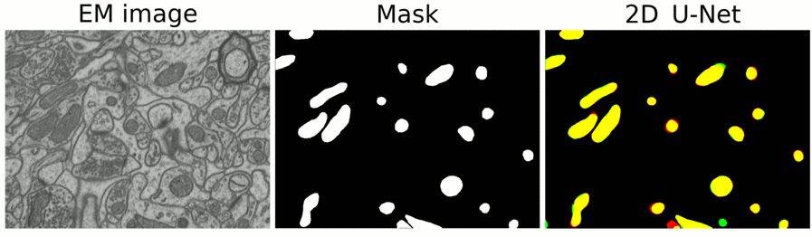

.. _semantic_segmentation:

Semantic segmentation
---------------------

Description of the task
~~~~~~~~~~~~~~~~~~~~~~~

The goal of this workflow is to assign a class to each pixel (or voxel) of the **input image**, thus producing a **label image** with **semantic** masks. 

The simplest case would be binary classification, as in the figure depicted below. There, only two labels are present in the label image: black pixels (usually with value ``0``) represent the background, and white pixels represent the foreground (mitochondria in this case, usually labeled with ``1`` or ``255`` value).

.. list-table:: 
  :align: center
  :width: 680px

  * - .. figure:: ../img/lucchi_test_0.png
         :align: center
         :width: 300
         :alt: Electron microscopy image to be segmented
        
         Input image (electron microscopy).

    - .. figure:: ../img/lucchi_test_0_gt.png
         :align: center
         :width: 300
         :alt: Corresponding label image with semantic masks

         Corresponding label image with semantic masks. 

If there are more than two classes, the label image is single-channel image where pixels (or voxels) of the different classes are labeled with a different integer. Below an example is depicted where ``0`` is background (black), ``1`` are outlines (pink) and ``2`` nuclei (light blue). 

.. list-table:: 
  :align: center
  :width: 680px

  * - .. figure:: ../img/semantic_seg/semantic_seg_multiclass_raw.png
         :align: center
         :width: 300
         :alt: Fluorescence microscopy image to be segmented
        
         Input image (fluorescence microscopy).

    - .. figure:: ../img/semantic_seg/semantic_seg_multiclass_mask.png
         :align: center
         :width: 300
         :alt: Corresponding label image with semantic masks

         Corresponding label image with semantic masks.

Inputs and outputs
~~~~~~~~~~~~~~~~~~
The semantic segmentation workflows in BiaPy expect a series of **folders** as input:

* **Training Raw Images**: A folder that contains the unprocessed (single-channel or multi-channel) images that will be used to train the model.
  
  .. collapse:: Expand to see how to configure

    .. tabs::
      .. tab:: GUI

        Under *Workflow*, select *Semantic segmentation*, twice *Continue*, under *General options* > *Train data*, click on the *Browse* button of **Input raw image folder** and select the folder with your training raw images:

        .. image:: ../img/semantic_seg/GUI-train-general-options.png
          :align: center

      .. tab:: Google Colab / Notebooks
        
        In either the 2D or the 3D semantic segmentation notebook, go to *Paths for Input Images and Output Files*, edit the field **train_data_path**:
        
        .. image:: ../img/Notebooks-Inputs-Outputs.png
          :align: center
          :width: 75%

      .. tab:: YAML configuration file
        
        Edit the variable ``DATA.TRAIN.PATH`` with the absolute path to the folder with your training raw images.

* **Training Label Images**: A folder that contains the semantic label (single-channel) images for training. Ensure the number and dimensions match the training raw images.
  
  .. collapse:: Expand to see how to configure

    .. tabs::
      .. tab:: GUI

        Under *Workflow*, select *Semantic segmentation*, twice *Continue*, under *General options* > *Train data*, click on the *Browse* button of **Input label folder** and select the folder with your training label images:

        .. image:: ../img/semantic_seg/GUI-train-general-options.png
          :align: center

      .. tab:: Google Colab / Notebooks
        
        In either the 2D or the 3D semantic segmentation notebook, go to *Paths for Input Images and Output Files*, edit the field **train_data_gt_path**:
        
        .. image:: ../img/Notebooks-Inputs-Outputs.png
          :align: center
          :width: 75%

      .. tab:: YAML configuration file
        
        Edit the variable ``DATA.TRAIN.GT_PATH`` with the absolute path to the folder with your training label images.

* .. raw:: html

      <b>[Optional] Test Raw Images</b>: A folder that contains the images to evaluate the model's performance.
 
  .. collapse:: Expand to see how to configure

    .. tabs::
      .. tab:: GUI

        Under *Workflow*, select *Semantic segmentation*, three times *Continue*, under *General options* > *Test data*, click on the *Browse* button of **Input raw image folder** and select the folder with your test raw images:

        .. image:: ../img/GUI-test-data.png
          :align: center

      .. tab:: Google Colab / Notebooks
        
        In either the 2D or the 3D semantic segmentation notebook, go to *Paths for Input Images and Output Files*, edit the field **test_data_path**:
        
        .. image:: ../img/Notebooks-Inputs-Outputs.png
          :align: center
          :width: 75%

      .. tab:: YAML configuration file
        
        Edit the variable ``DATA.TEST.PATH`` with the absolute path to the folder with your test raw images.

* .. raw:: html

      <b>[Optional] Test Label Images</b>: A folder that contains the semantic label images for testing. Again, ensure their count and sizes align with the test raw images.

  .. collapse:: Expand to see how to configure

    .. tabs::
      .. tab:: GUI

        Under *Workflow*, select *Semantic segmentation*, three times *Continue*, under *General options* > *Test data*, select "Yes" in the *Do you have test labels?* field, and then click on the *Browse* button of **Input label folder** and select the folder with your test label images:

        .. image:: ../img/GUI-test-data-gt.png
          :align: center

      .. tab:: Google Colab / Notebooks
        
        In either the 2D or the 3D semantic segmentation notebook, go to *Paths for Input Images and Output Files*, edit the field **test_data_gt_path**:
        
        .. image:: ../img/Notebooks-Inputs-Outputs.png
          :align: center
          :width: 75%

      .. tab:: YAML configuration file
        
        Edit the variable ``DATA.TEST._GT_PATH`` with the absolute path to the folder with your test label images.

Upon successful execution, a directory will be generated with the segmentation results. Both probability maps and label images will be available there. Therefore, you will need to define:

* **Output Folder**: A designated path to save the segmentation outcomes.

  .. collapse:: Expand to see how to configure

    .. tabs::
      .. tab:: GUI

        Under *Run Workflow*, click on the *Browse* button of **Output folder to save the results**:

        .. image:: ../img/semantic_seg/GUI-run-workflow.png
          :align: center

      .. tab:: Google Colab / Notebooks
        
        In either the 2D or the 3D semantic segmentation notebook, go to *Paths for Input Images and Output Files*, edit the field **output_path**:
        
        .. image:: ../img/Notebooks-Inputs-Outputs.png
          :align: center
          :width: 75%

      .. tab:: Command line
        
        When calling BiaPy from command line, you can specify the output folder with the ``--result_dir`` flag. See the *Command line* configuration of :ref:`semantic_segmentation_data_run` for a full example.

.. list-table::
  :align: center

  * - .. figure:: ../img/Inputs-outputs.svg
         :align: center
         :width: 400
         :alt: Graphical description of minimal inputs and outputs in BiaPy for semantic segmentation.
        
         BiaPy input and output folders for semantic segmentation.
  
.. _semantic_segmentation_data_prep:

Data structure
**************

To ensure the proper operation of the library, the data directory tree should be something like this: 

.. code-block::

  dataset/
  ├── train
  │   ├── raw
  │   │   ├── training-0001.tif
  │   │   ├── training-0002.tif
  │   │   ├── . . .
  │   │   └── training-9999.tif
  │   └── label
  │       ├── training_groundtruth-0001.tif
  │       ├── training_groundtruth-0002.tif
  │       ├── . . .
  │       └── training_groundtruth-9999.tif
  └── test
      ├── raw
      │   ├── testing-0001.tif
      │   ├── testing-0002.tif
      │   ├── . . .
      │   └── testing-9999.tif
      └── label
          ├── testing_groundtruth-0001.tif
          ├── testing_groundtruth-0002.tif
          ├── . . .
          └── testing_groundtruth-9999.tif

In this example, the raw training images are under ``dataset/train/raw/`` and their corresponding labels are under ``dataset/train/label/``, while the raw test images are under ``dataset/test/raw/`` and their corresponding labels are under ``dataset/test/label/``. **This is just an example**, you can name your folders as you wish as long as you set the paths correctly later.

.. note:: Ensure that images and their corresponding masks are sorted in the same way. A common approach is to fill with zeros the image number added to the filenames (as in the example).

Example datasets
****************
Below is a list of publicly available datasets that are ready to be used in BiaPy for semantic segmentation:

.. list-table::
  :widths: auto
  :header-rows: 1
  :align: center

  * - Example dataset
    - Image dimensions
    - Link to data
  * - `Electron Microscopy Dataset (EPFL - CVLAB) <https://www.epfl.ch/labs/cvlab/data/data-em/>`__
    - 2D
    - `fibsem_epfl.zip <https://drive.google.com/file/d/1DfUoVHf__xk-s4BWSKbkfKYMnES-9RJt/view?usp=drive_link>`__
  * - `Electron Microscopy Dataset (EPFL - CVLAB) <https://www.epfl.ch/labs/cvlab/data/data-em/>`__
    - 3D
    - `lucchi3D.zip <https://drive.google.com/file/d/10Cf11PtERq4pDHCJroekxu_hf10EZzwG/view?usp=sharing>`__

Minimal configuration
~~~~~~~~~~~~~~~~~~~~~
Apart from the input and output folders, there are a few basic parameters that always need to be specified in order to run a semantic segmentation workflow in BiaPy. **These parameters can be introduced either directly in the GUI, the code-free notebooks or by editing the YAML configuration file**.

Experiment name
***************
Also known as "model name" or "job name", this will be the name of the current experiment you want to run, so it can be differenciated from other past and future experiments.

.. collapse:: Expand to see how to configure

    .. tabs::
      .. tab:: GUI

        Under *Run Workflow*, type the name you want for the job in the **Job name** field:

        .. image:: ../img/semantic_seg/GUI-run-workflow.png
          :align: center

      .. tab:: Google Colab / Notebooks
        
        In either the 2D or the 3D semantic segmentation notebook, go to *Configure and train the DNN model* > *Select your parameters*, and edit the field **model_name**:
        
        .. image:: ../img/semantic_seg/Notebooks-model-name-data-conf.png
          :align: center
          :width: 50%

      .. tab:: Command line
        
        When calling BiaPy from command line, you can specify the output folder with the ``--name`` flag. See the *Command line* configuration of :ref:`semantic_segmentation_data_run` for a full example.

\

.. note:: Use only *my_model* -style, not *my-model* (Use "_" not "-"). Do not use spaces in the name. Avoid using the name of an existing experiment/model/job (saved in the same result folder) as it will be overwritten..

Data management
***************
Validation Set
""""""""""""""
With the goal to monitor the training process, it is common to use a third dataset called the "Validation Set". This is a subset of the whole dataset that is used to evaluate the model's performance and optimize training parameters. This subset will not be directly used for training the model, and thus, when applying the model to these images, we can see if the model is learning the training set's patterns too specifically or if it is generalizing properly.

.. list-table::
  :align: center

  * - .. figure:: ../img/data-partitions.png
         :align: center
         :width: 400
         :alt: Graphical description of data partitions in BiaPy
        
         Graphical description of data partitions in BiaPy.

To define such set, there are two options:
  
* **Validation proportion/percentage**: Select a proportion (or percentage) of your training dataset to be used to validate the network during the training. Usual values are 0.1 (10%) or 0.2 (20%), and the samples of that set will be selected at random.
  
  .. collapse:: Expand to see how to configure

      .. tabs::
        .. tab:: GUI

          Under *Workflow*, select *Semantic segmentation*, click twice on *Continue*, and under *General options* > *Advanced options* > *Validation data*, select "Extract from train (split training)" in **Validation type**, and introduce your value (between 0 and 1) in the **Train prop. for validation**:

          .. image:: ../img/GUI-validation-percentage.png
            :align: center

        .. tab:: Google Colab / Notebooks
          
          In either the 2D or the 3D semantic segmentation notebook, go to *Configure and train the DNN model* > *Select your parameters*, and edit the field **percentage_validation** with a value between 0 and 100:
          
          .. image:: ../img/semantic_seg/Notebooks-model-name-data-conf.png
            :align: center
            :width: 50%

        .. tab:: YAML configuration file
        
          Edit the variable ``DATA.VAL.SPLIT_TRAIN`` with a value between 0 and 1, representing the proportion of the training set that will be set apart for validation.

* **Validation paths**: Similar to the training and test sets, you can select two folders with the validation raw and label images:

  * **Validation Raw Images**: A folder that contains the unprocessed (single-channel or multi-channel) images that will be used to select the best model during training.
  
    .. collapse:: Expand to see how to configure

      .. tabs::
        .. tab:: GUI

          Under *Workflow*, select *Semantic segmentation*, click twice on *Continue*, and under *General options* > *Advanced options* > *Validation data*, select "Not extracted from train (path needed)" in **Validation type**, click on the *Browse* button of **Input raw image folder** and select the folder containing your validation raw images:

          .. image:: ../img/GUI-validation-paths.png
            :align: center

        .. tab:: Google Colab / Notebooks
          
          This option is currently not available in the notebooks.

        .. tab:: YAML configuration file
        
          Edit the variable ``DATA.VAL.PATH`` with the absolute path to your validation raw images.

  * **Validation Label Images**: A folder that contains the semantic label (single-channel) images for validation. Ensure the number and dimensions match the validation raw images.
  
    .. collapse:: Expand to see how to configure

      .. tabs::
        .. tab:: GUI

          Under *Workflow*, select *Semantic segmentation*, click twice on *Continue*, and under *General options* > *Advanced options* > *Validation data*, select "Not extracted from train (path needed)" in **Validation type**, click on the *Browse* button of **Input label folder** and select the folder containing your validation label images:

          .. image:: ../img/GUI-validation-paths.png
            :align: center

        .. tab:: Google Colab / Notebooks
          
          This option is currently not available in the notebooks.

        .. tab:: YAML configuration file
        
          Edit the variable ``DATA.VAL.GT_PATH`` with the absolute path to your validation label images.

Test ground-truth
"""""""""""""""""
Do you have labels for the test set? This is a key question so BiaPy knows if your test set will be used for evaluation in new data (unseen during training) or simply produce predictions on that new data. All supervised workflows contain a parameter to specify this aspect.

.. collapse:: Expand to see how to configure

  .. tabs::
    .. tab:: GUI

      Under *Workflow*, select *Semantic segmentation*, three times *Continue*, under *General options* > *Test data*, select "No" or "Yes" in the **Do you have test labels?** field:

      .. image:: ../img/GUI-test-data.png
        :align: center

    .. tab:: Google Colab / Notebooks
      
      In either the 2D or the 3D semantic segmentation notebook, go to *Configure and train the DNN model* > *Select your parameters*, and check or uncheck the **test_ground_truth** option:
      
      .. image:: ../img/semantic_seg/Notebooks-model-name-data-conf.png
        :align: center
        :width: 50%

    .. tab:: YAML configuration file
      
      Set the variable ``DATA.TEST.LOAD_GT`` to ``True`` or ``False``.

\

Basic training parameters
*************************
At the core of each BiaPy workflow there is a deep learning model. Although we try to simplify the number of parameters to tune, these are the basic parameters that need to be defined for training a semantic segmentation workflow:

* **Number of classes**: The number of segmentation labels, including the background, whose label is usually set to 0. For instance, if you are doing foreground vs background semantic segmentation, the number of classes will be 2 (one for foreground and one for background).

  .. collapse:: Expand to see how to configure

        .. tabs::
          .. tab:: GUI

            Under *Workflow*, select *Semantic segmentation*, click twice on *Continue*, and under *Workflow specific options* > *Train data options*, and edit the field **Number of classes**:

            .. image:: ../img/semantic_seg/GUI-workflow-specific-options.png
              :align: center

          .. tab:: Google Colab / Notebooks
            
            In either the 2D or the 3D semantic segmentation notebook, go to *Configure and train the DNN model* > *Select your parameters*, and edit the field **number_of_classes**:
            
            .. image:: ../img/semantic_seg/Notebooks-basic-training-params.png
              :align: center
              :width: 75%

          .. tab:: YAML configuration file
          
            Edit the variable ``MODEL.N_CLASSES`` with the number of classes.

* **Number of input channels**: The number of channels of your raw images (grayscale = 1, RGB = 3). Notice the dimensionality of your images (2D/3D) is set by default depending on the workflow template you select.
  
  .. collapse:: Expand to see how to configure

        .. tabs::
          .. tab:: GUI

            Under *Workflow*, select *Semantic segmentation*, click on *Continue*, and under *General options*, edit the last value of the field **Patch size** with the number of channels. This variable follows a ``(y, x, channels)`` notation in 2D and a ``(z, y, x, channels)`` notation in 3D:

            .. image:: ../img/GUI-general-options.png
              :align: center

          .. tab:: Google Colab / Notebooks
            
            In either the 2D or the 3D semantic segmentation notebook, go to *Configure and train the DNN model* > *Select your parameters*, and edit the field **input_channels**:
            
            .. image:: ../img/semantic_seg/Notebooks-basic-training-params.png
              :align: center
              :width: 75%

          .. tab:: YAML configuration file
          
            Edit the last value of the variable ``DATA.PATCH_SIZE`` with the number of channels. This variable follows a ``(y, x, channels)`` notation in 2D and a ``(z, y, x, channels)`` notation in 3D.

* **Number of epochs**: This number indicates how many `rounds <https://machine-learning.paperspace.com/wiki/epoch>`_ the network will be trained. On each round, the network usually sees the full training set. The value of this parameter depends on the size and complexity of each dataset. You can start with something like 100 epochs and tune it depending on how fast the loss (error) is reduced.
  
  .. collapse:: Expand to see how to configure

        .. tabs::
          .. tab:: GUI

            Under *Workflow*, select *Semantic segmentation*, click twice on *Continue*, and under *Advanced options*, scroll down to *General training parameters*, and edit the field **Number of epochs**:

            .. image:: ../img/semantic_seg/GUI-basic-training-params.png
              :align: center

          .. tab:: Google Colab / Notebooks
            
            In either the 2D or the 3D semantic segmentation notebook, go to *Configure and train the DNN model* > *Select your parameters*, and edit the field **number_of_epochs**:
            
            .. image:: ../img/semantic_seg/Notebooks-basic-training-params.png
              :align: center
              :width: 75%

          .. tab:: YAML configuration file
          
            Edit the last value of the variable ``TRAIN.EPOCHS`` with the number of epochs. For this to have effect, the variable ``TRAIN.ENABLE`` should also be set to ``True``.

* **Patience**: This is a number that indicates how many epochs you want to wait without the model improving its results in the validation set to stop training. Again, this value depends on the data you're working on, but you can start with something like 20.
   
  .. collapse:: Expand to see how to configure

        .. tabs::
          .. tab:: GUI

            Under *Workflow*, select *Semantic segmentation*, click twice on *Continue*, and under *Advanced options*, scroll down to *General training parameters*, and edit the field **Patience**:

            .. image:: ../img/semantic_seg/GUI-basic-training-params.png
              :align: center

          .. tab:: Google Colab / Notebooks
            
            In either the 2D or the 3D semantic segmentation notebook, go to *Configure and train the DNN model* > *Select your parameters*, and edit the field **patience**:
            
            .. image:: ../img/semantic_seg/Notebooks-basic-training-params.png
              :align: center
              :width: 75%

          .. tab:: YAML configuration file
          
            Edit the last value of the variable ``TRAIN.PATIENCE`` with the number of epochs. For this to have effect, the variable ``TRAIN.ENABLE`` should also be set to ``True``.

For improving performance, other advanced parameters can be optimized, for example, the model's architecture. The architecture assigned as default is the U-Net, as it is effective in semantic segmentation tasks. This architecture allows a strong baseline, but further exploration could potentially lead to better results.

.. note:: Once the parameters are correctly assigned, the training phase can be executed. Note that to train large models effectively the use of a GPU (Graphics Processing Unit) is essential. This hardware accelerator performs parallel computations and has larger RAM memory compared to the CPUs, which enables faster training times.

.. _semantic_segmentation_data_run:

How to run
~~~~~~~~~~
BiaPy offers different options to run workflows depending on your degree of computer expertise. Select whichever is more approppriate for you:

.. tabs::

   .. tab:: GUI

        In the BiaPy GUI, navigate to *Workflow*, then select *Semantic segmentation* and follow the on-screen instructions:

        .. image:: ../img/gui/biapy_gui_semantic_seg.png
            :align: center

        \

        .. note:: BiaPy's GUI requires that all data and configuration files reside on the same machine where the GUI is being executed.
        
        For a full example on how to configure a semantic segmentation workflow in BiaPy GUI, watch our semantic segmentation demo video:

        .. raw:: html

          <iframe width="560" height="315" src="https://www.youtube.com/embed/mosNPxHkLVo?si=6yo8A9HMuJ4_kiII" title="YouTube video player" frameborder="0" allow="accelerometer; autoplay; clipboard-write; encrypted-media; gyroscope; picture-in-picture; web-share" referrerpolicy="strict-origin-when-cross-origin" allowfullscreen></iframe>

        \
        
        .. tip:: If you need additional help, watch BiaPy's `GUI walkthrough video <https://www.youtube.com/embed/vY7aBh5FUNk?si=yvVolBnu5APNeHwB>`__.

   .. tab:: Google Colab

        BiaPy offers two code-free notebooks in Google Colab to perform semantic segmentation: 

        .. |sem_seg_2D_colablink| image:: https://colab.research.google.com/assets/colab-badge.svg
            :target: https://colab.research.google.com/github/BiaPyX/BiaPy/blob/master/notebooks/semantic_segmentation/BiaPy_2D_Semantic_Segmentation.ipynb

        * For 2D images: |sem_seg_2D_colablink|

        .. |sem_seg_3D_colablink| image:: https://colab.research.google.com/assets/colab-badge.svg
            :target: https://colab.research.google.com/github/BiaPyX/BiaPy/blob/master/notebooks/semantic_segmentation/BiaPy_3D_Semantic_Segmentation.ipynb

        * For 3D images: |sem_seg_3D_colablink|
      
        \

        .. tip:: If you need additional help, watch BiaPy's `Notebook walkthrough video <https://youtu.be/KEqfio-EnYw>`__.

   .. tab:: Docker
            
        If you installed BiaPy via Docker, `open a terminal <../get_started/faq.html#opening-a-terminal>`__ as described in :ref:`installation`. Then, you can use the `2d_semantic_segmentation.yaml <https://github.com/BiaPyX/BiaPy/blob/master/templates/semantic_segmentation/2d_semantic_segmentation.yaml>`__ template file (or your own file), and run the workflow as follows:

        .. code-block:: bash                                                                                                    

            # Configuration file
            job_cfg_file=/home/user/2d_semantic_segmentation.yaml
            # Path to the data directory
            data_dir=/home/user/data
            # Where the experiment output directory should be created
            result_dir=/home/user/exp_results
            # Just a name for the job
            job_name=my_2d_semantic_segmentation
            # Number that should be increased when one need to run the same job multiple times (reproducibility)
            job_counter=1
            # Number of the GPU to run the job in (according to 'nvidia-smi' command)
            gpu_number=0

            sudo docker run --rm \
                --gpus "device=$gpu_number" \
                --mount type=bind,source=$job_cfg_file,target=$job_cfg_file \
                --mount type=bind,source=$result_dir,target=$result_dir \
                --mount type=bind,source=$data_dir,target=$data_dir \
                biapyx/biapy:latest-11.8 \
                    --config $job_cfg_file \
                    --result_dir $result_dir \
                    --name $job_name \
                    --run_id $job_counter \
                    --gpu "$gpu_number"

        .. note:: 

            Note that ``data_dir`` must contain all the paths ``DATA.*.PATH`` and ``DATA.*.GT_PATH`` so the container can find them. For instance, if you want to only train in this example ``DATA.TRAIN.PATH`` and ``DATA.TRAIN.GT_PATH`` could be ``/home/user/data/train/x`` and ``/home/user/data/train/y`` respectively. 

   .. tab:: Command line

        `From a terminal <../get_started/faq.html#opening-a-terminal>`__, you can use the `2d_semantic_segmentation.yaml <https://github.com/BiaPyX/BiaPy/blob/master/templates/semantic_segmentation/2d_semantic_segmentation.yaml>`__ template file (or your own file), and run the workflow as follows:

        .. code-block:: bash
            
            # Configuration file
            job_cfg_file=/home/user/2d_semantic_segmentation.yaml       
            # Where the experiment output directory should be created
            result_dir=/home/user/exp_results  
            # Just a name for the job
            job_name=my_2d_semantic_segmentation      
            # Number that should be increased when one need to run the same job multiple times (reproducibility)
            job_counter=1
            # Number of the GPU to run the job in (according to 'nvidia-smi' command)
            gpu_number=0                   

            # Load the environment
            conda activate BiaPy_env
            
            biapy \
                --config $job_cfg_file \
                --result_dir $result_dir  \ 
                --name $job_name    \
                --run_id $job_counter  \
                --gpu "$gpu_number"  

        For multi-GPU training you can call BiaPy as follows:

        .. code-block:: bash

            # First check where is your biapy command (you need it in the below command)
            # $ which biapy
            # > /home/user/anaconda3/envs/BiaPy_env/bin/biapy

            gpu_number="0, 1, 2"
            python -u -m torch.distributed.run \
                --nproc_per_node=3 \
                /home/user/anaconda3/envs/BiaPy_env/bin/biapy \
                --config $job_cfg_file \
                --result_dir $result_dir  \ 
                --name $job_name    \
                --run_id $job_counter  \
                --gpu "$gpu_number" 

        ``nproc_per_node`` needs to be equal to the number of GPUs you are using (e.g. ``gpu_number`` length).

      

Templates                                                                                                                 
~~~~~~~~~

In the `templates/semantic_segmentation <https://github.com/BiaPyX/BiaPy/tree/master/templates/semantic_segmentation>`__ folder of BiaPy, you will find a few YAML configuration templates for this workflow. 

[Advanced] Special workflow configuration 
~~~~~~~~~~~~~~~~~~~~~~~~~~~~~~~~~~~~~~~~~

.. note:: This section is recommended for experienced users only to improve the performance of their workflows. When in doubt, do not hesitate to check our `FAQ & Troubleshooting <../get_started/faq.html>`__ or open a question in the `image.sc discussion forum <our FAQ & Troubleshooting section>`_.

Advanced Parameters 
*******************
Many of the parameters of our workflows are set by default to values that work commonly well. However, it may be needed to tune them to improve the results of the workflow. For instance, you may modify the following parameters

* **Model architecture**: Select the architecture of the deep neural network used as backbone of the pipeline. Options: U-Net, Residual U-Net, Attention U-Net, SEUNet, MultiResUNet, ResUNet++, UNETR-Mini, UNETR-Small, UNETR-Base, ResUNet SE and U-NeXt V1. Default value: U-Net.
* **Batch size**: This parameter defines the number of patches seen in each training step. Reducing or increasing the batch size may slow or speed up your training, respectively, and can influence network performance. Common values are 4, 8, 16, etc.
* **Patch size**: Input the size of the patches use to train your model (length in pixels in X and Y). The value should be smaller or equal to the dimensions of the image. The default value is 256 in 2D, i.e. 256x256 pixels.
* **Optimizer**: Select the optimizer used to train your model. Options: ADAM, ADAMW, Stochastic Gradient Descent (SGD). ADAM usually converges faster, while ADAMW provides a balance between fast convergence and better handling of weight decay regularization. SGD is known for better generalization. Default value: ADAMW.
* **Initial learning rate**: Input the initial value to be used as learning rate. If you select ADAM as optimizer, this value should be around 10e-4. 
* **Learning rate scheduler**: Select to adjust the learning rate between epochs. The current options are "Reduce on plateau", "One cycle", "Warm-up cosine decay" or no scheduler.
* **Test time augmentation (TTA)**: Select to apply augmentation (flips and rotations) at test time. It usually provides more robust results but uses more time to produce each result. By default, no TTA is peformed.

Output
******
The **output** of a semantic segmentation workflow can be: 

- Single-channel image, when ``DATA.TEST.ARGMAX_TO_OUTPUT`` is ``True``, with each class labeled with an integer. 
- Multi-channel image, when ``DATA.TEST.ARGMAX_TO_OUTPUT`` is ``False``, with the same number of channels as classes, and the same pixel in each channel will be the probability (in ``[0-1]`` range) of being of the class that represents that channel number. For instance, with ``3`` classes, e.g. background, mitochondria and contours, the fist channel will represent background, the second mitochondria and the last the contours. 

Data loading
************

If you want to select ``DATA.EXTRACT_RANDOM_PATCH`` you can also set ``DATA.PROBABILITY_MAP`` to create a probability map so the patches extracted will have a high probability of having an object in the middle of it. Useful to avoid extracting patches which no foreground class information. That map will be saved in ``PATHS.PROB_MAP_DIR``. Furthermore, in ``PATHS.DA_SAMPLES`` path, i.e. ``aug`` folder by default (see :ref:`semantic_segmentation_results`), two more images will be created so you can check how this probability map is working. These images will have painted a blue square and a red point in its middle, which correspond to the patch area extracted and the central point selected respectively. One image will be named as ``mark_x`` and the other one as ``mark_y``, which correspond to the input image and ground truth respectively.  

Metrics
*******

During the inference phase the performance of the test data is measured using different metrics if test masks were provided (i.e. ground truth) and, consequently, ``DATA.TEST.LOAD_GT`` is ``True``. In the case of semantic segmentation the **Intersection over Union** (IoU) metrics is calculated after the network prediction. This metric, also referred as the Jaccard index, is essentially a method to quantify the percent of overlap between the target mask and the prediction output. Depending on the configuration different values are calculated (as explained in :ref:`config_test` and :ref:`config_metric`). This values can vary a lot as stated in :cite:p:`Franco-Barranco2021`.

* **Per patch**: IoU is calculated for each patch separately and then averaged. 
* **Reconstructed image**: IoU is calculated for each reconstructed image separately and then averaged. Notice that depending on the amount of overlap/padding selected the merged image can be different than just concatenating each patch. 
* **Full image**: IoU is calculated for each image separately and then averaged. The results may be slightly different from the reconstructed image.

Post-processing
***************

Only applied to ``3D`` images (e.g. ``PROBLEM.NDIM`` is ``2D`` or ``TEST.ANALIZE_2D_IMGS_AS_3D_STACK`` is ``True``). There are the following options:

* **Z-filtering**: to apply a median filtering in ``z`` axis. Useful to maintain class coherence across ``3D`` volumes. Enable it with ``TEST.POST_PROCESSING.Z_FILTERING`` and use ``TEST.POST_PROCESSING.Z_FILTERING_SIZE`` for the size of the median filter. 

* **YZ-filtering**: to apply a median filtering in ``y`` and ``z`` axes. Useful to maintain class coherence across ``3D`` volumes that can work slightly better than ``Z-filtering``. Enable it with ``TEST.POST_PROCESSING.YZ_FILTERING`` and use ``TEST.POST_PROCESSING.YZ_FILTERING_SIZE`` for the size of the median filter.  

.. _semantic_segmentation_results:

Results                                                                                                                 
~~~~~~~  

The results are placed in ``results`` folder under ``--result_dir`` directory with the ``--name`` given. An example of this workflow is depicted below:

   Example of semantic segmentation model predictions. From left to right: input image, its mask and the overlap between the mask and the model's output binarized. 

Following the example, you should see that the directory ``/home/user/exp_results/my_2d_semantic_segmentation`` has been created. If the same experiment is run 5 times, varying ``--run_id`` argument only, you should find the following directory tree: 

.. collapse:: Expand directory tree 

    .. code-block:: bash
        
      my_2d_semantic_segmentation/
      ├── config_files
      │   └── my_2d_semantic_segmentation_1.yaml                                                                                                           
      ├── checkpoints
      │   └── my_2d_semantic_segmentation_1-checkpoint-best.pth
      └── results
          ├── my_2d_semantic_segmentation_1
          ├── . . .
          └── my_2d_semantic_segmentation_5
              ├── aug
              │   └── .tif files
              ├── charts
              │   ├── my_2d_semantic_segmentation_1_*.png
              │   └── my_2d_semantic_segmentation_1_loss.png
              ├── per_image
              │   ├── .tif files
              │   └── .zarr files (or.h5)
              ├── per_image_binarized
              │   └── .tif files
              ├── full_image
              │   └── .tif files
              ├── full_image_binarized
              │   └── .tif files
              ├── full_post_processing
              │   └── .tif files
              ├── tensorboard
              └── train_logs

\

* ``config_files``: directory where the .yaml filed used in the experiment is stored. 

  * ``my_2d_semantic_segmentation.yaml``: YAML configuration file used (it will be overwrited every time the code is run)

* ``checkpoints``, *optional*: directory where model's weights are stored. Only created when ``TRAIN.ENABLE`` is ``True`` and the model is trained for at least one epoch. 

  * ``my_2d_semantic_segmentation_1-checkpoint-best.pth``, *optional*: checkpoint file (best in validation) where the model's weights are stored among other information. Only created when the model is trained for at least one epoch. 
    
  * ``normalization_mean_value.npy``, *optional*: normalization mean value. Is saved to not calculate it everytime and to use it in inference. Only created if ``DATA.NORMALIZATION.TYPE`` is ``custom``.
  
  * ``normalization_std_value.npy``, *optional*: normalization std value. Is saved to not calculate it everytime and to use it in inference. Only created if ``DATA.NORMALIZATION.TYPE`` is ``custom``.

* ``results``: directory where all the generated checks and results will be stored. There, one folder per each run are going to be placed.

  * ``my_2d_semantic_segmentation_1``: run 1 experiment folder. Can contain:

    * ``aug``, *optional*: image augmentation samples. Only created if ``AUGMENTOR.AUG_SAMPLES`` is ``True``.

    * ``charts``, *optional*: only created when ``TRAIN.ENABLE`` is ``True`` and epochs trained are more or equal ``LOG.CHART_CREATION_FREQ``. Can contain:  

      * ``my_2d_semantic_segmentation_1_*.png``: plot of each metric used during training.

      * ``my_2d_semantic_segmentation_1_loss.png``: loss over epochs plot. 

    * ``per_image``, *optional*: only created if ``TEST.FULL_IMG`` is ``False``. Can contain:

      * ``.tif files``, *optional*: reconstructed images from patches. Created when ``TEST.BY_CHUNKS.ENABLE`` is ``False`` or when ``TEST.BY_CHUNKS.ENABLE`` is ``True`` but ``TEST.BY_CHUNKS.SAVE_OUT_TIF`` is ``True``. 

      * ``.zarr files (or.h5)``, *optional*: reconstructed images from patches. Created when ``TEST.BY_CHUNKS.ENABLE`` is ``True``.

    * ``per_image_binarized``, *optional*: only created if ``TEST.FULL_IMG`` is ``False``. Can contain: 

      * ``.tif files``: Same as ``per_image`` but with the images binarized.

    * ``full_image``, *optional*: only created if ``TEST.FULL_IMG`` is ``True``. Can contain:

      * ``.tif files``: full image predictions.

    * ``full_image_binarized``: 

      * ``.tif files``: Same as ``full_image`` but with the image binarized.

    * ``full_image_post_processing``, *optional*: only created if ``TEST.FULL_IMG`` is ``True`` and a post-proccessing is enabled. Can contain:

      * ``.tif files``: same as ``full_image_instances`` but applied post-processing. 
    
    * ``tensorboard``: Tensorboard logs.

    * ``train_logs``: each row represents a summary of each epoch stats. Only avaialable if training was done.
        
.. note:: 
   Here, for visualization purposes, only ``my_2d_semantic_segmentation_1`` has been described but ``my_2d_semantic_segmentation_2``, ``my_2d_semantic_segmentation_3``, ``my_2d_semantic_segmentation_4`` and ``my_2d_semantic_segmentation_5`` will follow the same structure.
